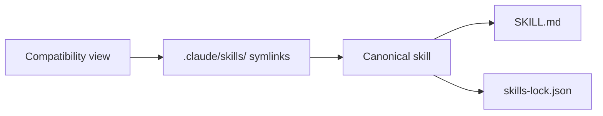

# Context

This repository contains the canonical quirk Skills bundle in `.agents/skills/`.

Use the repository-local docs in `docs/agents/` to understand issue tracking, work-item format, domain-doc layout, and triage labels before using the workflow skills.

When installing or syncing this bundle in another repository, prefer the AI-agnostic prompts in `README.md`:

- Use the greenfield prompt when the target repo has no established local context and needs a clean skills bootstrap.
- Use the existing-repo prompt when the target repo already has ADRs, local documentation, and a repository-specific context that must stay untouched.

## Vocabulary

| Term | Meaning |
|---|---|
| **quirk Skills** | The author-owned skills bundle in this repository |
| **quirk Method** | The workflow philosophy that governs how the skills route work, preserve context, produce artifacts, review changes, repair findings, and ship |
| **Canonical skill** | A skill folder under `.agents/skills/` with a `SKILL.md` entrypoint and matching lockfile entry |
| **Compatibility view** | The `.claude/skills/` symlink tree that exposes canonical skills to consumers expecting that layout |
| **Provenance** | The recorded origin and redesign status of a skill, name, or workflow |
| **Agent Canvas** | Workspace/session control skill (`agent-canvas`) for multi-agent persistence |
| **Context Engine** | Dynamic context retrieval (`context-engine`) via RAG from issues/docs/traces |
| **MCP Server** | External data connection (`mcp-server`) for issues, PRs, traces |
| **Subagent Swarm** | Coordinated sub-agent roles (`subagent-swarm`) with handoff contracts |
| **Work Item Router** | Routing script (`work-item-router.mjs`) that maps descriptions to skills |

## Usage rules

- Use **quirk Skills** when referring to the whole workflow system.
- Use **quirk Method** when discussing why the skills behave the way they do.
- Use **Canonical skill** when distinguishing real skills from compatibility symlinks.
- Use **Compatibility view** when discussing installation or parity.
- Use **Provenance** when discussing authorship, influence, retired aliases, or renamed skills.
- Use the README prompts as the operational entry point for AI-agnostic installation or sync tasks.

## Maintenance Rule

This file is required. It must name the local domain vocabulary, project boundaries, and naming conventions. Skills should reference this context and avoid vocabulary from unrelated repositories.
