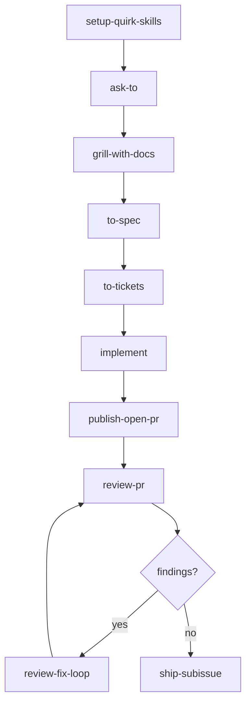
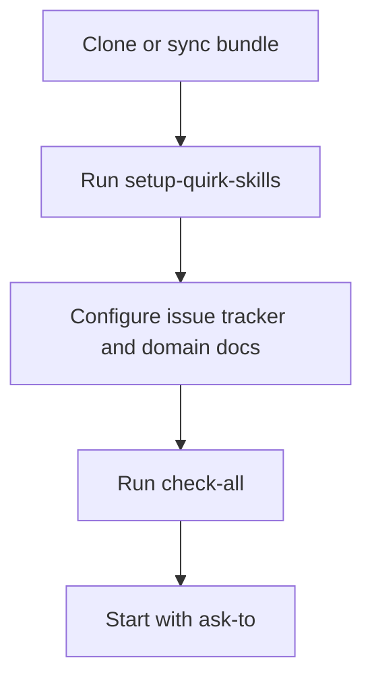
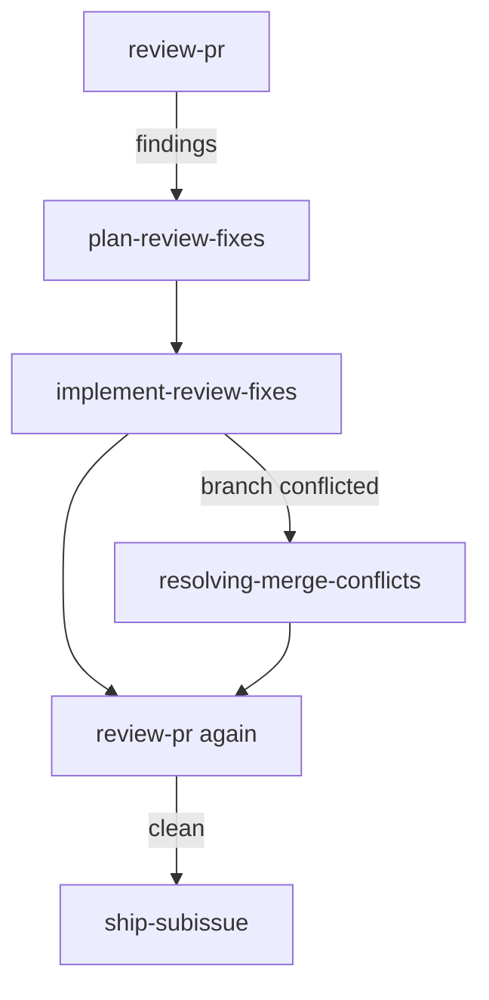
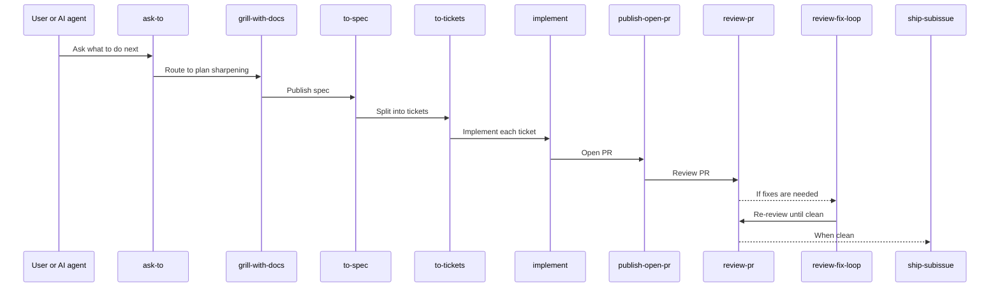

# quirk Skills

`quirk Skills` is a **repository-local engineering workflow** for taking software projects from rough intent to reviewed, validated delivery.

The bundle follows the `quirk` method: clarify before building, preserve project context, cut work into claimable slices, review through separate Standards and Spec axes, repair through explicit plans, and ship only after evidence is clean.

When a PR branch is conflicted, the review-repair flow first routes that branch-state problem through `resolving-merge-conflicts`, then returns to `review-pr` / `review-fix-loop`, and only ships once the branch is clean and review is clean.

## Table of Contents

- [What This Is](#what-this-is)
- [Core Flow](#core-flow)
- [Method](#method)
- [Official Documentation](#official-documentation)
- [Validate](#validate)
- [Versioning](#versioning)
- [Distribution](#distribution)
- [Install In Any Repo](#install-in-any-repo)
- [Authorship](#authorship)

## What This Is

> A portable skills stack for standard project development. Copy or adapt into project repositories, then specialize through each repo's own `CONTEXT.md`, ADRs, issue tracker configuration, validation commands, and stack-specific skills.

| Location | Role |
|---|---|
| `.agents/skills/` | Canonical skill definitions |
| `.claude/skills/` | Compatibility view (symlinks) |


## Core Flow



## Method

The method is documented in:

## Method

The method is documented in:

| Document | Purpose |
|---|---|
| [AUTHORSHIP.md](AUTHORSHIP.md) | Authorship and integrity |
| [quirk method](docs/agents/quirk-method.md) | Method vocabulary and quality bar |
| [provenance](docs/agents/provenance.md) | Origin and redesign status |
| [adoption guide](docs/agents/adoption-guide.md) | Installation and sync |
| [skill templates](docs/agents/skill-templates.md) | Artifact templates map |
| [stack matrix](docs/agents/stack-matrix.md) | Stack-specific skills |
| [skill style guide](docs/agents/skill-style-guide.md) | Editing and authoring rules |
| [Skill Lab toolkit](docs/agents/skill-lab.md) | Skill lab reference |
| [release checklist](docs/agents/release-checklist.md) | Pre/post-release gates |
| [multi-agent protocol](docs/agents/multi-agent-protocol.md) | Multi-session handoff rules |

## Official Documentation

For a portable, AI-agnostic installation and usage path, start here:

> Start here for installation, templates, and the full skills inventory.

| Document | Purpose |
|---|---|
| [Adoption guide](docs/agents/adoption-guide.md) | Installation and sync |
| [Skill templates](docs/agents/skill-templates.md) | Scaffolding reference |
| [Skills map](docs/agents/skills-map.md) | Full inventory |

### Installation Flow



### Review and Shipping Flow



### Standard Feature Flow



## Validate

Run the local gate from the repo root:

```bash
node .agents/skills/platform/check-all.mjs
```

Expected result: `status: "pass"`.

## Versioning

The current version is recorded in [VERSION](VERSION). Release changes are recorded in [CHANGELOG.md](CHANGELOG.md).

## Distribution

### Dry-run sync

```bash
node .agents/skills/platform/sync-bundle.mjs /path/to/target-repo
```

### Apply sync

```bash
node .agents/skills/platform/sync-bundle.mjs /path/to/target-repo --write
```

## Install In Any Repo

The bundle is designed to be copied into another repository and then specialized there.

### Quick start

```bash
bash scripts/install-quirk-skills.sh /path/to/target-repo
```

### One-line installer

```bash
curl -fsSL https://raw.githubusercontent.com/quantumquirkxyz/skills-quirk/main/scripts/install-quirk-skills.sh | bash -s -- /path/to/target-repo
```

If you already have a local checkout of this bundle, use:

```bash
bash scripts/install-quirk-skills.sh /path/to/target-repo
```

If you prefer to inspect first and then install from a clone:

```bash
git clone https://github.com/quantumquirkxyz/skills-quirk.git
cd skills-quirk
bash scripts/install-quirk-skills.sh /path/to/target-repo
```

The installer copies these bundle files:

| File | Purpose |
|---|---|
| `.agents/skills/` | Canonical skill definitions |
| `.claude/skills/` | Compatibility symlinks |
| `docs/agents/` | Governance and method docs |
| `docs/adr/README.md` | ADR entry point |
| `CONTEXT.md` | Repository-local vocabulary |
| `skills-lock.json` | Canonical skill hashes |

### After installation

1. Run `setup-quirk-skills` in the target repo.
2. Follow the [adoption guide](docs/agents/adoption-guide.md) to set the issue tracker, domain docs, and validation commands.
3. Use `ask-to` or the standard flow to route work.

## Authorship

Copyright (c) 2026 Jhuomar Boskoll Quintero.

The project is MIT licensed. See [LICENSE](LICENSE).
