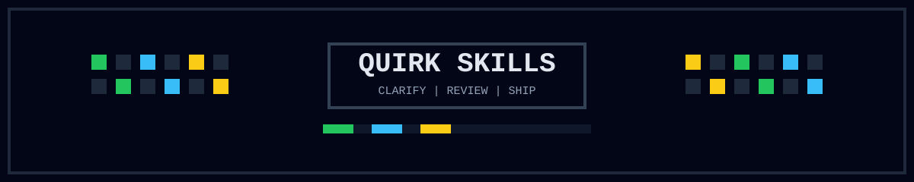
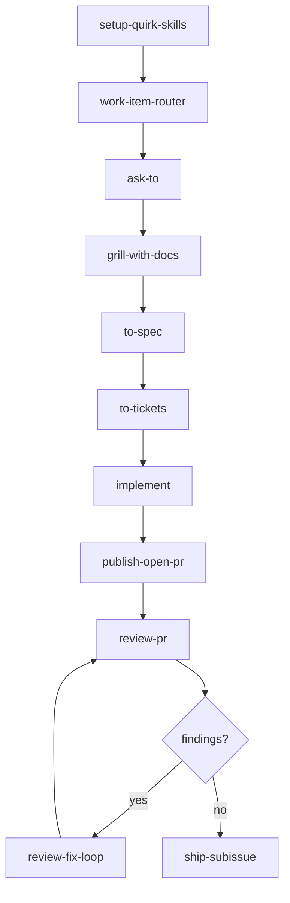
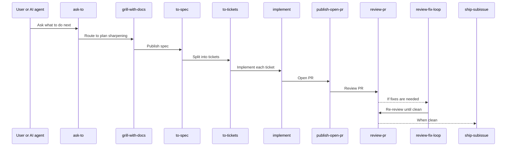
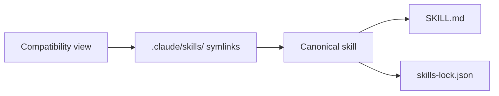

<p align="center">
  
  
  
</p>

# quirk Skills

<p align="center">
  
</p>

<p align="center">
  
  
  
</p>

`quirk Skills` is a repository-local workflow system for moving software work from intent to validated delivery.

It follows the `quirk` method: clarify before building, preserve context, split work into claimable slices, review against separate Standards and Spec axes, repair with explicit plans, and ship only on clean evidence.

If a PR branch is conflicted, resolve branch state first with `resolving-merge-conflicts`, then return to `review-pr` and `review-fix-loop` before shipping.

[Quick Start](#quick-start) · [Flow](#core-flow) · [Architecture](#architecture) · [Docs](#documentation) · [Quality](#quality--validation) · [Install](#installation--sync) · [Contribute](#contributing) · [License](#license)

<a id="quick-start"></a>

## 🚀 Quick Start

```bash
git clone https://github.com/quantumquirkxyz/skills-quirk.git
cd skills-quirk
node .agents/skills/platform/check-all.mjs
```

Then sync the bundle into the target repo and start with `ask-to` or the relevant work-item skill.

<details>
<summary>What the bundle includes</summary>

- **Setup automation** — `scripts/setup-quirk-skills.sh` to install in target repos
- **Seed bundle** — `tooling/seed/` with `integration-playground`, `testing-framework`, and foundation skills: `agent-canvas`, `context-engine`, `mcp-server`, `subagent-swarm`
- **CI validation** — `.github/workflows/validate.yml`
- **Skill evolution** — `skill-lab.mjs` and `skill-evolver.mjs`
- **Skills manifest** — `skills.json` for portable bundle definition and `npx skills` compatibility
- **Work-item routing** — `work-item-router.mjs` for keyword-based skill selection
- **Video tutorials** — `tooling/videos/README.md`

</details>

## Table of Contents

- [About](#about)
- [Core Flow](#core-flow)
- [Architecture](#architecture)
- [Method](#method)
- [Documentation](#documentation)
- [Quality & Validation](#quality--validation)
- [Distribution](#distribution)
- [Installation & Sync](#installation--sync)
- [Contributing](#contributing)
- [License](#license)

<a id="about"></a>

## About

> A portable skills stack for standard project development. Install it into a repository, then specialize it through that repo's own `CONTEXT.md`, ADRs, issue tracker configuration, validation commands, and stack-specific skills.

| Location | Role |
|---|---|
| `.agents/skills/` | Skills canónicas (`SKILL.md` + lockfile) |
| `.claude/skills/` | Vista de compatibilidad (symlinks) |
| `skills-lock.json` | Hash canónico de cada skill |
| `CONTEXT.md` | Vocabulario local del repo |
| `docs/agents/` | Documentación de método, provenance y adoption |

---

<a id="core-flow"></a>

## Core Flow



### Standard Feature Flow



---

<a id="architecture"></a>

## Architecture



<details>
<summary>Skill layer</summary>

- `.agents/skills/` — skills canónicas con `SKILL.md` y lockfile
- `.claude/skills/` — symlinks de compatibilidad
- `skills-lock.json` — hashes de integridad

</details>

<details>
<summary>Method layer</summary>

- `CONTEXT.md` — vocabulario y convenciones locales
- `docs/agents/` — ADRs, provenance, adoption guide, skill templates

</details>

<details>
<summary>Execution layer</summary>

- Scripts de validación: `.agents/skills/platform/check-all.mjs`
- Scripts de sync: `.agents/skills/platform/sync-bundle.mjs`
- Router: `work-item-router.mjs`

</details>

<details>
<summary>Quality layer</summary>

- **Quality scoring** — `quality-scorer.mjs`
- **Security scanner** — `security-scanner.mjs`
- **Dependency graph** — `dependency-graph.mjs`
- **Evaluation fixtures** — `evaluate-fixtures.mjs`

</details>

<details>
<summary>Registry & distribution layer</summary>

- **Registry** — `registry.yaml`
- **Marketplace** — `.claude-plugin/marketplace.json`
- **Catalog** — `CATALOG.md`
- **LLMS** — `llms.txt`
- **Plugins** — `plugins/fullstack/`, `plugins/devops/`, `plugins/ai-ml/`

</details>

<details>
<summary>Runtime layer</summary>

- **MCP server** — `mcp-server/mcp-skills-server.mjs`
- **OTEL instrumentation** — `otel-skill-instrumentation.mjs`
- **Execution analytics** — `record-execution.mjs`

</details>

<details>
<summary>Governance layer</summary>

- **Evidence-gated updates** — `skill-evolver.mjs`
- **Audit trail** — `audit-trail.mjs`
- **Versioning** — dist-tags `stable` / `beta` / `canary`

</details>

<details>
<summary>Platform layer</summary>

- **NPX CLI** — `bin/skills-quirk.js`
- **Discovery site** — `site/`
- **Plugin system** — `.claude-plugin/plugin.json`

</details>

---

<a id="method"></a>

## Method

> [!NOTE]
> The full method vocabulary and quality bar are documented at [docs/agents/quirk-method.md](docs/agents/quirk-method.md).

| Principle | Rule |
|---|---|
| Context before action | Build a fresh context pack before broad work |
| Questions before commitments | Use `grill` or `grill-with-docs` when work is ambiguous |
| Artifacts over vibes | Specs, tickets, PR bodies, review plans must be durable |
| Vertical slices | Tickets should be narrow, complete paths |
| Measurement before repair | Review Standards and Spec separately |
| Branch-state before repair | Resolve conflicts first, then review |
| Repo-local specialization | Each project owns its domain language and risk boundaries |
| Fail closed on uncertainty | Missing fixed points must be surfaced |

---

<a id="documentation"></a>

## Documentation

> [!NOTE]
> For installation and sync, start with [docs/agents/adoption-guide.md](docs/agents/adoption-guide.md).

| Document | Purpose |
|---|---|
| [AUTHORSHIP.md](AUTHORSHIP.md) | Authorship and integrity |
| [quirk method](docs/agents/quirk-method.md) | Method vocabulary and quality bar |
| [provenance](docs/agents/provenance.md) | Origin and redesign status |
| [adoption guide](docs/agents/adoption-guide.md) | Installation and sync |
| [skill templates](docs/agents/skill-templates.md) | Artifact templates map |
| [stack matrix](docs/agents/stack-matrix.md) | Stack-specific skills |
| [skill style guide](docs/agents/skill-style-guide.md) | Editing and authoring rules |
| [Skill Lab toolkit](docs/agents/skill-lab.md) | Skill lab reference |
| [release checklist](docs/agents/release-checklist.md) | Pre/post-release gates |
| [multi-agent protocol](docs/agents/multi-agent-protocol.md) | Multi-session handoff rules |
| [skill inventory](docs/agents/skill-inventory.md) | Generated per-skill status table |

---

<a id="quality--validation"></a>

## Quality & Validation

> Run the local gate from the repo root. Expected result: `status: "pass"`.

```bash
node .agents/skills/platform/check-all.mjs
```

> [!TIP]
> The full gate covers structure, semantic health, scenario fixtures, behavioral fixtures, syntax checks, shell template checks, and platform tests.

### Quality scoring

```bash
node .agents/skills/platform/quality-scorer.mjs .agents/skills/skill-dev/skill-creator
```

Scores each skill 0-100 across 6 dimensions. Returns grade A-F and tier BASIC/STANDARD/POWERFUL.

### Security scan

```bash
node .agents/skills/platform/security-scanner.mjs .agents/skills/skill-dev/skill-creator
```

Detects credential leakage, command injection, prompt injection, missing approval gates, and typosquatting risks. Returns blocked / review-required / pass.

### Dependency graph

```bash
node .agents/skills/platform/dependency-graph.mjs --format mermaid
node .agents/skills/platform/dependency-graph.mjs --format json
```

Produces a DAG of skill dependencies, detects cycles, and identifies central skills.

### Fixtures

```bash
node .agents/skills/platform/evaluate-fixtures.mjs --threshold 0.8
```

Runs behavioral, regression, and security fixtures with configurable pass threshold.

---

<a id="distribution"></a>

## Distribution

### NPX CLI

```bash
npx skills-quirk list
npx skills-quirk search "react testing"
npx skills-quirk score skill-creator
npx skills-quirk security implement
npx skills-quirk sync --write
```

### Registry and marketplace

- `registry.yaml` — source of truth with JSON Schema validation
- `.claude-plugin/marketplace.json` — generated Claude Code marketplace manifest
- `CATALOG.md` — auto-generated skill catalog
- `llms.txt` — agent-discovery entrypoint
- `plugins/` — namespace plugin bundles

### MCP server

```bash
node .agents/skills/platform/mcp-server/mcp-skills-server.mjs --stdio
```

Exposes skills as MCP tools: `list_skills`, `get_skill`, `search_skills`, `resolve_skill_for_task`, `validate_skill`, `score_skill`.

### Sync

<details>
<summary>Dry-run sync</summary>

```bash
node .agents/skills/platform/sync-bundle.mjs /path/to/target-repo
```

</details>

<details>
<summary>Apply sync</summary>

```bash
node .agents/skills/platform/sync-bundle.mjs /path/to/target-repo --write
```

</details>

---

<a id="installation--sync"></a>

## Installation & Sync

The bundle is designed to be copied into another repository and specialized there.

```text
[ PROMPTS ] AI-AGNOSTIC PROMPTS
```

Use one of these prompts when you want an AI-agnostic IDE to install or sync this skills bundle into another repository.

> [!IMPORTANT]
> These prompts are preserved verbatim. Use them as-is when installing or syncing.

### 1. Greenfield repository, no prior context

```text
You are going to install the quirk Skills bundle into this repository from scratch.

REPO_UPSTREAM = <url of the canonical skills repo>  # for example, https://github.com/quantumquirkxyz/skills-quirk

## Objective
Bring this repository into a valid quirk Skills state with the canonical bundle installed, local context documented, and the repo ready for normal work.

## What you must not touch
- Any existing ADRs or files under `docs/adr/`
- Any repository documentation that is already established and unrelated to the bundle bootstrap
- Anything that is not needed to install, configure, or validate the skills bundle

## Allowed scope
1. `.agents/skills/**`
2. `.claude/skills/**`
3. `skills-lock.json`
4. `CONTEXT.md`
5. `README.md` only if needed to add a short install or usage entry point
6. `docs/agents/**` only if the repository does not already have the quirk documentation surface and it must be created as part of the bootstrap

## Steps
1. Clone the upstream into a temporary directory with `git clone --depth 1 <REPO_UPSTREAM> <temp-dir>`.
2. Verify that the upstream contains `.agents/skills/**`, `.claude/skills/**`, `skills-lock.json`, and the expected docs surface.
3. Compare the local repo with the upstream bundle and identify any missing skills, renamed skills, or local-only additions.
4. Copy the canonical bundle into the local repo, preserving symlinks and lockfile hashes.
5. Create or update `CONTEXT.md` so it describes only this repository's local vocabulary and setup.
6. Update `README.md` only if it needs a short installation or usage entry point for the new repository.
7. Run the bundle validation commands and confirm the working tree is clean for the intended scope.

## Final checks
- `git status` must show only the expected bundle files and the local context/docs files you intentionally changed.
- No ADR file under `docs/adr/` should be modified unless the user explicitly requested it.
- The result should be a repository that can be used by an AI-agnostic IDE without extra hidden setup.
```

### 2. Existing repository with ADRs and local context

```text
You are going to synchronize the quirk Skills bundle in this repository with the canonical upstream.

REPO_UPSTREAM = <url of the canonical skills repo>  # for example, https://github.com/quantumquirkxyz/skills-quirk

## Objective
Update the skills implementation so it matches the upstream bundle while preserving the repository's own documentation, ADRs, and local context.

## What you must not touch
- `docs/adr/**` and any ADR content
- `CONTEXT.md`
- `README.md`
- Any repository documentation outside the skills bundle scope
- Any project files unrelated to the skills bundle

## Allowed scope
1. `.agents/skills/**`
2. `.claude/skills/**`
3. `skills-lock.json`
4. Optional: `.agents/AGENTS.md` only if the upstream bundle includes it and it differs

## Steps
1. Clone the upstream into a temporary directory with `git clone --depth 1 <REPO_UPSTREAM> <temp-dir>`.
2. Inspect the differences between local and upstream before editing anything.
3. Replace the canonical skills tree, compatibility view, and lockfile with the upstream versions, preserving symlinks.
4. Do not rewrite repository docs or ADRs to make the sync fit; keep the bundle change narrowly scoped to the skills bundle only.
5. Validate the sync and confirm that only the allowed paths changed.

## Final checks
- `git status --short` must show only `.agents/skills/`, `.claude/skills/`, `skills-lock.json`, and any explicitly allowed optional file.
- `docs/adr/**`, `CONTEXT.md`, and `README.md` must remain untouched.
- If any protected path changes, revert only that part before finishing.
```

<details>
<summary>Quick install</summary>

```bash
bash scripts/install-quirk-skills.sh
```

**One-line installer:**

```bash
curl -fsSL https://raw.githubusercontent.com/quantumquirkxyz/skills-quirk/main/scripts/install-quirk-skills.sh
```

</details>

<details>
<summary>After installation</summary>

1. Run `setup-quirk-skills` in the target repo.
2. Follow the [adoption guide](docs/agents/adoption-guide.md) to set the issue tracker, domain docs, and validation commands.
3. Use `ask-to` or the standard flow to route work.

</details>

---

<a id="governance"></a>

## Governance

> [!NOTE]
> Evidence-gated updates require specific evidence types depending on the change category.

### Versioning

The current version is recorded in [VERSION](VERSION). Release changes are recorded in [CHANGELOG.md](CHANGELOG.md).

### Evidence-gated updates

```bash
node .agents/skills/platform/skill-evolver.mjs .agents/skills/skill-dev/skill-creator --target-version 2
node .agents/skills/platform/skill-evolver.mjs .agents/skills/skill-dev/skill-creator --dry-run --evidence quality-score,security-scan
```

| Change category | Required evidence |
|---|---|
| `metadata` | quality-score |
| `operational-spec` | behavioral-fixture + quality-score |
| `behavioral-constraint` | behavioral-fixture + security-scan |
| `knowledge` | quality-score |
| `compatibility` | dependency-check + regression-test |

### Audit trail

```bash
node .agents/skills/platform/audit-trail.mjs record evolution-approved --skill skill-creator --detail '{"version":"1->2"}'
node .agents/skills/platform/audit-trail.mjs query --skill skill-creator
node .agents/skills/platform/audit-trail.mjs stats
```

Immutable JSONL append-only log of skill lifecycle events in `.agents/skills/platform/audit/`.

---

<a id="contributing"></a>

## Contributing

See [CONTRIBUTING.md](CONTRIBUTING.md) for the full development workflow.

Quick checklist before submitting:

1. Run `node .agents/skills/platform/check-all.mjs`
2. Verify `node .agents/skills/platform/validate-skills.mjs`
3. Check `node .agents/skills/platform/audit-semantics.mjs`
4. Confirm `node .agents/skills/platform/evaluate-scenarios.mjs`

> [!IMPORTANT]
> Follow [docs/agents/skill-style-guide.md](docs/agents/skill-style-guide.md) when editing or authoring skills.

Questions? Check `docs/agents/` for more documentation.

## License

MIT License — see [LICENSE](LICENSE) for details.

## Authorship

Copyright (c) 2026 Jhuomar Boskoll Quintero.

The project is MIT licensed. See [LICENSE](LICENSE).

[Back to top](#)
