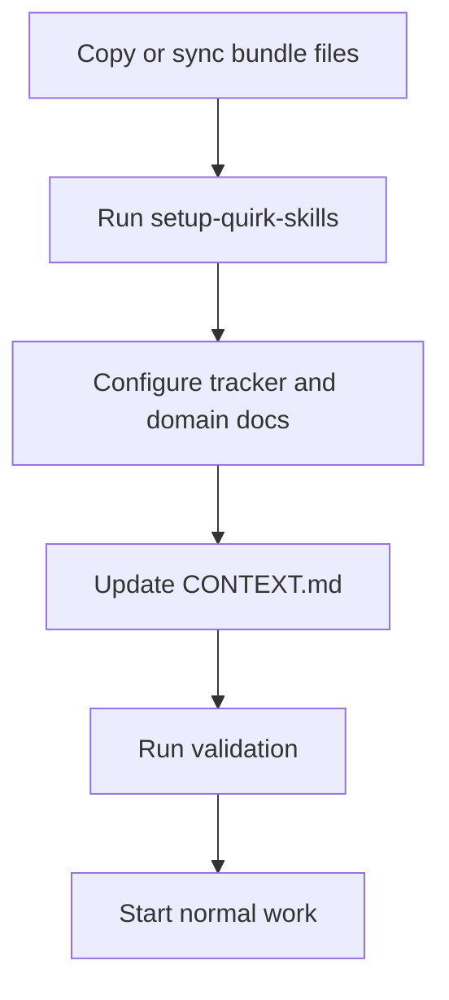
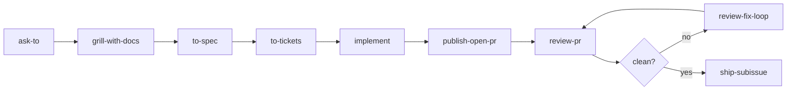
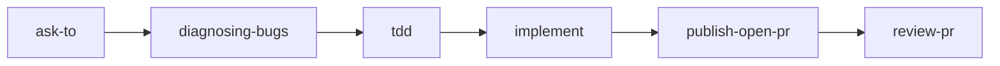
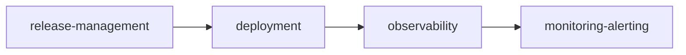

# quirk Skills Adoption Guide

Use this guide to install this skills bundle into a new or existing project repository.

## Adoption Flow



1. Copy or sync `.agents/skills/`, `.claude/skills/`, `docs/agents/`, `docs/adr/README.md`, `CONTEXT.md`, and `skills-lock.json` into the target repo.
2. Run `setup-quirk-skills` once in the target repo.
3. Configure `docs/agents/issue-tracker.md`, `docs/agents/triage-labels.md`, and `docs/agents/domain.md` for the project's real tracker and domain layout.
4. Update `CONTEXT.md` with project-specific language. Do not copy domain vocabulary from another repo.
5. Run `work-item-router` before any workflow skill whenever tracker governance or ownership may have changed.
6. Run the validation commands in this guide.
7. Start normal work through `ask-to` for ambiguous routing or the canonical feature flow for a claimed work item.

## Installation Prompts

The repository `README.md` contains two AI-agnostic prompts:

- Use the greenfield prompt when you are bootstrapping a repository that has no prior local context.
- Use the existing-repo prompt when the target repository already has ADRs, a `CONTEXT.md`, and documentation that must remain untouched.

## Required Repo Files

| File | Purpose |
|---|---|
| `AUTHORSHIP.md` | Authorship, naming, and integrity rules |
| `.agents/skills/` | Canonical skill definitions |
| `.claude/skills/` | Compatibility symlinks to canonical skills |
| `skills-lock.json` | SHA-256 hashes for canonical `SKILL.md` files |
| `docs/agents/index.md` | Governance index for work-item skills |
| `docs/agents/quirk-method.md` | Method vocabulary and quality bar |
| `docs/agents/provenance.md` | Origin, redesign, retired-name record |
| `docs/agents/work-item-format.md` | Metadata shape for specs, tickets, PRs |
| `docs/agents/skill-templates.md` | Artifact template map |
| `CONTEXT.md` | Repository-local domain vocabulary |

## Validation Commands

Run from the target repo root:

```bash
node .agents/skills/platform/check-all.mjs
```

Expected result: `status: "pass"`.

## First Project Run

### Standard feature



### Bug fix



### Operations



## Specialization Rules

- Keep skill names stable unless the target repo has a strong reason to fork them.
- Specialize through `CONTEXT.md`, ADRs, issue tracker docs, validation commands, and stack-specific skills.
- Do not embed another repo's domain terms, branch names, issue numbers, or examples.
- Preserve `AUTHORSHIP.md`, `docs/agents/quirk-method.md`, and `docs/agents/provenance.md` unless intentionally forking the method.
- Add new skills only when the behavior is repeatedly useful and cannot be expressed cleanly through existing skills.
- Prefer scenario fixtures under `evaluate-skill/scenarios/` before changing core workflow skills.
- Treat `compatibility only` skills as transitional. Keep them only when the alias is still used externally, and add a concrete migration or retirement note in provenance before the next release that touches the surrounding area.

## Readiness Checklist

- [ ] `setup-quirk-skills` has run or equivalent docs exist.
- [ ] `CONTEXT.md` names only this repo's domain.
- [ ] `docs/agents/issue-tracker.md` reflects the actual tracker.
- [ ] `docs/agents/triage-labels.md` matches actual label strings.
- [ ] `skills-lock.json` matches all local `SKILL.md` hashes.
- [ ] `.claude/skills` has a symlink for every canonical skill.
- [ ] Scenario evaluation passes.
- [ ] Semantic audit passes.
- [ ] Behavioral fixtures pass.
- [ ] Any real use of the bundle is captured under `case-studies/` when it changes the method.

## Maintenance Cadence

| Check | When to run |
|---|---|
| `check-all.mjs` | After every skill edit |
| `audit-semantics.mjs` | Before publishing the bundle |
| `evaluate-scenarios.mjs` | After changing routing, templates, or workflow skills |
