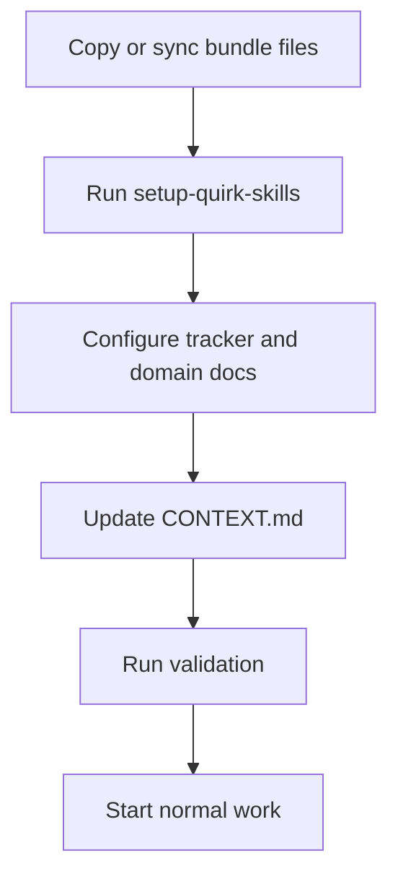
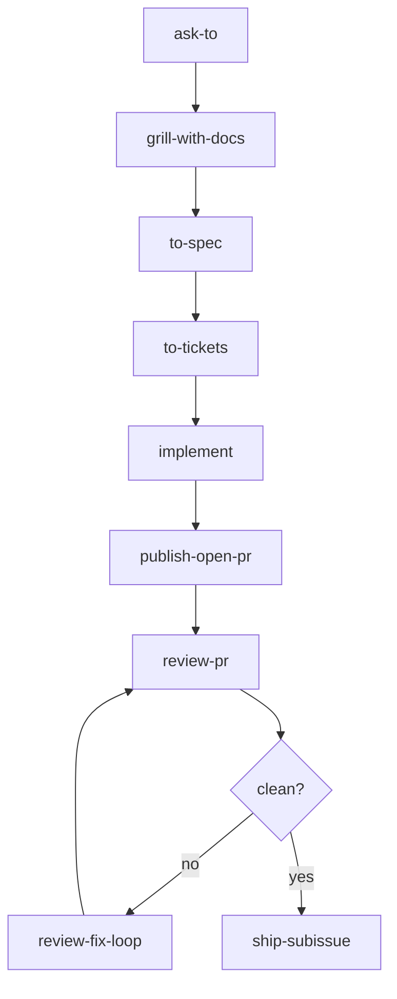
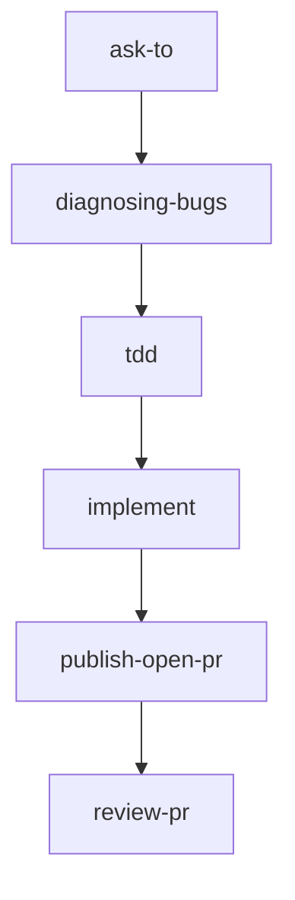
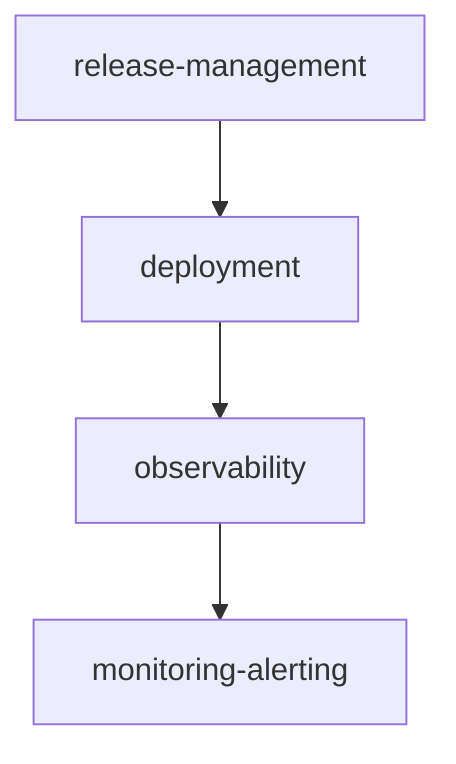

# quirk Skills Adoption Guide

Use this guide to install this skills bundle into a new or existing project repository.

## Adoption Flow


```mermaid
flowchart TD
    A[Copy or sync bundle files] --> B[Run setup-quirk-skills]
    B --> C[Configure tracker and domain docs]
    C --> D[Update CONTEXT.md]
    D --> E[Run validation]
    E --> F[Start normal work]
```

1. Validate the source checkout with `node .agents/skills/platform/check-all.mjs`.
2. For a new target, preview `node .agents/skills/platform/sync-bundle.mjs /path/to/target-repo`, inspect the file plan, then repeat with `--write`. This copies documentation and recreates compatibility symlinks.
3. For an existing target, use the README's existing-repository prompt to update only the skills tree, compatibility symlinks, and lockfile. The sync utility also copies `README.md`, `CONTEXT.md`, and documentation; it is not a skills-only updater. Differing files block by default. `--force` permits overwriting them.
4. Configure `docs/agents/issue-tracker.md`, `docs/agents/triage-labels.md`, and `docs/agents/domain.md` for the project's actual tracker and domain layout.
5. For a new target, specialize `CONTEXT.md` with project-specific language; preserve existing context during synchronization.
6. Invoke `setup-quirk-skills` through the coding agent for repository setup. The similarly named shell script copies files and prompts interactively; it is a separate operation.
7. Run the validation commands below from the target root, then start through `ask-to` or the relevant work-item skill. Run `work-item-router` when tracker governance or ownership changes.

The shell installers copy `.agents/skills/`, `.claude/skills/`, `docs/agents/`, `docs/adr/README.md`, `CONTEXT.md`, and `skills-lock.json`. They replace these target paths and do not copy `skills.json` or `.env.template`. Add optional manifests or environment configuration deliberately when needed.

## Installation Prompts

The repository `README.md` contains two AI-agnostic prompts:

- Use the greenfield prompt when you are bootstrapping a repository that has no prior local context.
- Use the existing-repo prompt when the target repository already has ADRs, a `CONTEXT.md`, and documentation that must remain untouched.

## Required Repo Files

| File | Purpose |
|---|---|
| `AUTHORSHIP.md` | Authorship, naming, and integrity rules |
| `.agents/skills/` | Canonical skill definitions |
| `.claude/skills/` | Compatibility symlinks to canonical skills |
| `skills-lock.json` | SHA-256 hashes for canonical `SKILL.md` files |
| `docs/adr/README.md` | ADR entry point copied by the installation scripts |
| `skills.json` | Optional distribution manifest; not copied by the installers |
| `.env.template` | Optional environment configuration; not copied by the installers |
| `CONTEXT.md` | Repository-local domain vocabulary and project conventions |
| `docs/agents/index.md` | Governance index for work-item skills |
| `docs/agents/quirk-method.md` | Method vocabulary and quality bar |
| `docs/agents/provenance.md` | Origin, redesign, retired-name record |
| `docs/agents/work-item-format.md` | Metadata shape for specs, tickets, PRs |
| `docs/agents/skill-templates.md` | Artifact template map |

## Validation Commands

Run from the target repo root:

```bash
node .agents/skills/platform/check-all.mjs
```

Expected result: `status: "pass"`.

## First Project Run

### Standard feature


```mermaid
flowchart TD
    A[ask-to] --> B[grill-with-docs]
    B --> C[to-spec]
    C --> D[to-tickets]
    D --> E[implement]
    E --> F[publish-open-pr]
    F --> G[review-pr]
    G --> H{clean?}
    H -->|no| I[review-fix-loop]
    I --> G
    H -->|yes| J[ship-subissue]
```

### Bug fix


```mermaid
flowchart TD
    A[ask-to] --> B[diagnosing-bugs]
    B --> C[tdd]
    C --> D[implement]
    D --> E[publish-open-pr]
    E --> F[review-pr]
```

### Operations


```mermaid
flowchart TD
    A[release-management] --> B[deployment]
    B --> C[observability]
    C --> D[monitoring-alerting]
```

## Specialization Rules

- Keep skill names stable unless the target repo has a strong reason to fork them.
- Specialize through `CONTEXT.md`, ADRs, issue tracker docs, validation commands, and stack-specific skills.
- Do not embed another repo's domain terms, branch names, issue numbers, or examples.
- Preserve `AUTHORSHIP.md`, `docs/agents/quirk-method.md`, and `docs/agents/provenance.md` unless intentionally forking the method.
- Add new skills only when the behavior is repeatedly useful and cannot be expressed cleanly through existing skills.
- Prefer scenario fixtures under `evaluate-skill/scenarios/` before changing core workflow skills.
- Treat `compatibility only` skills as transitional. Keep them only when the alias is still used externally, and add a concrete migration or retirement note in provenance before the next release that touches the surrounding area.

## Readiness Checklist

- [ ] `setup-quirk-skills` has run or equivalent docs exist.
- [ ] The project ADR directory exists and records relevant design decisions
- [ ] `CONTEXT.md` exists, names only this repo's domain, and references the project ADR directory
- [ ] `docs/agents/issue-tracker.md` reflects the actual tracker.
- [ ] `docs/agents/triage-labels.md` matches actual label strings.
- [ ] `skills-lock.json` matches all local `SKILL.md` hashes.
- [ ] `.claude/skills` has a symlink for every canonical skill.
- [ ] Scenario evaluation passes.
- [ ] Semantic audit passes.
- [ ] Behavioral fixtures pass.
- [ ] Any real use of the bundle is captured under `tooling/case-studies/` when it changes the method.

## Maintenance Cadence

| Check | When to run |
|---|---|
| `check-all.mjs` | After every skill edit |
| `audit-semantics.mjs` | Before publishing the bundle |
| `evaluate-scenarios.mjs` | After changing routing, templates, or workflow skills |
