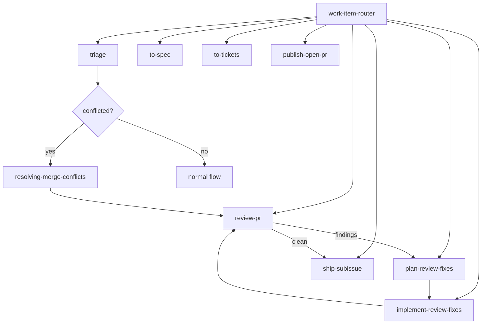

# Agent Skills Index

This repo uses the repository-local quirk Skills bundle in `.agents/skills/`. This index is the operating map for the bundle and the first stop for any work-item or review flow.

## Work item flow

- `work-item-router` reads this index first before any spec, ticket, project board, or publication flow.
- `triage` uses the same index when classifying issues and PRs into durable states.
- `to-spec` and `to-tickets` use the issue tracker configuration and canonical work-item format documented here.
- `review-pr`, `plan-review-fixes`, `implement-review-fixes`, `publish-open-pr`, and `ship-subissue` preserve the same metadata contract.
- If a PR branch is conflicted while review or repair is in progress, branch-state resolution belongs to `resolving-merge-conflicts` before review or shipping resumes.

## Configuration docs

| Document | Purpose |
|---|---|
| [quirk method](quirk-method.md) | Method vocabulary and quality bar |
| [Provenance](provenance.md) | Origin, redesign, retired names |
| [Issue tracker](issue-tracker.md) | Tracker configuration |
| [Work item format](work-item-format.md) | Metadata shape for specs, tickets, PRs |
| [Domain docs](domain.md) | Domain vocabulary layout |
| [Triage labels](triage-labels.md) | Triage label vocabulary |
| [Skills map](skills-map.md) | Full skills inventory |
| [Skill inventory](skill-inventory.md) | Per-skill status table |
| [Slash command map](slash-command-map.md) | Flat alias map |
| [Skill templates](skill-templates.md) | Artifact templates map |
| [Adoption guide](adoption-guide.md) | Installation and sync |
| [Stack matrix](stack-matrix.md) | Stack-specific skills |
| [Skill style guide](skill-style-guide.md) | Editing and authoring rules |
| [Release checklist](release-checklist.md) | Pre/post-release gates |
| [Multi-agent protocol](multi-agent-protocol.md) | Multi-session handoff rules |
| [Provenance inventory](provenance-inventory.md) | Provenance records |
