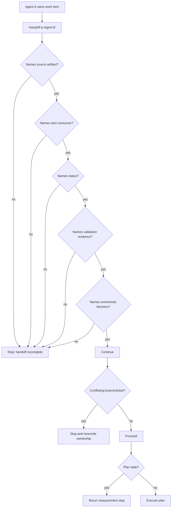

# Multi-agent Protocol

Use this protocol when more than one agent or session works on the same project.

## Rules

- One agent owns one work item at a time.
- Every handoff names the source artifact, next consumer, current status, validation evidence, and unresolved blockers.
- Do not duplicate work already claimed in the tracker.
- Do not merge review, repair, and ship responsibilities into one opaque action.
- A subagent may investigate or review, but the main agent owns final synthesis and user-facing state.
- A work item is not claimable until its owner, scope, and next consumer are recorded in the tracker or handoff artifact.
- If two sessions discover a new overlap not covered by the matrix, pause mutation, record the overlap in `docs/agents/conflict-matrix.md`, and resume only after a primary rule exists.
- If a handoff is incomplete, keep the work with the current owner rather than letting another agent infer intent from the branch name or issue title.

## Standard Handoffs

| Producer | Consumer | Artifact |
|---|---|---|
| `grill-with-docs` | `to-spec` | Clarified decisions, glossary/ADR updates |
| `to-spec` | `to-tickets` | Spec issue |
| `to-tickets` | `implement` | Claimable ticket |
| `implement` | `publish-open-pr` | Validated issue branch |
| `review-pr` | `plan-review-fixes` | Standards and Spec findings |
| `plan-review-fixes` | `implement-review-fixes` | Review Fix Plan PR comment |
| `implement-review-fixes` | `review-pr` | Implementation note and validation |
| `review-pr` | `ship-subissue` | Clean review state |

## Conflict Handling

| Situation | Rule |
|---|---|
| Two agents touch same branch or ticket | Stop and reconcile ownership |
| Plan is stale | Rerun the measurement step before editing |
| Validation fails after repair | Keep PR in review-fix-loop, do not ship |
| New overlap appears and no primary rule exists | Stop routing, update the conflict matrix, then resume with an explicit primary |
