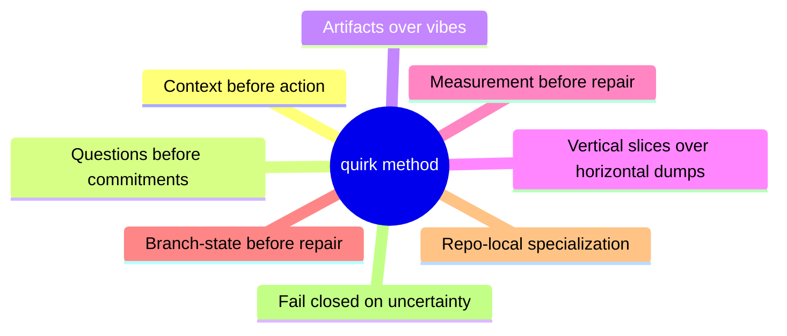
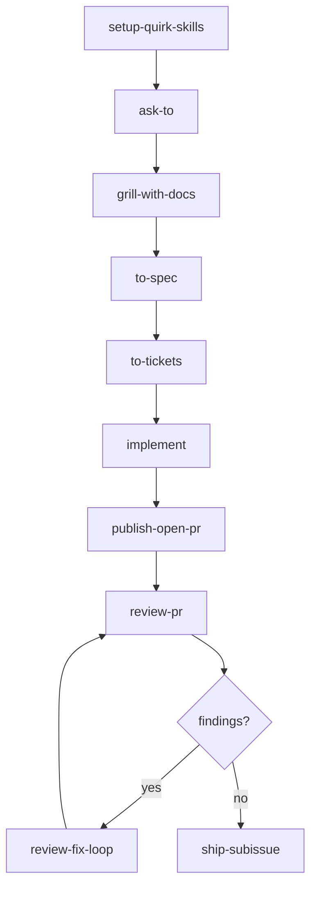

# quirk Method

The `quirk` method is a workflow for agent-assisted project development. It is designed for repositories where work must move from ambiguous intent to reviewed delivery without losing context, widening scope, or hiding risk.

## Principles

- **Context before action.** Build a fresh context pack before broad work. Prefer repo docs, ADRs, issue tracker state, and direct code evidence over memory.
- **Questions before commitments.** Use `grill` or `grill-with-docs` when the work is ambiguous. Decisions are made with the user, not guessed.
- **Artifacts over vibes.** Specs, tickets, PR bodies, review plans, implementation notes, ADRs, and handoffs must be durable enough for another agent to consume later, and each artifact shape should belong to the skill that emits it.
- **Vertical slices over horizontal dumps.** Tickets should be narrow, complete paths through behavior, validation, and delivery.
- **Measurement before repair.** `review-pr` measures Standards and Spec separately. `plan-review-fixes` plans. `implement-review-fixes` executes. `ship-subissue` ships.
- **Branch-state before repair.** If a PR branch is conflicted, resolve that branch-state problem first with `resolving-merge-conflicts`, then return to review and repair.
- **Repo-local specialization.** Each project owns its own domain language, tracker configuration, commands, and risk boundaries.
- **Fail closed on uncertainty.** Missing fixed points, stale plans, unclear issue traceability, unresolved blockers, and skipped validation must be surfaced.

## Vocabulary

| Term | Meaning |
|---|---|
| **Context pack** | A bounded set of fresh reads and provenance for the next skill |
| **Domain language** | The project's chosen terms, recorded in `CONTEXT.md` and ADRs |
| **Seam** | The public boundary where design, implementation, testing, or operations become explicit |
| **Tracer bullet** | A ticket that makes one narrow end-to-end behavior work |
| **Frontier** | Tickets that are unblocked and claimable now |
| **Review axis** | One of two independent review dimensions: Standards or Spec |
| **Repair plan** | A durable PR comment that converts findings into scoped, validated fixes |
| **Ship state** | Review is clean, validation is known, and linked work can be merged or completed |

## Canonical Flow

## Alternate Entry Points

| Skill | When to use |
|---|---|
| `project-development` | Project shape or stack is not yet clear |
| `wayfinder` | Effort is too large for one session |
| `triage` | Raw issues or external PRs need classification |
| `diagnosing-bugs` | Failure needs a tight reproduction loop |
| `nextjs` | Next.js app surface needs sharper constraints |
| `react` | React component structure needs sharper constraints |
| `postgres` | PostgreSQL schema needs sharper constraints |
| `auth` | Auth boundary needs sharper constraints |
| `deployment` | Deployment needs sharper constraints |
| `monitoring-alerting` | Monitoring needs sharper constraints |

## Quality Bar

A quirk artifact is acceptable when it answers:

| Question | Why it matters |
|---|---|
| What is the source of truth? | Prevents drift and duplication |
| What is in scope? | Keeps slices narrow and claimable |
| What is explicitly out of scope? | Surfaces risk early |
| Who or what consumes this artifact next? | Makes handoffs durable |
| What evidence proves it is done? | Enables clean review and ship |
| What risk remains? | Preserves uncertainty for the next step |

If an artifact cannot answer those questions, improve the artifact before routing it downstream.

## Operating Checks

The method is maintained by executable checks:

| Check | Purpose |
|---|---|
| `validate-skills.mjs` | Bundle parity and lock coverage |
| `audit-semantics.mjs` | Semantic drift, retired names, weak templates, links, risk signals |
| `evaluate-scenarios.mjs` | Workflow route expectations |
| `evaluate-behavioral-fixtures.mjs` | Representative artifact shape |
| `check-all.mjs` | Full local gate |

## Terminology Notes

- `work-item-router` is the governance preflight for work-item and review flows.
- `ask-to` is the router for ambiguous routing after governance preflight.
- `grill-with-docs` updates durable docs when a codebase exists.
- `review-fix-loop` coordinates the repair cycle; `ship-subissue` owns merge and closure.
