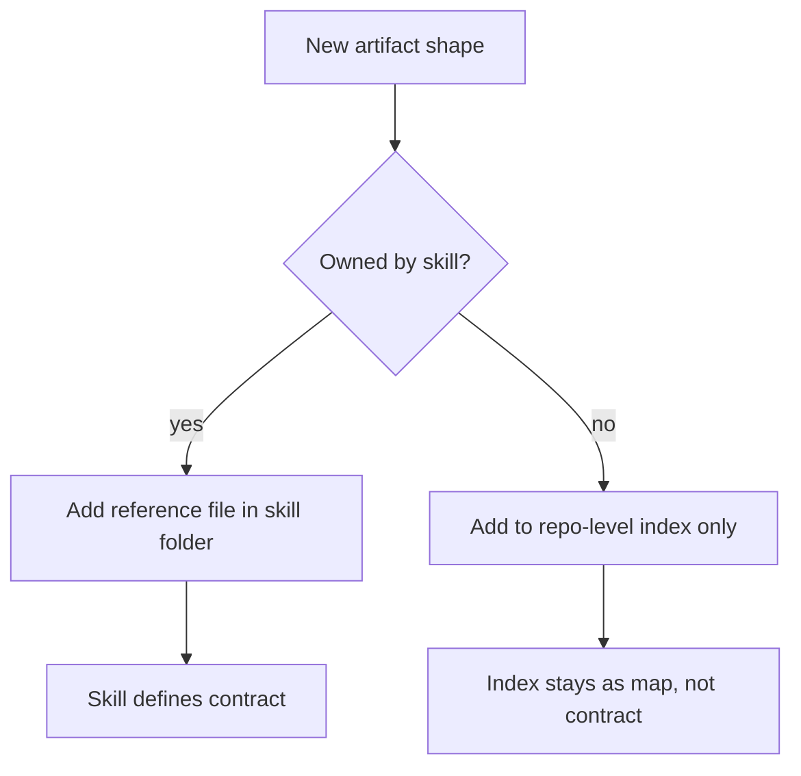

# Skill Templates

Each skill owns the template, examples, and supporting references for the artifact it produces. There is no single universal template that should be copied into every skill.

## How to read this map

- If a skill writes a durable artifact, the template belongs next to that skill.
- If a skill has multiple artifact shapes, it should keep one reference file per artifact shape.
- Shared quality principles live in `docs/agents/quirk-method.md` and `docs/agents/work-item-format.md`.
- `evaluate-skill` owns both `scenarios/` and `behavioral-fixtures/`; scenarios cover route and contract behavior, while behavioral fixtures cover representative artifact shape.
- `skill-creator` and `skill-sandbox` should mirror the same split when generating experimental skills.

## Current template ownership

### Work items and review

| Skill | Artifact | Purpose | Next consumer |
|---|---|---|---|
| `triage` | `AGENT-BRIEF.md`, `OUT-OF-SCOPE.md`, needs-info template | Stable triage state and durable handoff | `implement`, `plan-review-fixes`, or `wontfix` closure |
| `to-spec` | `references/spec-template.md` | Publish a buildable spec issue | `to-tickets` |
| `to-tickets` | `references/issue-template.md` | Split spec into tracer-bullet tickets | `implement` |
| `plan-review-fixes` | `references/review-fix-plan.md` | Convert review findings into a repair plan | `implement-review-fixes` |
| `implement-review-fixes` | `references/implementation-note.md` | Apply the scoped review plan and report completion | `review-pr` again |
| `review-fix-loop` | review-pr, plan-review-fixes, implement-review-fixes handoff | Close the review-repair loop | `ship-subissue` when clean |
| `publish-open-pr` | `references/pr-body.md`, `references/validation.md`, `references/failure-modes.md` | Package a finished branch into a reviewable PR | `review-pr` |

### Setup and structure

| Skill | Artifact | Purpose | Next consumer |
|---|---|---|---|
| `setup-quirk-skills` | seed tracker/domain templates | Configure a repo for quirk workflows | `ask-to`, `triage`, `to-spec` |
| `make-project` | `references/graphql.md` | Create and configure a GitHub Projects board | project users and work-item skills |
| `domain-modeling` | `ADR-FORMAT.md`, `CONTEXT-FORMAT.md` | Record and maintain domain vocabulary | `grill-with-docs`, `triage`, `make-project` |
| `grill-with-docs` | context and ADR updates created during the interview | Sharpen the plan and write durable context | `to-spec`, `implement` |

### Routing and learning

| Skill | Artifact | Purpose | Next consumer |
|---|---|---|---|
| `ask-to` | routing guidance in `SKILL.md` | Choose the next skill path | the user and downstream skill |
| `evaluate-skill` | `scenarios/` and `behavioral-fixtures/` | Prove route behavior and representative artifact shape | `audit-semantics`, `check-all` |
| `writing-great-skills` | glossary and authoring guidance files | Maintain the style and vocabulary of the bundle | skill authors and reviewers |
| `skill-creator` | generated skill skeletons, scenarios, and behavioral fixtures | Scaffold new skills with the correct artifact split | `skill-sandbox`, `skill-testing-framework` |

## Operating rule

When a skill needs a new artifact shape, create a new reference file for that skill instead of expanding a repository-wide template document. Keep the section names that make the artifact scannable and testable, but let the owning skill define the rest.
