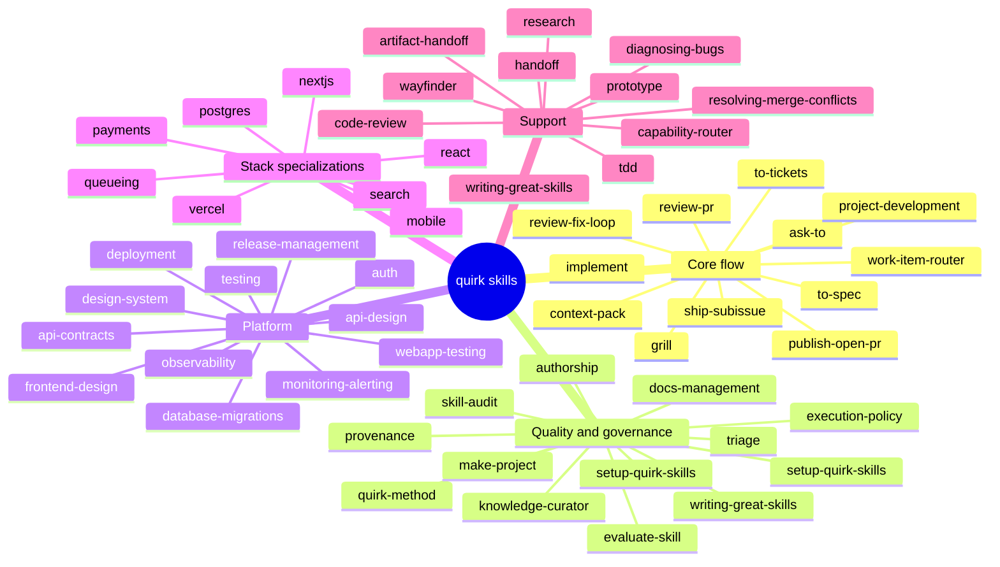

# Skills Map

## Core flow

| Skill | Purpose |
|---|---|
| `ask-to` | Route to the right next step |
| `grill` / `grilling` / `grill-me` / `grill-with-docs` | Sharpen plans through interview |
| `project-development` | Evaluate project shape and starting point |
| `context-pack` | Build a minimal fresh context pack |
| `work-item-router` | Force reading the governance index before routing |
| `domain-modeling` | Build and sharpen domain model |
| `codebase-design` | Design deep modules and seams |
| `to-spec` | Turn conversation into a published spec |
| `to-tickets` | Break plan into tracer-bullet tickets |
| `implement` | Implement work from spec or tickets |
| `publish-open-pr` | Open a PR from an issue branch |
| `review-pr` | Review PR against Standards and Spec axes |
| `review-fix-loop` | Orchestrate review-repair loop |
| `plan-review-fixes` | Convert review findings into a remediation plan |
| `implement-review-fixes` | Apply the planned review fixes |
| `ship-subissue` | Merge clean PR and close linked issue |

Canonical route: `setup-quirk-skills` once per repo, then `ask-to` when routing is unclear. For standard feature work, use `grill-with-docs` -> `to-spec` -> `to-tickets` -> `implement` -> `publish-open-pr` -> `review-pr`. If the review is dirty, `review-fix-loop` coordinates `plan-review-fixes` and `implement-review-fixes` until the PR is clean or blocked. `ship-subissue` owns merge, issue closure, and tracker completion only after a clean review.

## Quality and governance

| Skill | Purpose |
|---|---|
| `AUTHORSHIP.md` | Authorship and integrity rules |
| `docs/agents/quirk-method.md` | Method vocabulary and quality bar |
| `docs/agents/provenance.md` | Origin and redesign status |
| `skill-audit` | Audit bundle, lockfile, symlink parity |
| `evaluate-skill` | Evaluate skill against fixed scenarios |
| `knowledge-curator` | Keep context and ADRs coherent |
| `writing-great-skills` | Vocabulary and principles for skills |
| `execution-policy` | Decide whether a skill action is allowed |
| `docs-management` | Keep docs aligned with project shape |
| `triage` | Classify issues and PRs into durable states |
| `make-project` | Create and configure GitHub Projects |
| `setup-quirk-skills` | Configure repo for quirk workflows |

## Skill Lab

- `skill-template-generator`
- `skill-testing-framework`
- `skill-dependency-graph`
- `rule-cataloger`
- `skill-diff-analyzer`
- `interactive-tutorial-builder`
- `skill-performance-metrics`
- `integration-playground`
- `contribution-workflow-optimizer`

These Skills share the `platform/skill-lab.mjs` command surface and use the
`.skill-sandbox/` directory for experiments before promotion.

## Platform

| Skill | Purpose |
|---|---|
| `frontend-design` | Production-grade frontend interfaces |
| `design-system` | Reusable UI tokens and components |
| `webapp-testing` | Test strategy for web apps |
| `api-design` | Small, durable API seam |
| `api-contracts` | Request/response contracts and versioning |
| `auth` | Authentication and authorization seam |
| `deployment` | Build, release, and rollback seam |
| `release-management` | Release train and CI handoff |
| `monitoring-alerting` | Alerts, dashboards, runtime signals |
| `observability` | Logs, metrics, traces, and alerts |
| `testing` | Test strategy and seams |
| `database-migrations` | Safe schema change sequencing |

## Stack specializations

| Skill | Surface |
|---|---|
| `nextjs` | Next.js routes, server/client seams |
| `react` | React component structure and state |
| `vercel` | Vercel deployment and runtime |
| `postgres` | PostgreSQL schema and queries |
| `search` | Search indexing and relevance |
| `queueing` | Background processing and message flow |
| `mobile` | Device constraints, offline behavior |
| `payments` | Payment flows, reconciliation, rollback |

## New Domain Skills — Promoted from Sandbox (2026-09)

Validated via `skill-lab.mjs validate --json` (33 PASS, 2 FAIL excluded) and promoted to `.agents/skills/` with `.claude/skills/` symlinks.

| Skill | Domain / Subfield |
|---|---|
| `math-pure-proofs` | Pure math proofs (number theory, algebra, analysis) |
| `math-computational` | Numerical / symbolic computation |
| `math-optimization` | Optimization (LP, convex, MIP, combinatorial) |
| `math-linear-algebra` | Decompositions (SVD, eigendecomposition, least squares) |
| `math-probability-models` | Probability distributions, stochastic processes |
| `math-cryptography` | Cryptographic primitives and hardness assumptions |
| `physics-quantum` | Quantum mechanics, Dirac notation, measurement |
| `physics-classical` | Newton / Lagrangian / Hamiltonian mechanics |
| `physics-thermo` | Thermodynamics, cycles, entropy, phase transitions |
| `physics-astro` | Astrophysics, stellar dynamics, cosmology |
| `quant-factors` | Quantitative factor construction (momentum, value, carry) |
| `quant-backtest` | Backtest audit (biases, costs, out-of-sample) |
| `quant-derivatives-pricing` | Options / exotics pricing, Greeks, calibration |
| `quant-portfolio-opt` | Portfolio optimization (mean-variance, risk-parity, factor) |
| `quant-credit-risk` | PD/LGD/EAD, portfolio loss distribution, stress |
| `quant-market-micro` | Microstructure, execution costs, optimal execution |
| `quant-risk-modeling` | VaR / CVaR / drawdown / stress testing |
| `finance-corporate-val` | Corporate valuation (DCF, multiples, sum-of-parts) |
| `finance-dcf` | Discounted cash flow (forecast, WACC, sensitivity) |
| `finance-portfolio-theory` | MPT, CAPM, APT, performance attribution |
| `web3-smart-contracts` | Contract design, security audit, gas, upgrade |
| `web3-tokenomics` | Token economics, issuance, incentives, governance |
| `web3-consensus` | Consensus analysis (PoW, PoS, BFT, finality) |
| `web3-l2-scaling` | Rollups, validiums, DA, throughput / cost |
| `web3-defi` | AMM, lending, stablecoins, composability risk |
| `web3-governance` | On-chain / off-chain governance, voting, attacks |
| `db-relational-design` | Schema, keys, indexes, normalisation, migrations |
| `db-nosql-modeling` | Document / key-value / wide-column / graph / time-series |
| `se-architecture-decisions` | ADR creation, trade-off documentation |
| `cs-algorithms` | Algorithm design, correctness, complexity analysis |
| `scientific-hypothesis` | Hypothesis formulation, variables, statistical plan |
| `docs-adrs` | Architecture Decision Records |
| `pro-market-analysis` | TAM / SAM / SOM, competitive mapping, trends |

Provenance: `docs/agents/provenance.md` section "2026-09 — Sandbox-to-canonical promotion".

## Support

| Skill | Purpose |
|---|---|
| `artifact-handoff` | Transfer structured artifacts between skills |
| `handoff` | Compact conversation into handoff document |
| `prototype` | Build throwaway prototype to answer design question |
| `research` | Investigate a question against primary sources |
| `tdd` | Test-driven development |
| `diagnosing-bugs` | Diagnosis loop for hard bugs |
| `resolving-merge-conflicts` | Resolve conflicted or blocked branch state |
| `capability-router` | Route work by declared capabilities |
| `code-review` | Review changes against Standards and Spec |
| `wayfinder` | Plan huge work as a map of decision tickets |
| `writing-great-skills` | Reference for writing and editing skills |

## New Domain Skills — Second Promotion (Math + Physics specialist) 2026-09

Validated via `skill-lab.mjs validate --json` (15 PASS, 0 FAIL) and promoted to `.agents/skills/` with `.claude/skills/` symlinks.

### Math specialist (7)
| Skill | Domain / Subfield |
|---|---|
| `math-literature-track` | arXiv, MathSciNet, citation alerts |
| `math-formal-proof` | Lean/Coq/Isabelle/Agda proof development |
| `math-computation-reproducible` | SymPy/Mathematica/Magma/Sage/Julia + container |
| `math-teaching-problem-set` | Problem-set / exam design + rubric |
| `math-grant-structure` | NSF/ERC/Simons proposal drafting |
| `math-presentation-beamer` | Beamer / TikZ / speaker notes |
| `math-paper-collaboration` | Overleaf/GitHub collaboration + arXiv package |

### Physics specialist (8)
| Skill | Domain / Subfield |
|---|---|
| `physics-literature-search` | arXiv hep-th/cond-mat/astro-ph + INSPIRE + ADS |
| `physics-experimental-notebook` | Lab notebook / FAIR data / calibration |
| `physics-simulation-setup` | GEANT4, LAMMPS, VASP, QuTiP container |
| `physics-data-analysis-root` | ROOT / pandas / uproot + calibration / errors |
| `physics-writing-revtex` | RevTeX / APS / IOP / AIP formatting |
| `physics-talk-design` | Seminar / poster / public talk |
| `physics-career-postdoc` | Postdoc / faculty / grant applications |
| `physics-reproducibility-archive` | Zenodo DOI + GitHub release + FAIR checklist |

## New Domain Skills — Third Promotion (AI, Security, DevOps, Data, Product) 2026-09

Validated via `skill-lab.mjs validate --json` (19 PASS, 0 FAIL) and promoted to `.agents/skills/` with `.claude/skills/` symlinks.

### AI/ML (4)
| Skill | Subfield |
|---|---|
| `ai-ml-pipeline` | ML pipeline design (data, model, eval, deploy) |
| `ai-prompt-engineering` | LLM prompt design + evaluation |
| `ai-model-evaluation` | Metrics, fairness, robustness, explainability |
| `ai-time-series-forecasting` | Forecasting (ARIMA, Prophet, LSTM, Transformer) |

### Security (4)
| Skill | Subfield |
|---|---|
| `sec-security-audit` | Code / dependency / secret audit |
| `sec-threat-modeling` | STRIDE / ATT&CK threat modeling |
| `sec-privacy-engineering` | GDPR / CCPA / HIPAA compliance design |
| `sec-cryptography-applied` | Encryption, signatures, key management, TLS |

### DevOps (5)
| Skill | Subfield |
|---|---|
| `devops-k8s-orchestration` | Kubernetes architecture & policies |
| `devops-ci-cd-pipeline` | CI/CD pipeline design & rollback |
| `devops-sre-observability` | SLIs, SLOs, dashboards, alerts, runbooks |
| `devops-terraform-iac` | Infrastructure as Code |
| `devops-feature-flags` | Feature flags, rollouts, kill switches |

### Data Engineering (3)
| Skill | Subfield |
|---|---|
| `data-etl-pipeline` | ETL / ELT design |
| `data-warehouse-modeling` | Star / snowflake / OBT schemas |
| `data-streaming` | Kafka / Kinesis / Flink streaming |

### Product (3)
| Skill | Subfield |
|---|---|
| `prod-prd-writing` | PRD, user stories, acceptance criteria |
| `prod-ab-testing` | A/B test design (power, metrics, rollback) |
| `prod-okr-planning` | OKR cycles (objectives, key results, initiatives) |
