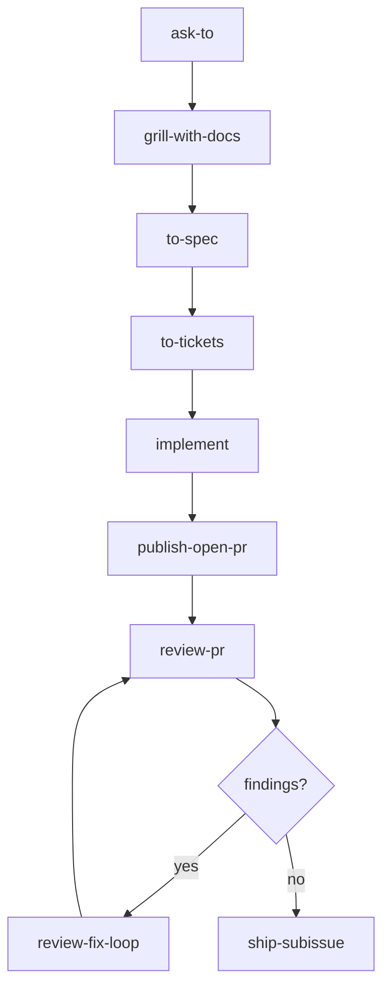
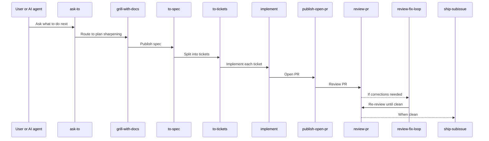
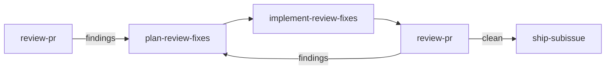
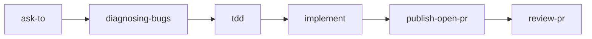
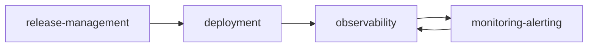
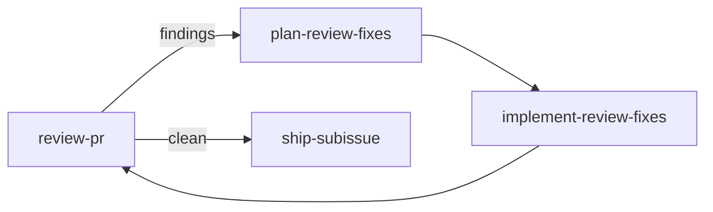
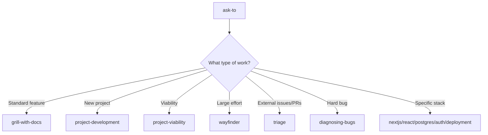
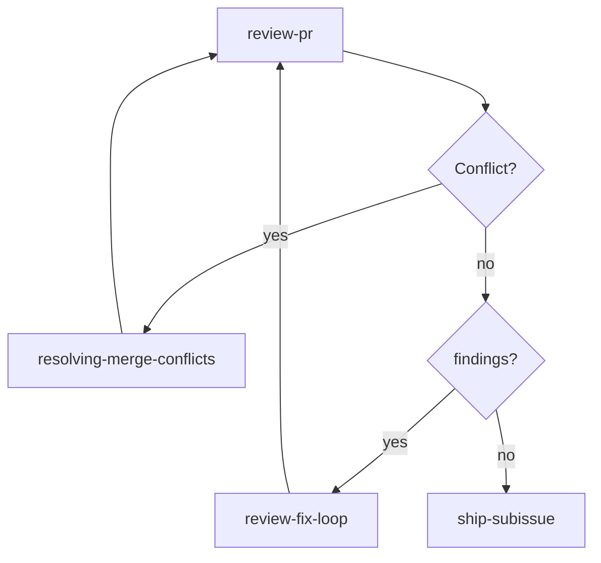

# Workflows — Workflow Guide

> Complete documentation of the workflows in the quirk Skills repository.  
> Skill names and code are presented in English. All explanatory content is in English.

---

## Table of Contents

1. [Overview](#overview)
2. [Standard feature flow](#standard-feature-flow)
3. [Bug fix flow](#bug-fix-flow)
4. [Operations flow](#operations-flow)
5. [Work-items governance preflight](#work-items-governance-preflight)
6. [Routing and clarification](#routing-and-clarification)
7. [Specification and tickets](#specification-and-tickets)
8. [Implementation](#implementation)
9. [Review and repair](#review-and-repair)
10. [Shipping](#shipping)
11. [Alternative entry points](#alternative-entry-points)
12. [Branch conflict resolution](#branch-conflict-resolution)

---

## Overview

The `quirk` method prescribes: **clarify before building**, **preserve context**, **divide work into claimable slices**, **review against the Standards and Spec axes separately**, **repair with an explicit plan**, and **merge only with clean evidence**.

The workflows are designed to move work from ambiguous intent to validated delivery without losing context, expanding scope, or hiding risks.

### Guiding Principles

| Principle | Description |
|---|---|
| **Context before action** | Build a fresh context pack before broad work. Prefer repo docs, ADRs, issue tracker state, and direct code evidence over memory. |
| **Questions before commitments** | Use `grill` or `grill-with-docs` when work is ambiguous. Decisions are made with the user, not guessed. |
| **Artifacts over vibes** | Specs, tickets, PR bodies, review plans, implementation notes, ADRs, and handoffs must be durable so another agent can consume them afterward. |
| **Vertical slices over horizontal dumps** | Tickets should be narrow, end-to-end paths through behavior, validation, and delivery. |
| **Measurement before repair** | `review-pr` measures Standards and Spec separately. `plan-review-fixes` plans. `implement-review-fixes` executes. `ship-subissue` ships. |
| **Branch state before repair** | If a PR branch is in conflict, resolve that branch state issue first with `resolving-merge-conflicts`, then return to review and repair. |
| **Repo-local specialization** | Each project owns its own domain language, tracker configuration, commands, and risk boundaries. |
| **Close on uncertainty** | Missing fixed points, obsolete plans, unclear issue traceability, unresolved blockers, and skipped validation must be surfaced. |

---

## Standard feature flow

This is the canonical flow for new feature work. It follows the quirk method from initial clarification to validated delivery.

### Flowchart

### Sequence diagram

### Flow steps

| Step | Skill | Purpose | When to use it | What it produces | What comes next |
|---|---|---|---|---|---|
| 1 | `ask-to` | Route to the next correct step | When routing is ambiguous or the request is not a claimed work item | Routing decision | `grill-with-docs` |
| 2 | `grill-with-docs` | Sharpen plans through interview | When work is ambiguous and a codebase exists | Updated documentation + sharpened plan | `to-spec` |
| 3 | `to-spec` | Convert conversation into a published spec | After clarification | Spec published in the issue tracker | `to-tickets` |
| 4 | `to-tickets` | Split plan into tracer-bullet tickets | After the spec | Claimable and blocked tickets | `implement` |
| 5 | `implement` | Implement work from spec or tickets | When a clear plan exists | Implemented code + tests | `publish-open-pr` |
| 6 | `publish-open-pr` | Open PR from issue branch | After implementation | Opened pull request | `review-pr` |
| 7 | `review-pr` | Review PR against Standards and Spec axes | Always after opening PR | Review findings or clean signal | `review-fix-loop` or `ship-subissue` |
| 8 | `review-fix-loop` | Orchestrate repair cycle | When review has findings | Plan-repair-execution cycle | `review-pr` |
| 9 | `ship-subissue` | Merge clean PR and close linked issue | When review is clean | Merge + issue closure | End of flow |

### Review and repair cycle

If `review-pr` finds issues, the flow enters the repair cycle:

| Step | Skill | Purpose | What it produces |
|---|---|---|---|
| Plan | `plan-review-fixes` | Convert review findings into a remediation plan | Correction plan published as PR comment |
| Implement | `implement-review-fixes` | Apply the planned corrections | Fixed code |
| Re-verify | `review-pr` | Review PR again | Clean findings or new corrections |

---

## Bug fix flow

This flow focuses on diagnosing and fixing bugs iteratively, ideal for hard-to-reproduce or intermittent failures.

### Flowchart

### Flow steps

| Step | Skill | Purpose | When to use it | What it produces | What comes next |
|---|---|---|---|---|---|
| 1 | `ask-to` | Route to the fix flow | When a bug is reported | Routing decision | `diagnosing-bugs` |
| 2 | `diagnosing-bugs` | Diagnostic loop for hard bugs | When the bug is intermittent, ambiguous, or hard to reproduce | Diagnosis with reproduction | `tdd` |
| 3 | `tdd` | Test-driven development | When a diagnosis exists | Failing tests + solution design | `implement` |
| 4 | `implement` | Implement the fix | When failing tests exist | Implemented fix | `publish-open-pr` |
| 5 | `publish-open-pr` | Open PR | After implementation | Pull request | `review-pr` |
| 6 | `review-pr` | Review PR | Always | Findings or clean signal | `review-fix-loop` or `ship-subissue` |

> **Note**: After `review-pr`, if there are findings, use `review-fix-loop` before `ship-subissue`.

---

## Operations flow

This flow covers release, deployment, and monitoring activities. It is a continuous flow rather than one with defined start and end points.

### Flowchart

### Flow steps

| Step | Skill | Purpose | When to use it | What it produces |
|---|---|---|---|---|
| 1 | `release-management` | Plan the release train and CI handoff | Before each release | Release plan, deployment gates |
| 2 | `deployment` | Define how the project is built, released, and rolled back | During setup or infrastructure changes | Operational deployment seam |
| 3 | `observability` | Define logs, metrics, traces, and alerts | During system design | SLIs, SLOs, dashboards, alert rules |
| 4 | `monitoring-alerting` | Monitor system in production | Continuously | Alerts, runbooks, dashboards |

> **Note**: This flow is cyclical. `observability` feeds `monitoring-alerting`, which in turn can detect the need for a new `deployment` or `release-management`.

---

## Work-items governance preflight

Before any work-item flow or review, `work-item-router` acts as the governance preflight.

### What is `work-item-router`?

`work-item-router` forces reading the governance index before routing specs, tickets, project boards, or publication flows.

### Purpose

- Verify that the issue tracker and ownership have been configured correctly
- Read the governance index (`../reference/agents/index.md`) before any work-item flow
- Ensure that triage labels, work-item format, and tracker configuration are up to date

### When to use it

- Before any work-item flow (`to-spec`, `to-tickets`, `review-pr`, etc.)
- When tracker governance or ownership may have changed
- At the start of a new work session

### What it produces

- Confirmed reading of the governance index
- Tracker configuration validation
- Fresh context for the next skill

### What comes next

After `work-item-router`, the flow continues with `ask-to` for ambiguous routing or directly with the flow-specific skill.

---

## Routing and clarification

### `ask-to`

**Purpose**: Route to the next correct step when routing is ambiguous or the request is not a claimed work item.

**When to use it**:
- When the user asks "what do I do now?"
- When the request does not fit a known work-item flow
- After `work-item-router` when the next step is not clear

**What it produces**: Routing decision to the appropriate skill.

**What comes next**: The routed skill (typically `grill-with-docs` for feature work).

### `grill-with-docs`

**Purpose**: Sharpen plans through interview and update durable documentation when a codebase exists.

**When to use it**:
- When work is ambiguous and needs clarification
- When a codebase exists and durable docs must be updated
- Before creating a spec or plan

**What it produces**:
- Updated documentation (ADRs, domain docs)
- Sharpened plan with explicit decisions
- Preserved context for the next step

**What comes next**: `to-spec` to convert the sharpened plan into a published specification.

> **Note**: `grill-with-docs` is the codebase-oriented version of `grill`. Use `grill` when there is no existing codebase or when a lighter approach is desired.

---

## Specification and tickets

### `to-spec`

**Purpose**: Convert the current conversation into a specification published in the issue tracker.

**When to use it**:
- After `grill-with-docs` when the plan is sharpened
- When a durable specification is needed before splitting the work

**What it produces**: Specification published in the issue tracker with:
- Context and objective
- Explicit scope (in and out)
- Acceptance criteria
- Handoff traces for the next consumer

**What comes next**: `to-tickets` to split the specification into traceable tickets.

### `to-tickets`

**Purpose**: Split a plan, spec, or conversation into a set of tracer-bullet tickets, each declaring its blocking edges.

**When to use it**:
- After `to-spec` when a specification exists
- When work needs to be split into claimable slices

**What it produces**: Tracer-bullet tickets with:
- Narrow and end-to-end scope
- Explicit dependencies
- "Done" criteria
- Blocked/unblocked states

**What comes next**: `implement` to implement each ticket individually.

---

## Implementation

### `implement`

**Purpose**: Implement work from a spec or set of tickets.

**When to use it**:
- When a clear plan exists (spec or tickets)
- For each individual ticket in the flow

**What it produces**:
- Implemented code
- Associated tests
- Local validation

**What comes next**: `publish-open-pr` to open a pull request.

### `publish-open-pr`

**Purpose**: Publish a pull request from an already-prepared issue branch.

**When to use it**:
- After `implement` when work is ready for review
- When an issue branch is clean

**What it produces**: Opened pull request with:
- Change description
- Validation evidence
- References to linked issues/tickets

**What comes next**: `review-pr` to review the PR.

---

## Review and repair

### `review-pr`

**Purpose**: Review changes since a fixed point against two separate axes: Standards and Spec.

**When to use it**:
- Always after `publish-open-pr`
- After `implement-review-fixes` in the repair cycle

**What it produces**: Review findings classified as:
- **Standards**: Code conventions, style, security, performance
- **Spec**: Compliance with specification, acceptance criteria

**What comes next**:
- If there are findings → `review-fix-loop`
- If clean → `ship-subissue`

### `plan-review-fixes`

**Purpose**: Convert `review-pr` findings into a concrete remediation plan and publish it as a PR comment.

**When to use it**:
- When `review-pr` finds findings
- Within the `review-fix-loop` cycle

**What it produces**: Correction plan published as PR comment with:
- Findings list
- Planned corrections
- Estimated effort

**What comes next**: `implement-review-fixes` to execute the plan.

### `implement-review-fixes`

**Purpose**: Apply the corrections planned by `plan-review-fixes`.

**When to use it**:
- After `plan-review-fixes`
- Within the `review-fix-loop` cycle

**What it produces**: Code corrected according to the plan.

**What comes next**: `review-pr` to re-review the PR.

### `review-fix-loop`

**Purpose**: Orchestrate the PR repair cycle until it is clean or blocked.

**When to use it**:
- When `review-pr` finds findings
- Coordinates `plan-review-fixes` and `implement-review-fixes`

**What it produces**: Plan-repair-execution-review cycle until:
- Clean PR → `ship-subissue`
- Unresolvable blocker → stop with evidence

**Cycle diagram**:

---

## Shipping

### `ship-subissue`

**Purpose**: Merge clean PR, mark as completed, and close the linked issue — with release discipline.

**When to use it**:
- Only after clean `review-pr`
- Only when validation is known and green

**What it produces**:
- PR merge
- Linked issue closure
- Project tracker update
- Release notes if applicable

**What comes next**: End of flow, or new flow for the next work item.

> **Important**: `ship-subissue` is the only skill that can merge and close issues. Review must not be skipped.

---

## Alternative entry points

In addition to the standard feature flow, there are alternative entry points for specific situations:

| Skill | When to use it | Purpose |
|---|---|---|
| `project-development` | The project shape or stack is unclear | Evaluate project shape, agent fit, and architectural starting point |
| `project-viability` | A structured assessment of health, architecture, and scalability is needed | Analyze codebase against `CONTEXT.md` and ADRs before committing more work |
| `wayfinder` | The effort is too large for one session | Plan large chunk of work as a map of decision tickets on the issue tracker |
| `triage` | External issues or PRs need classification | Move external issues and PRs through a state machine of triage roles |
| `diagnosing-bugs` | A failure needs a tight reproduction loop | Diagnosis loop for hard bugs and performance regressions |
| `nextjs` | Next.js app surface needs clearer seams | Shape Next.js projects around routes, server/client seams, data flow |
| `react` | React component structure needs clearer seams | Design React component structure and state seams |
| `postgres` | PostgreSQL schema needs clearer seams | Shape PostgreSQL schema and query decisions |
| `auth` | Auth boundary needs clearer seams | Design authentication/authorization as an explicit seam |
| `deployment` | Deployment needs clearer seams | Define how the project is built, released, and rolled back |
| `monitoring-alerting` | Monitoring needs clearer seams | Production monitoring with alerts and runbooks |

### Entry points diagram

---

## Branch conflict resolution

### `resolving-merge-conflicts`

**Purpose**: Resolve blocked or conflicting branch state — in-progress merge/rebase conflicts, PR branch corrections, or other branch-state blockers that need deliberate resolution.

**When to use it**:
- When a PR branch is in conflict during review or repair
- When merge/rebase is blocked
- When conflicts need to be resolved before continuing review or shipping

**What it produces**:
- Resolved branch state
- Solved merge/rebase conflict
- Branch ready to continue with review or shipping

**What comes next**:
- Return to `review-pr` to continue review
- Then `review-fix-loop` if there are findings
- Finally `ship-subissue` when clean

### Branch state rule

> **Critical rule**: If a PR branch is in conflict while review or repair is in progress, branch state resolution belongs to `resolving-merge-conflicts` before review or shipping continues.

### Conflict flowchart

---

## Quick reference table

| Flow | Input | Output |
|---|---|---|
| **Standard** | `ask-to` → `grill-with-docs` → `to-spec` → `to-tickets` → `implement` → `publish-open-pr` → `review-pr` → `ship-subissue` | Feature merged and delivered |
| **Bug fix** | `ask-to` → `diagnosing-bugs` → `tdd` → `implement` → `publish-open-pr` → `review-pr` → `ship-subissue` | Bug fixed and delivered |
| **Operations** | `release-management` → `deployment` → `observability` → `monitoring-alerting` | System operational and monitored |
| **Repair** | `review-pr` → `plan-review-fixes` → `implement-review-fixes` → `review-pr` | Clean PR for shipping |
| **Conflict** | Any flow → `resolving-merge-conflicts` → continue flow | Branch resolved |

---

## Quality bar

A quirk artifact is acceptable when it answers:

| Question | Why it matters |
|---|---|
| What is the source of truth? | Prevents drift and duplication |
| What is in scope? | Keeps slices narrow and claimable |
| What is explicitly out of scope? | Surfaces risk early |
| Who or what consumes this artifact afterward? | Makes handoffs durable |
| What evidence proves it is done? | Enables clean review and shipping |
| What risk remains? | Preserves uncertainty for the next step |

If an artifact cannot answer these questions, improve the artifact before routing it downstream.

---

## Navigation

- [Back to documentation index](../../README.md)
- [quirk Method](../explanation/quirk-method.md)
- [Skills Map](../reference/agents/skills-map.md)
- [Agent Skills Index](../reference/agents/index.md)
- [Adoption Guide](../reference/agents/index.md)
