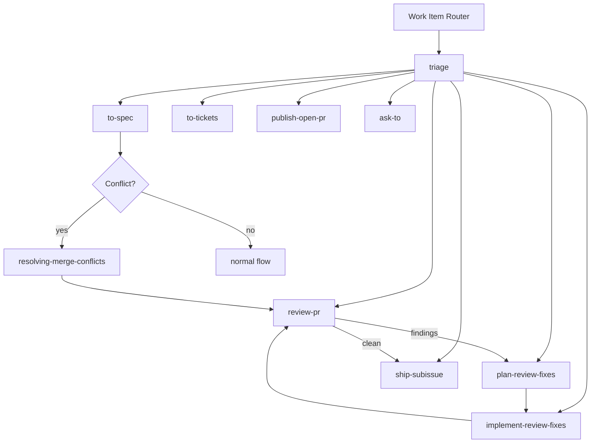
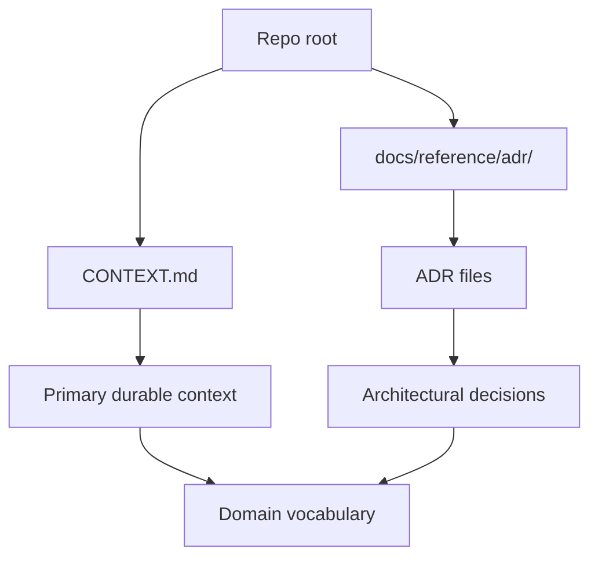
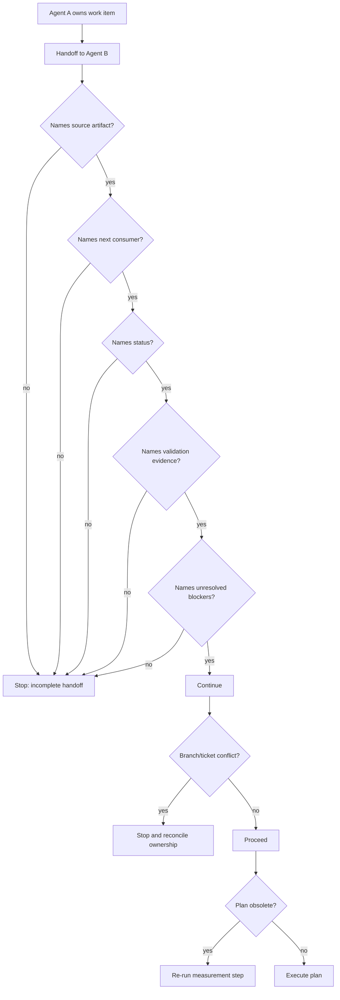
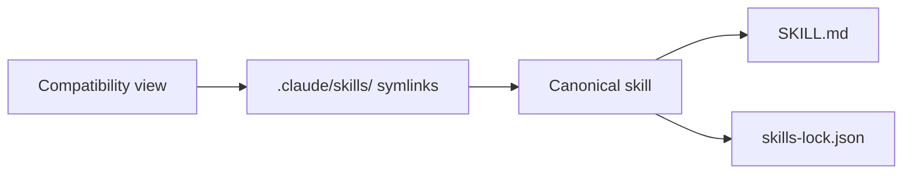

# Work-Item Governance

> Reference document for work-item governance in the **quirk Skills** repository (quantumquirkxyz/skills-quirk).
> This document consolidates the issue tracker configuration, work-item format, triage labels, domain documentation layout, governance index, and multi-agent protocol.

---

## 1. Work-Item Governance Overview

Work-item governance in quirk Skills defines how work items are created, routed, triaged, implemented, reviewed, and published throughout their lifecycle. The system rests on three pillars:

1. **Issue tracker as source of truth**: GitHub Issues is the canonical registry for specs, tickets, and linked PRs.
2. **Canonical metadata format**: Every work-item (spec, ticket, PR) follows a uniform metadata structure.
3. **Multi-agent protocol**: Explicit handoff rules, session boundaries, and evidence logging when multiple agents collaborate on the same project.

The general governance flow follows this diagram:

---

## 2. Issue Tracker Configuration

The issue tracker for this repository is **GitHub Issues** at quantumquirkxyz/skills-quirk.

### 2.1 Tools

- **Issue creation and update**: the gh issue command is used.
- **PR publishing and review metadata**: the gh pr command is used.

### 2.2 Workflow

- Issues are created and updated via gh issue.
- Linked work-items are published in issue order when a skill requires tracker-backed handoff.
- PRs are managed with gh pr for publishing and review metadata when a skill delivers work to code review or submission.

### 2.3 Default Values

| Work-item type | Default labels |
|---|---|
| Specs | spec, ready-for-agent |
| Tickets | ready-for-agent + justified labels inherited from the parent spec or issue |

Milestones, project items, and custom fields must align with the canonical work-item format.

### 2.4 Wayfinding Operations

| Skill | Operation |
|---|---|
| to-spec | Publishes a spec issue. |
| to-tickets | Publishes tracer-bullet tickets with explicit blockers. |
| publish-open-pr | Publishes a prepared branch as a PR. |
| ship-subissue | Merges a clean subissue PR and closes the linked issue when necessary. |

> **Note**: PRs are not treated as a general request surface unless a skill explicitly indicates so.

---

## 3. Work-Item Format

Canonical metadata form for specs, tickets, and linked PRs.

### 3.1 Metadata Fields

| Field | Description |
|---|---|
| labels | Issue tracker labels. |
| milestone | Associated milestone. |
| project | Associated project item. |
| fields.work_type | Work type (e.g., Epic, Feature, Bug). |
| fields.repo_scope | Affected repository scope. |
| fields.phase | Current work-item phase. |
| fields.priority | Priority. |
| fields.risk | Risk level. |
| fields.sprint | Associated sprint. |
| fields.release_train | Release train. |
| todo | Pending task list. |

### 3.2 Rules

- **Specs** default to spec and ready-for-agent with fields.work_type = Epic.
- **Tickets** default to ready-for-agent plus justified labels inherited from the parent spec or issue.
- Linked issue or PR metadata is preserved as source of truth.
- Conflicting tracker metadata is not invented in downstream comments or handoff notes.

### 3.3 Tracker Coupling

| Skill | Role in format |
|---|---|
| to-spec | Writes the spec using this form. |
| to-tickets | Preserves this form in each ticket. |
| plan-review-fixes | Maintains the same metadata aligned with the review loop. |
| implement-review-fixes | Maintains the same metadata aligned with the review loop. |

---

## 4. Triage Labels

Canonical triage labels represent stable roles in the workflow. The real string mapping from the tracker should be used for these roles, keeping it stable in this repository.

| Canonical role | Purpose |
|---|---|
| bug | Confirmed defect. |
| enhancement | Improvement or new functionality. |
| needs-triage | Pending initial classification. |
| needs-info | Requires additional information from the requester. |
| ready-for-agent | Ready for an agent to process. |
| ready-for-human | Ready for human review or action. |
| wontfix | Will not be implemented. |

---

## 5. Domain Documentation Layout

Durable domain documentation is organized in three canonical locations:

### 5.1 CONTEXT.md at the root

CONTEXT.md is the primary durable context file. It must remain at the repository root and contain:

- Local domain vocabulary.
- Project boundaries.
- Naming conventions.
- Maintenance rules.

> **Maintenance Rule:** This file is required. It must name the local domain vocabulary, project boundaries, and naming conventions. Skills must reference this context and avoid vocabulary from unrelated repositories.

### 5.2 docs/reference/adr/ for ADRs

Architecture Decision Records (ADRs) are stored under docs/reference/adr/ when the repository adopts formal architectural decisions. Each ADR documents:

- Decision context.
- Considered alternatives.
- Consequences of the adopted decision.

### 5.3 docs/reference/agents/ for method documentation

The quirk method documentation (tracker configuration, work-item format, triage labels, multi-agent protocol, etc.) resides in docs/reference/agents/. This is the reference documentation that workflow skills consult before acting.

### 5.4 Consumption Rules

- Read durable documents before tactical ticket or implementation details when a skill depends on project vocabulary.
- Maintain CONTEXT.md as the primary source of truth for project context.
- This repository currently uses a single context rather than multiple context partitions.

---

## 6. Governance Index

The ../reference/agents/index.md file is the operational map of the skills bundle and the first stop after work-item-router for any work-item flow or review.

### 6.1 Work-item flow

| Skill | Role |
|---|---|
| work-item-router | Reads this index first before any spec, ticket, project board, or publication flow. |
| triage | Uses this index when classifying issues and PRs into durable states. |
| to-spec | Uses tracker configuration and canonical work-item format. |
| to-tickets | Preserves the same metadata form in each ticket. |
| review-pr | Evaluates against the user-provided fixed point, separating Standards and Spec findings. |
| plan-review-fixes | Converts review findings into a concrete remediation plan. |
| implement-review-fixes | Applies the planned corrections. |
| publish-open-pr | Publishes a finished branch as an open PR. |
| ship-subissue | Merges a clean PR and closes the linked issue. |
| ask-to | User-oriented path selector after governance preflight. |

If a PR has conflicts during review or repair, branch state resolution belongs to resolving-merge-conflicts before review or submission resumes.

### 6.2 Configuration documents

| Document | Purpose |
|---|---|
| quirk Method | Method vocabulary and quality bar |
| Provenance | Origin, redesign, retired names |
| Issue tracker | Tracker configuration |
| Work item format | Metadata form for specs, tickets, PRs |
| Domain docs | Domain vocabulary layout |
| Triage labels | Triage label vocabulary |
| Skills map | Complete skills inventory |
| Skill inventory | Per-skill status table |
| Slash command map | Flat alias map |
| Skill templates | Artifact template map |
| Adoption guide | Installation and synchronization |
| Stack matrix | Stack-specific skills |
| Skill style guide | Editing and authoring rules |
| Release checklist | Pre/post release gates |
| Multi-agent protocol | Multi-session handoff rules |
| Provenance inventory | Provenance records |

---

## 7. Multi-Agent Protocol

Use this protocol when more than one agent or session works on the same project.

### 7.1 Handoff Rules

- An agent **owns one work item at a time**.
- Every handoff must name: source artifact, next consumer, current status, validation evidence, and unresolved blockers.
- Do not duplicate work already claimed in the tracker.
- Do not merge review, repair, and submission responsibilities into an opaque action.
- A subagent may investigate or review, but the main agent owns the final synthesis and user-facing status.
- A work item is not claimable until its owner, scope, and next consumer are registered in the tracker or handoff artifact.
- If two sessions discover new overlap not covered by the matrix, pause mutation, log the overlap in ../reference/agents/conflict-matrix.md, and resume only after an explicit primary rule exists.
- If a handoff is incomplete, keep the work with the current owner rather than allow another agent to infer intent from the branch name or issue title.

### 7.2 Standard Handoffs

| Producer | Consumer | Artifact |
|---|---|---|
| grill-with-docs | to-spec | Clarified decisions, glossary/ADR updates |
| to-spec | to-tickets | Spec issue |
| to-tickets | implement | Claimable ticket |
| implement | publish-open-pr | Validated issue branch |
| review-pr | plan-review-fixes | Standards and Spec findings |
| plan-review-fixes | implement-review-fixes | PR Review Fix Plan comment |
| implement-review-fixes | review-pr | Implementation note and validation |
| review-pr | ship-subissue | Clean review status |

### 7.3 Session Boundaries

- Each agent session must end with an explicit handoff or registered claimable state.
- If a session ends without handoff, the work-item remains with the last known owner.
- State continuity between sessions must not be assumed without a valid handoff artifact.

### 7.4 Evidence Logging

- Every handoff must include validation evidence (logs, test results, passed checks).
- Review findings (review-pr) are logged as PR comments with separate Standards and Spec labels.
- Remediation plans (plan-review-fixes) are logged as structured PR comments.
- Implemented fixes (implement-review-fixes) are logged as implementation notes with attached validation.

### 7.5 Conflict Handling

| Situation | Rule |
|---|---|
| Two agents touch the same branch or ticket | Stop and reconcile ownership |
| The plan is obsolete | Re-run the measurement step before editing |
| Validation fails after repair | Keep the PR in review-fix-loop, do not submit |
| New overlap appears and no primary rule exists | Stop routing, update the conflict matrix, then resume with an explicit primary rule |

---

## 8. Work-Item Routing Rules

Work-item routing in quirk Skills follows these rules:

1. **Governance preflight**: Before any action, work-item-router reads the governance index (../reference/agents/index.md) to determine the appropriate skill.
2. **Triage as entry gate**: Every new issue or PR passes through triage, which classifies the item into a durable state using canonical labels.
3. **Spec first**: If the work lacks a clear spec, the flow directs to to-spec to create one.
4. **Derived tickets**: An approved spec is decomposed into tickets via to-tickets, each with explicit blockers.
5. **Implementation and review**: Tickets are implemented, reviewed, and repaired following the loop review-pr -> plan-review-fixes -> implement-review-fixes until a clean review is obtained.
6. **Publication and shipping**: A clean work-item is published as a PR (publish-open-pr) and shipped (ship-subissue) after merge.
7. **Conflict resolution**: If branch conflicts arise during the flow, resolving-merge-conflicts intervenes before continuing.
8. **Path selector**: ask-to is the user-oriented interface for choosing the appropriate skill or flow when the next step is not obvious.

> **Tracker coupling rule**: All work-items created or modified by skills must maintain tracker metadata as source of truth. Conflicting metadata must not be invented in comments or handoff notes.

---

## 9. Relationship with the Skills Bundle

The canonical skills bundle resides in .agents/skills/. The compatibility view in .claude/skills/ exposes the same skills as symlinks for consumers expecting that layout.

Workflow skills are those that modify state in the issue tracker or repository. Their operational authority is declared in their metadata and audited through the protocol described in this document.

---

*Last updated: this document consolidates work-item governance from ../reference/agents/issue-tracker.md, ../reference/agents/work-item-format.md, ../reference/agents/triage-labels.md, ../reference/agents/domain.md, ../reference/agents/index.md, and ../reference/agents/multi-agent-protocol.md.*
