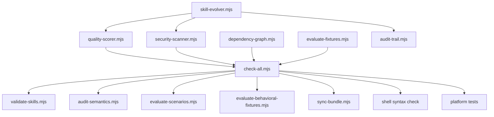
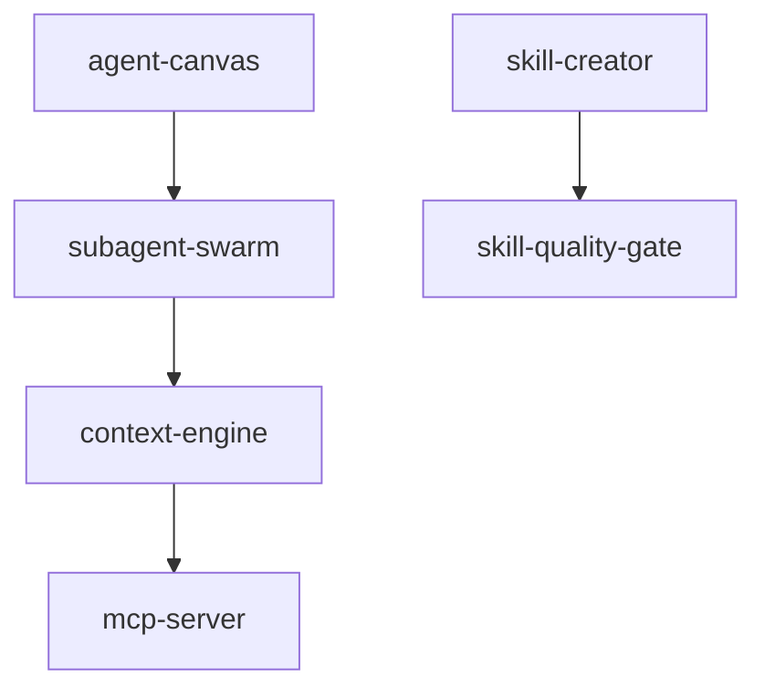
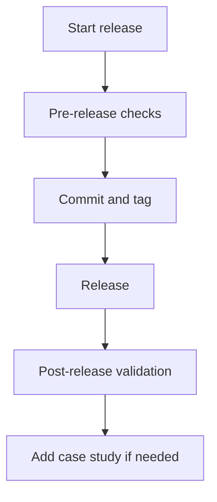

# Quality and Validation in quirk Skills

> Documentation of the quality assurance system, security scanning, dependency graph, fixtures, full validation gate, release checklist, evidenced evolution, and audit trail.



---

## 1. Quality summary

The repository includes a **quality layer** integrated in .agents/skills/platform/ that evaluates each canonical skill before synchronizing or publishing it. Validation covers:

- Structured scoring by dimensions (quality-scorer.mjs)
- Static security scanning (security-scanner.mjs)
- Dependency and cycle analysis (dependency-graph.mjs)
- Behavioral, regression, and security fixtures (evaluate-fixtures.mjs)
- Unified gate (check-all.mjs)
- Evidenced evolution (skill-evolver.mjs)
- Immutable audit trail (audit-trail.mjs)

The expected result of the full gate is status: pass with failed: 0.

---

## 2. Quality Scoring — quality-scorer.mjs

### Dimensions

| Dimension | Max weight | Description |
|---|---|---|
| frontmatterCompleteness | 20 | Required fields (name, description, category) and recommended (version, maturity, capabilities, inputs, outputs, sideEffects, dependencies, stopCondition, risk, trustTier, maxIterations). |
| bodyDepth | 20 | tokens >= 500, headers >= 10, lines >= 100. |
| sections | 20 | Presence of Contract, Process, Guardrails, Completion. |
| assets | 15 | scripts, references, assets, behavioral-fixtures, evals folders and existence of SKILL.md. |
| behavioralSpec | 15 | Declared stopCondition, maxIterations, inputs, outputs. |
| safety | 10 | No dangerous patterns (rm -rf /, curl | bash, eval(), chmod 777). |

### Grades and Tiers

| Grade | Score | Tier | Additional requirements |
|---|---|---|---|
| A | >= 90 | — | Excellent |
| B | >= 80 | **POWERFUL** | >= 300 lines, >= 2 scripts, >= 500 LOC in scripts |
| C | >= 70 | — | Good |
| D | >= 60 | **STANDARD** | >= 200 lines, >= 1 script |
| F | < 60 | **BASIC** | Meets minimum structural requirements |

### Usage

```bash
node .agents/skills/platform/quality-scorer.mjs .agents/skills/skill-dev/skill-creator
node .agents/skills/platform/quality-scorer.mjs .agents/skills/skill-dev/skill-creator --minimum-score 60
node .agents/skills/platform/quality-scorer.mjs .agents/skills/skill-dev/skill-creator --json
```

### Example output (text)

```text
Skill: skill-creator
Score: 85/100 (Grade B, Tier: POWERFUL)
Metrics: 1200 tokens, 350 lines, 14 headers

Issues:
  - missing stopCondition

Warnings:
  - short body (140 tokens)

Breakdown:
  frontmatterCompleteness: 18
  bodyDepth: 20
  sections: 15
  assets: 12
  behavioralSpec: 10
  safety: 10
```

### Example output (JSON)

```json
{
  skill: skill-creator,
  path: .agents/skills/skill-dev/skill-creator,
  scores: {
    frontmatterCompleteness: 18,
    bodyDepth: 20,
    sections: 15,
    assets: 12,
    behavioralSpec: 10,
    safety: 10
  },
  total: 85,
  grade: B,
  tier: POWERFUL,
  issues: [missing stopCondition],
  warnings: [short body (140 tokens)],
  metrics: { tokens: 1200, lines: 350, headers: 14 }
}
```

---

## 3. Security Scanning — security-scanner.mjs

### Detections

| Category | Severity | Patterns |
|---|---|---|
| credential-leakage | critical | api_key, password, sk-, AKIA, AIza, BEGIN PRIVATE KEY blocks |
| command-injection | high | Backticks with $, nested , eval(), exec(), system(), popen(), subprocess with shell=True |
| prompt-injection | critical | ignore previous instructions, disregard above, role overrides (DAN, unrestricted), <<SYS>> / [INST] markers |
| missing-approval-gate | warning | sideEffects declared without mention of approval, human-in-the-loop, or HITL |
| typosquatting-risk | warning | Names similar to popular brands (claud, gpt\d, openai, anthropic, copilot) without being the real entity |

### Result

| Status | Condition |
|---|---|
| blocked | >= 1 critical finding |
| review-required | >= 1 high finding and no critical |
| pass | No critical or high findings |

### Usage

```bash
node .agents/skills/platform/security-scanner.mjs .agents/skills/skill-dev/skill-creator
node .agents/skills/platform/security-scanner.mjs .agents/skills/skill-dev/skill-creator --json
```

### Example output

```text
Security Scan: skill-creator
Status: review-required
Findings: 1 critical, 1 high, 0 medium, 0 low

Findings:
  [HIGH] command-injection: backtick command interpolation
  [CRITICAL] prompt-injection: ignore previous

Warnings:
  [WARN] missing-approval-gate: Skill has side effects but no approval gate mentioned
```

### JSON

```json
{
  skill: skill-creator,
  path: .agents/skills/skill-dev/skill-creator,
  findings: [
    { severity: high, category: command-injection, pattern: backtick command interpolation, count: 2 },
    { severity: critical, category: prompt-injection, pattern: prompt injection: ignore previous }
  ],
  warnings: [
    { category: missing-approval-gate, sideEffects: [write-code], message: Skill has side effects but no approval gate mentioned }
  ],
  info: [scripts directory: 3 file(s)],
  summary: { critical: 1, high: 1, medium: 0, low: 0 },
  status: blocked
}
```

---

## 4. Dependency Graph — dependency-graph.mjs

### Output

| Element | Description |
|---|---|
| DAG | Dependency graph between skills declared in frontmatter dependencies. |
| Cycles | Closed paths detected by DFS. |
| Central skills | Ranking by centrality (inDegree + outDegree). |
| Orphans | Skills with no incoming or outgoing dependencies. |

### Formats

- json (default)
- mermaid
- dot

### Usage

```bash
node .agents/skills/platform/dependency-graph.mjs --format mermaid
node .agents/skills/platform/dependency-graph.mjs --format json
node .agents/skills/platform/dependency-graph.mjs --format dot
```

### Example Mermaid



### Example JSON

```json
{
  totalSkills: 189,
  totalDependencies: 42,
  cycles: [],
  centralSkills: [
    { name: context-engine, category: foundation, inDegree: 5, outDegree: 2, centrality: 7 }
  ],
  orphans: [xr-development, physics-astro],
  format: graph TD
  ...
}
```

> If cycles are detected, the script prints warnings to stderr and the cycles field contains the closed path.

---

## 5. Fixtures — evaluate-fixtures.mjs

### Fixture types

| Type | Location | Purpose |
|---|---|---|
| behavioral | .agents/skills/platform/fixtures/behavioral/*.json | Verifies invocation, expected phrases, and exclusion of forbidden phrases. |
| regression | .agents/skills/platform/fixtures/regression/*.json | Verifies minimum/maximum length and phrases that must persist. |
| security | .agents/skills/platform/fixtures/security/*.json | Verifies presence/absence of credentials, injection, and sideEffects declaration. |

### Threshold configuration

```bash
node .agents/skills/platform/evaluate-fixtures.mjs --threshold 0.8
node .agents/skills/platform/evaluate-fixtures.mjs --fixture-dir ./custom-fixtures --threshold 0.9 --json
```

### Example fixture JSON

```json
{
  fixtures: [
    {
      id: behavioral-skill-creator,
      skill: skill-creator,
      type: behavioral,
      expected: {
        outputContains: [## Contract, ## Guardrails],
        doesNotContain: [TODO, placeholder text]
      }
    },
    {
      id: regression-skill-creator,
      skill: skill-creator,
      type: regression,
      expectedOutput: {
        contains: [## Contract, ## Completion],
        minLength: 500
      }
    },
    {
      id: security-skill-creator,
      skill: skill-creator,
      type: security,
      expected: {
        containsCredentials: false,
        containsInjection: false,
        declaresSideEffects: true
      }
    }
  ]
}
```

### Example output

```text
Fixture Evaluation Results
Passed: 12/16 (75.0%)
Threshold: 80.0% — FAIL

Failed fixtures:
  - behavioral-skill-creator (skill-creator): missing phrase: ## Guardrails; should not contain: TODO
```

---

## 6. Full Validation Gate — check-all.mjs

### What it covers

| Check | Script | Purpose |
|---|---|---|
| Canonical structure | validate-skills.mjs | .agents/ canonicality, .claude/ symlinks, lock coverage. |
| Semantics | audit-semantics.mjs | Retired names, weak markers, dependencies, Markdown links, lock drift. |
| Scenarios | evaluate-scenarios.mjs | Expected paths, phrases, references, and side-effects. |
| Behavioral fixtures | evaluate-behavioral-fixtures.mjs | Required sections in representative artifacts. |
| Bundle sync | sync-bundle.mjs --check | Verifies sync consistency. |
| Shell syntax | bash -n | Shell template without syntax errors. |
| Platform tests | tests/*.test.mjs | Platform unit test suite. |

### Expected result

```json
{
  status: pass,
  checks: [
    { command: node .agents/skills/platform/validate-skills.mjs, status: pass, code: 0, skills: 189 },
    { command: node .agents/skills/platform/evaluate-scenarios.mjs, status: pass, code: 0, scenarios: 8 },
    { command: node .agents/skills/platform/evaluate-behavioral-fixtures.mjs, status: pass, code: 0, fixtures: 4 }
  ],
  summary: {
    totalChecks: 10,
    passed: 10,
    failed: 0,
    skillsEvaluated: 189,
    totalWarnings: 0,
    totalErrors: 0
  }
}
```

### Usage

```bash
node .agents/skills/platform/check-all.mjs
```

> If any check fails, the script prints details to stderr and exits with code 1.

---

## 7. Release Checklist

### Pre-release

| Item | Verification |
|---|---|
| VERSION | Updated. |
| CHANGELOG.md | Entry added. |
| ../../explanation/provenance.md | New, renamed, or retired skills documented. |
| ../reference/agents/skills-map.md | Paths updated if routing changed. |
| Scenarios | Added or updated for workflow changes. |
| Behavioral fixtures | Added or updated for artifact template changes. |
| Full gate | node .agents/skills/platform/check-all.mjs passes. |
| Vocabulary | No project-specific vocabulary in reusable docs. |

### Release

| Item | Verification |
|---|---|
| Commit | Only release files with closed scope. |
| Tag | v<version>. |
| Push | Branch and tag pushed. |
| Notes | Published from CHANGELOG.md. |

### Post-release

| Item | Verification |
|---|---|
| Dry-run sync | Executed in a destination repo. |
| Destination validation | Destination repo validation commands pass. |
| Case study | Added if the release exposes a method change. |



---

## 8. Evidence-Gated Updates — skill-evolver.mjs

### Change categories and required evidence

| Category | Evidence |
|---|---|
| metadata | quality-score |
| operational-spec | behavioral-fixture + quality-score |
| behavioral-constraint | behavioral-fixture + security-scan |
| knowledge | quality-score |
| compatibility | dependency-check + regression-test |

### Usage

```bash
node .agents/skills/platform/skill-evolver.mjs .agents/skills/skill-dev/skill-creator --target-version 2
node .agents/skills/platform/skill-evolver.mjs .agents/skills/skill-dev/skill-creator --dry-run --evidence quality-score,security-scan
```

### Example output (dry-run)

```json
{
  skill: skill-creator,
  status: would-evolve,
  changeCategory: metadata,
  version: 1 -> 2,
  evidence: [
    { type: quality-score, passed: true, detail: score=85 }
  ],
  dryRun: true
}
```

### Example output (blocked)

```json
{
  skill: skill-creator,
  status: blocked,
  changeCategory: behavioral-constraint,
  version: 1 -> 2,
  evidence: [
    { type: behavioral-fixture, passed: true, detail: fixtures-exist },
    { type: security-scan, passed: false, detail: findings=1, blocked: [...] }
  ],
  blockedBy: [security-scan]
}
```

---

## 9. Audit Trail — audit-trail.mjs

### Format

- Immutable JSONL in .agents/skills/platform/audit/
- One file per day: YYYY-MM-DD.jsonl
- Each line is a JSON object with timestamp, event, skill, actor, detail, recordedAt, source

### Commands

```bash
# Record event
node .agents/skills/platform/audit-trail.mjs record evolution-approved --skill skill-creator --detail '{"version":"1->2"}'

# Query by skill
node .agents/skills/platform/audit-trail.mjs query --skill skill-creator

# Global stats
node .agents/skills/platform/audit-trail.mjs stats
```

### Example record

```json
{
  event: evolution-approved,
  skill: skill-creator,
  actor: jhuomar,
  detail: { version: 1->2 },
  source: skill-evolver,
  recordedAt: 2026-09-25T05:00:00.000Z
}
```

### Example stats

```json
{
  totalRecords: 3,
  byEvent: {
    evolution-approved: 2,
    evolution-blocked: 1
  },
  bySkill: {
    skill-creator: 2,
    skill-promoter: 1
  }
}
```

---

## References

- README.md — Section [ QUALITY ] QUALITY SCORING & SECURITY
- ../reference/agents/skill-inventory.md — Inventory of 189 canonical skills
- ../../how-to/release.md — Pre/post-release checklist
- .agents/skills/platform/README.md — Shared platform resources
- .agents/skills/platform/quality-scorer.mjs — Scorer implementation
- .agents/skills/platform/security-scanner.mjs — Scanner implementation
- .agents/skills/platform/dependency-graph.mjs — Graph implementation
- .agents/skills/platform/evaluate-fixtures.mjs — Fixtures implementation
- .agents/skills/platform/check-all.mjs — Unified gate
- .agents/skills/platform/skill-evolver.mjs — Evidenced evolution
- .agents/skills/platform/audit-trail.mjs — Audit trail
