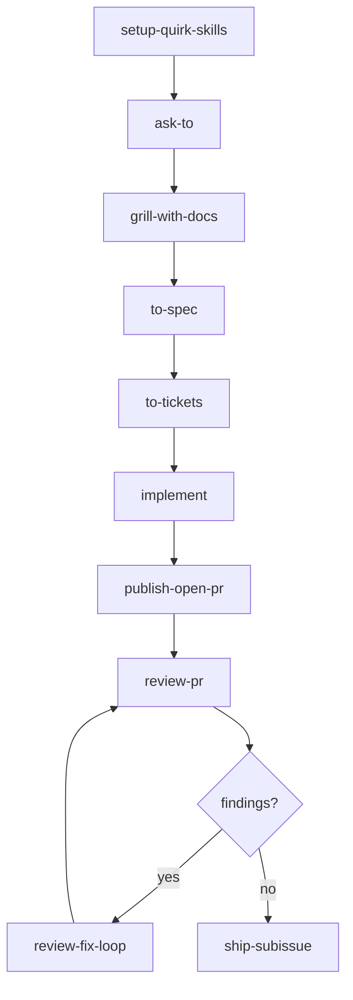
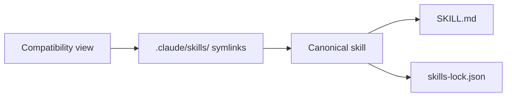
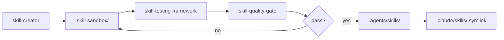
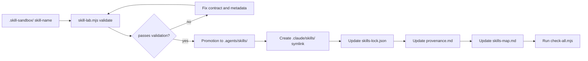

# Skills — Repository documentation for quirk Skills

This document describes the **quirk Skills** system: what a skill is, how the bundle is structured, how the 189 canonical skills are organized, how they differ from the compatibility view, and how they evolve from the sandbox to the main branch.

> **Note:** Skill names and code snippets remain in English. All explanatory text is in English.

---

## 1. Bundle overview

The `skills-quirk` repository contains the **canonical quirk Skills bundle** located in `.agents/skills/`. Each skill is a self-contained folder with a `SKILL.md` file as the main entry point and, where applicable, auxiliary references, templates, and fixtures.

**Key data:**
- **189 canonical skills** organized into domains and categories.
- Each canonical skill has a **flat alias** in `.claude/skills/` for compatibility with consumers expecting that layout.
- The inventory is validated via `check-all.mjs`, `validate-skills.mjs`, `audit-semantics.mjs`, and `evaluate-scenarios.mjs`.
- The method that governs the flow is called the **quirk Method** and prioritizes context before action, questions before commitments, and durable artifacts over "good vibes".

### Canonical flow



---

## 2. Skill map by category

The bundle is distributed across functional domains. Below is a high-level **mind map**, followed by detailed tables by category.

### 2.1 Mind map

```mermaid
mindmap
    root((quirk skills))
        Core flow
            ask-to
            grill
            project-development
            context-pack
            work-item-router
            to-spec
            to-tickets
            implement
            publish-open-pr
            issue-operations
            pr-operations
            review-pr
            review-fix-loop
            ship-subissue
        Quality and governance
            authorship
            quirk-method
            provenance
            skill-audit
            evaluate-skill
            lockfile-maintenance
            skill-quality-gate
            workflow-fixture-author
            side-effect-auditor
            knowledge-curator
            writing-great-skills
            execution-policy
            docs-management
            project-viability
            triage
            make-project
            setup-quirk-skills
        Platform
            frontend-design
            design-system
            webapp-testing
            api-design
            api-contracts
            auth
            deployment
            release-management
            observability
            testing
            performance
            system-design
            db-migrations
        Stack specializations
            nextjs
            react
            vercel
            postgres
            search
            backend-queues
            mobile
            payments
        Support
            artifact-handoff
            handoff
            prototype
            research
            tdd
            diagnosing-bugs
            resolving-merge-conflicts
            capability-router
            code-review
            wayfinder
            writing-great-skills
        AI/ML
            ai-ml-pipeline
            ai-prompt-engineering
            ai-model-evaluation
            ai-time-series-forecasting
        Security
            sec-security-audit
            sec-threat-modeling
            sec-privacy-engineering
            sec-cryptography-applied
        DevOps
            devops-k8s-orchestration
            devops-ci-cd-pipeline
            devops-terraform-iac
            devops-feature-flags
        Data Engineering
            data-etl-pipeline
            data-warehouse-modeling
            data-streaming
        Product
            prod-prd-writing
            prod-ab-testing
            prod-okr-planning
        Math
            math-pure-proofs
            math-computational
            math-optimization
            math-linear-algebra
            math-probability-models
            math-cryptography
            math-literature-track
            math-formal-proof
            math-computation-reproducible
            math-teaching-problem-set
            math-grant-structure
            math-presentation-beamer
            math-paper-collaboration
        Physics
            physics-quantum
            physics-classical
            physics-thermo
            physics-astro
            physics-literature-search
            physics-experimental-notebook
            physics-simulation-setup
            physics-data-analysis-root
            physics-writing-revtex
            physics-talk-design
            physics-career-postdoc
            physics-reproducibility-archive
        Quant Finance
            quant-factors
            quant-backtest
            quant-derivatives-pricing
            quant-portfolio-opt
            quant-credit-risk
            quant-market-micro
            quant-risk-modeling
        General Finance
            finance-corporate-val
            finance-dcf
            finance-portfolio-theory
        Web3
            web3-smart-contracts
            web3-tokenomics
            web3-consensus
            web3-l2-scaling
            web3-defi
            web3-governance
        Database
            db-relational-design
            db-nosql-modeling
            db-query-optimization
        CS
            cs-algorithms
            cs-complexity-analysis
            cs-computability
            cs-data-structures
        Documentation
            docs-adrs
            docs-knowledge-base
            docs-technical-writing
        Research
            research-literature-review
            research-data-archiving
            scientific-hypothesis
        Professional Research
            pro-market-analysis
```



### 2.2 Table by categories

#### Core flow

| Skill | Purpose |
|---|---|
| `ask-to` | Route to the next appropriate step |
| `grill` / `grilling` / `grill-me` / `grill-with-docs` | Refine plans through interview |
| `project-development` | Evaluate the shape of the project and its starting point |
| `context-pack` | Build a minimal and fresh context pack |
| `work-item-router` | Force reading the governance index before routing |
| `domain-modeling` | Build and refine the domain model |
| `codebase-design` | Design deep modules and seams |
| `to-spec` | Convert a conversation into a published spec |
| `to-tickets` | Decompose a plan into tracer-bullet tickets |
| `implement` | Implement work from a spec or tickets |
| `publish-open-pr` | Open a PR from an issue branch |
| `issue-operations` | Create, update, comment, label, assign, or close issue tracker items with evidence |
| `pr-operations` | Create or update PRs, comments, labels, and review requests with validation evidence |
| `review-pr` | Review a PR against the Standards and Spec axes |
| `review-fix-loop` | Orchestrate the review repair cycle |
| `plan-review-fixes` | Convert review findings into a remediation plan |
| `implement-review-fixes` | Apply the planned corrections from the review |
| `ship-subissue` | Merge a clean PR and close the linked issue |

#### Quality and governance

| Skill | Purpose |
|---|---|
| `skill-audit` | Audit bundle, lockfile, and symlink parity |
| `evaluate-skill` | Evaluate a skill against fixed scenarios |
| `lockfile-maintenance` | Reconcile `skills-lock.json` with canonical skill files |
| `skill-quality-gate` | Execute and interpret schema, semantic, routing, placeholder, and side-effect gates |
| `workflow-fixture-author` | Author deterministic scenario and behavioral fixtures |
| `side-effect-auditor` | Audit side-effect, risk, trust tier, and dependency declarations |
| `knowledge-curator` | Keep context and ADRs coherent |
| `writing-great-skills` | Vocabulary and principles for writing skills |
| `execution-policy` | Decide whether a skill action is allowed |
| `docs-management` | Keep documentation aligned with the project shape |
| `project-viability` | Evaluate viability, functionality, and scalability against `CONTEXT.md` and ADRs |
| `triage` | Classify issues and PRs into durable states |
| `make-project` | Create and configure GitHub Projects |
| `setup-quirk-skills` | Configure the repo for quirk flows |

#### Platform

| Skill | Purpose |
|---|---|
| `frontend-design` | Production-grade frontend interfaces |
| `design-system` | Reusable UI tokens and components |
| `webapp-testing` | Test strategy for web applications |
| `api-design` | Small, durable API seam |
| `api-contracts` | Request/response contracts and versioning |
| `auth` | Authentication and authorization seam |
| `deployment` | Build, release, and rollback seam |
| `release-management` | Release train and CI handoff |
| `observability` | Logs, metrics, traces, SLIs, SLOs, dashboards, alerts, runbooks |
| `performance` | Latency, throughput, bottlenecks, capacity planning |
| `system-design` | End-to-end architecture, scaling, reliability |
| `testing` | Test strategy and seams |
| `db-migrations` | Safe sequencing of schema changes |

#### Stack specializations

| Skill | Surface |
|---|---|
| `nextjs` | Next.js routes, server/client seams |
| `react` | React component structure and state |
| `vercel` | Deployment and runtime on Vercel |
| `postgres` | PostgreSQL schema and queries |
| `search` | Indexing and relevance in searches |
| `backend-queues` | Background jobs, queues, retries, idempotency |
| `mobile` | Device constraints, offline behavior |
| `payments` | Payment flows, reconciliation, rollback |

#### Support

| Skill | Purpose |
|---|---|
| `artifact-handoff` | Transfer structured artifacts between skills |
| `handoff` | Compact a conversation into a handoff document |
| `prototype` | Build a disposable prototype to answer a design question |
| `research` | Investigate a question against primary sources |
| `tdd` | Test-driven development |
| `diagnosing-bugs` | Diagnostic loop for hard bugs |
| `resolving-merge-conflicts` | Resolve blocked or conflicted branch state |
| `capability-router` | Route work by declared capabilities |
| `code-review` | Review changes against Standards and Spec |
| `wayfinder` | Plan large work as a map of decision tickets |
| `writing-great-skills` | Reference for writing and editing skills |

#### AI/ML

| Skill | Subfield |
|---|---|
| `ai-ml-pipeline` | ML pipeline design (data, model, eval, deploy) |
| `ai-prompt-engineering` | Prompt design for LLMs and evaluation |
| `ai-model-evaluation` | Metrics, fairness, robustness, explainability |
| `ai-time-series-forecasting` | Forecasting (ARIMA, Prophet, LSTM, Transformer) |

#### Security

| Skill | Subfield |
|---|---|
| `sec-security-audit` | Code, dependency, and secret audit |
| `sec-threat-modeling` | STRIDE / ATT&CK threat modeling |
| `sec-privacy-engineering` | GDPR / CCPA / HIPAA compliance design |
| `sec-cryptography-applied` | Encryption, signatures, key management, TLS |

#### DevOps

| Skill | Subfield |
|---|---|
| `devops-k8s-orchestration` | Kubernetes architecture and policies |
| `devops-ci-cd-pipeline` | CI/CD pipeline design and rollback |
| `devops-terraform-iac` | Infrastructure as Code |
| `devops-feature-flags` | Feature flags, gradual rollouts, kill switches |

#### Data Engineering

| Skill | Subfield |
|---|---|
| `data-etl-pipeline` | ETL / ELT design |
| `data-warehouse-modeling` | Star / snowflake / OBT schemas |
| `data-streaming` | Streaming with Kafka / Kinesis / Flink |

#### Product

| Skill | Subfield |
|---|---|
| `prod-prd-writing` | PRD, user stories, acceptance criteria |
| `prod-ab-testing` | A/B test design (power, metrics, rollback) |
| `prod-okr-planning` | OKR cycles (objectives, key results, initiatives) |

#### Math

| Skill | Subfield |
|---|---|
| `math-pure-proofs` | Pure math proofs (number theory, algebra, analysis) |
| `math-computational` | Numerical / symbolic computation |
| `math-optimization` | Optimization (LP, convex, MIP, combinatorics) |
| `math-linear-algebra` | Decompositions (SVD, eigendecomposition, least squares) |
| `math-probability-models` | Probability distributions, stochastic processes |
| `math-cryptography` | Cryptographic primitives and hardness assumptions |
| `math-literature-track` | arXiv, MathSciNet, citation alerts |
| `math-formal-proof` | Proof development in Lean / Coq / Isabelle / Agda |
| `math-computation-reproducible` | SymPy / Mathematica / Magma / Sage / Julia + container |
| `math-teaching-problem-set` | Problem sets / exam design + rubric |
| `math-grant-structure` | NSF / ERC / Simons proposal drafting |
| `math-presentation-beamer` | Beamer / TikZ / speaker notes |
| `math-paper-collaboration` | Overleaf / GitHub collaboration + arXiv package |

#### Physics

| Skill | Subfield |
|---|---|
| `physics-quantum` | Quantum mechanics, Dirac notation, measurement |
| `physics-classical` | Newtonian / Lagrangian / Hamiltonian mechanics |
| `physics-thermo` | Thermodynamics, cycles, entropy, phase transitions |
| `physics-astro` | Astrophysics, stellar dynamics, cosmology |
| `physics-literature-search` | arXiv hep-th/cond-mat/astro-ph + INSPIRE + ADS |
| `physics-experimental-notebook` | Lab notebook / FAIR data / calibration |
| `physics-simulation-setup` | GEANT4, LAMMPS, VASP, QuTiP in container |
| `physics-data-analysis-root` | ROOT / pandas / uproot + calibration / errors |
| `physics-writing-revtex` | RevTeX / APS / IOP / AIP formatting |
| `physics-talk-design` | Seminar / poster / public talk |
| `physics-career-postdoc` | Postdoc / faculty / grant applications |
| `physics-reproducibility-archive` | Zenodo DOI + GitHub release + FAIR checklist |

#### Quant Finance

| Skill | Subfield |
|---|---|
| `quant-factors` | Quantitative factor construction (momentum, value, carry) |
| `quant-backtest` | Backtest audit (biases, costs, out-of-sample) |
| `quant-derivatives-pricing` | Options / exotics pricing, Greeks, calibration |
| `quant-portfolio-opt` | Portfolio optimization (mean-variance, risk-parity, factor) |
| `quant-credit-risk` | PD/LGD/EAD, portfolio loss distribution, stress |
| `quant-market-micro` | Microstructure, execution costs, optimal execution |
| `quant-risk-modeling` | VaR / CVaR / drawdown / stress testing |

#### General Finance

| Skill | Subfield |
|---|---|
| `finance-corporate-val` | Corporate valuation (DCF, multiples, sum-of-parts) |
| `finance-dcf` | Discounted cash flow (forecast, WACC, sensitivity) |
| `finance-portfolio-theory` | MPT, CAPM, APT, performance attribution |

#### Web3

| Skill | Subfield |
|---|---|
| `web3-smart-contracts` | Contract design, security audit, gas, upgrade |
| `web3-tokenomics` | Token economics, emission, incentives, governance |
| `web3-consensus` | Consensus analysis (PoW, PoS, BFT, finality) |
| `web3-l2-scaling` | Rollups, validiums, DA, throughput / cost |
| `web3-defi` | AMM, lending, stablecoins, composability risk |
| `web3-governance` | On-chain / off-chain governance, voting, attacks |

#### Database

| Skill | Subfield |
|---|---|
| `db-relational-design` | Schema, keys, indexes, normalization, migrations |
| `db-nosql-modeling` | Document / key-value / wide-column / graph / time-series |
| `db-query-optimization` | Query optimization, indexes, execution plans |

#### CS

| Skill | Subfield |
|---|---|
| `cs-algorithms` | Algorithm design, correctness, complexity analysis |
| `cs-complexity-analysis` | Algorithmic complexity analysis |
| `cs-computability` | Decidability, reductions, recognizability |
| `cs-data-structures` | Data structure design and analysis |

#### Documentation

| Skill | Subfield |
|---|---|
| `docs-adrs` | Architecture Decision Records |
| `docs-knowledge-base` | Repository knowledge base |
| `docs-technical-writing` | Clear and maintainable technical writing |

#### Research

| Skill | Subfield |
|---|---|
| `research-literature-review` | Systematic literature review |
| `research-data-archiving` | Research data archiving |
| `scientific-hypothesis` | Scientific hypothesis formulation |

#### Professional Research

| Skill | Subfield |
|---|---|
| `pro-market-analysis` | Professional market analysis (TAM / SAM / SOM) |

---

## 3. Anatomy of a canonical skill

A **canonical skill** is a folder under `.agents/skills/` that meets a minimum structure and a metadata contract. Its parts are broken down below.

### 3.1 File structure

```text
.agents/skills/<domain>/<skill-name>/
├── SKILL.md              # Mandatory entry point
├── skills-contract.json  # Contract of capabilities, inputs, outputs, sideEffects, risk, trustTier, Boundary
└── references/           # (Optional) Auxiliary artifacts: templates, fixtures, examples
```

### 3.2 `SKILL.md` frontmatter

Every `SKILL.md` begins with a YAML frontmatter block:

```yaml
---
name: <skill-name>
description: <what it does and when to use it>
capabilities:
  - <capability 1>
  - <capability 2>
inputs:
  - <input 1>
outputs:
  - <output 1>
sideEffects:
  - <side effect>
stopCondition:
  - <stop condition>
risk: low | medium | high
trustTier: 1 | 2 | 3 | 4
maxIterations: <number or null>
---
```

**Key rules:**
- `name` must exactly match the folder name.
- `description` must declare what the skill does and when it should be invoked.
- `risk` cannot be `low` if the skill writes code, tracker state, branches, PRs, or docs outside a purely local and explicitly harmless scope.
- `trustTier` must align with `risk`:
  - **Tier 1:** metadata/routing only (`ask-to`, `capability-router`).
  - **Tier 2:** read-only analysis or documentation (`review-pr`, `research`, `domain-modeling`).
  - **Tier 3:** supervised local writing (`implement`, `tdd`, `to-spec`, `plan-review-fixes`).
  - **Tier 4:** autonomous remote writing (`publish-open-pr`, `ship-subissue`, `review-fix-loop`).
- `maxIterations` is mandatory in any skill whose body contains an explicit or implicit loop.

### 3.3 Document body

The body of `SKILL.md` must follow this form:

1. **Purpose and boundary:** what the skill does and what it does not do.
2. **Contract:** section for non-trivial skills that describes inputs, outputs, and verifiable completion criteria.
3. **Ordered steps:** only when sequence matters.
4. **Completion criteria:** verifiable conditions indicating the skill has finished.
5. **References:** mode-specific details or templates are pushed to files in `references/` to avoid bloating `SKILL.md`.

### 3.4 Templates and artifacts

- Templates owned by a skill are stored within the skill itself (usually in `references/`).
- The repository index acts as a map, not as a contract.
- Published artifacts must not contain placeholders.
- Examples are only allowed when they are generic or clearly marked as examples.

---

## 4. Canonical view vs. compatibility view

The bundle is stored in a **canonical location** and exposed to external consumers through a **compatibility view**.



### 4.1 Canonical view

- **Path:** `.agents/skills/<domain>/<skill-name>/SKILL.md`
- **Purpose:** It is the real source of truth. It contains the `SKILL.md`, the `skills-contract.json`, and any auxiliary references.
- **Inventory:** It is registered in `skills-lock.json`, which includes the hash of each canonical `SKILL.md`.
- **Validation:** The `check-all.mjs` script validates parity, lockfile coverage, and semantics.

### 4.2 Compatibility view

- **Path:** `.claude/skills/<skill-name>` (symlink)
- **Purpose:** Expose canonical skills to tools or agents that expect the flat `.claude/skills/` layout.
- **Maintenance:** Each symlink points directly to its canonical skill. When a skill is renamed, moved, or deleted, the symlink must be updated accordingly.

### 4.3 Synchronization rules

1. Never edit a skill through `.claude/skills/`. Always edit in `.agents/skills/`.
2. After any change, run `check-all.mjs` to confirm that symlinks and the lockfile are up to date.
3. If a skill is removed from the bundle, its compatibility symlink must also be removed.

---

## 5. Skill inventory

Below is the complete inventory of the 189 canonical skills. The table includes name, canonical path, category, maturity, and status.

> **Note:** The complete table is generated from `.agents/skills/` and validated against `skills-lock.json`.

| Skill | Canonical path | Category | Risk | Trust Tier | Maturity | Status |
|---|---|---|---|---|---|---|
| `accessibility` | `.agents/skills/accessibility/accessibility/SKILL.md` | `accessibility` | `low` | `1` | `stable` | `ok` |
| `accessibility-design` | `.agents/skills/accessibility/accessibility-design/SKILL.md` | `accessibility` | `low` | `1` | `stable` | `ok` |
| `accessibility-testing` | `.agents/skills/accessibility/accessibility-testing/SKILL.md` | `accessibility` | `low` | `1` | `stable` | `ok` |
| `execution-policy` | `.agents/skills/auxiliary/execution-policy/SKILL.md` | `auxiliary` | `low` | `1` | `experimental` | `ok` |
| `integration-playground` | `.agents/skills/auxiliary/integration-playground/SKILL.md` | `auxiliary` | `low` | `2` | `experimental` | `ok` |
| `interactive-tutorial-builder` | `.agents/skills/auxiliary/interactive-tutorial-builder/SKILL.md` | `auxiliary` | `low` | `2` | `experimental` | `ok` |
| `setup-quirk-skills` | `.agents/skills/auxiliary/setup-quirk-skills/SKILL.md` | `auxiliary` | `medium` | `3` | `stable` | `ok` |
| `backend-architecture` | `.agents/skills/backend/backend-architecture/SKILL.md` | `backend` | `low` | `1` | `stable` | `ok` |
| `backend-caching` | `.agents/skills/backend/backend-caching/SKILL.md` | `backend` | `low` | `1` | `stable` | `ok` |
| `backend-queues` | `.agents/skills/backend/backend-queues/SKILL.md` | `backend` | `low` | `1` | `stable` | `ok` |
| `microservices` | `.agents/skills/backend/microservices/SKILL.md` | `backend` | `low` | `1` | `stable` | `ok` |
| `cms-access-control` | `.agents/skills/cms/cms-access-control/SKILL.md` | `cms` | `low` | `1` | `stable` | `ok` |
| `cms-architecture` | `.agents/skills/cms/cms-architecture/SKILL.md` | `cms` | `low` | `1` | `stable` | `ok` |
| `cms-content-strategy` | `.agents/skills/cms/cms-content-strategy/SKILL.md` | `cms` | `low` | `1` | `stable` | `ok` |
| `localization` | `.agents/skills/cms/localization/SKILL.md` | `cms` | `low` | `1` | `stable` | `ok` |
| `compiler-design` | `.agents/skills/compilers/compiler-design/SKILL.md` | `compilers` | `low` | `1` | `stable` | `ok` |
| `compiler-testing` | `.agents/skills/compilers/compiler-testing/SKILL.md` | `compilers` | `low` | `1` | `stable` | `ok` |
| `compilers` | `.agents/skills/compilers/compilers/SKILL.md` | `compilers` | `low` | `1` | `stable` | `ok` |
| `cs-complexity-analysis` | `.agents/skills/cs/cs-complexity-analysis/SKILL.md` | `cs` | `low` | `1` | `stable` | `ok` |
| `cs-computability` | `.agents/skills/cs/cs-computability/SKILL.md` | `cs` | `low` | `1` | `stable` | `ok` |
| `cs-data-structures` | `.agents/skills/cs/cs-data-structures/SKILL.md` | `cs` | `low` | `1` | `stable` | `ok` |
| `db-migrations` | `.agents/skills/db/db-migrations/SKILL.md` | `db` | `low` | `1` | `stable` | `ok` |
| `db-query-optimization` | `.agents/skills/db/db-query-optimization/SKILL.md` | `db` | `low` | `1` | `stable` | `ok` |
| `code-review` | `.agents/skills/delivery/code-review/SKILL.md` | `delivery` | `low` | `1` | `stable` | `ok` |
| `contribution-workflow-optimizer` | `.agents/skills/delivery/contribution-workflow-optimizer/SKILL.md` | `delivery` | `low` | `1` | `experimental` | `ok` |
| `diagnosing-bugs` | `.agents/skills/delivery/diagnosing-bugs/SKILL.md` | `delivery` | `low` | `1` | `stable` | `ok` |
| `implement` | `.agents/skills/delivery/implement/SKILL.md` | `delivery` | `medium` | `3` | `stable` | `ok` |
| `implement-review-fixes` | `.agents/skills/delivery/implement-review-fixes/SKILL.md` | `delivery` | `medium` | `3` | `stable` | `ok` |
| `plan-review-fixes` | `.agents/skills/delivery/plan-review-fixes/SKILL.md` | `delivery` | `medium` | `3` | `stable` | `ok` |
| `prototype` | `.agents/skills/delivery/prototype/SKILL.md` | `delivery` | `low` | `1` | `stable` | `ok` |
| `research` | `.agents/skills/delivery/research/SKILL.md` | `delivery` | `low` | `2` | `stable` | `ok` |
| `resolving-merge-conflicts` | `.agents/skills/delivery/resolving-merge-conflicts/SKILL.md` | `delivery` | `medium` | `3` | `stable` | `ok` |
| `review-fix-loop` | `.agents/skills/delivery/review-fix-loop/SKILL.md` | `delivery` | `medium` | `3` | `stable` | `ok` |
| `review-pr` | `.agents/skills/delivery/review-pr/SKILL.md` | `delivery` | `low` | `1` | `stable` | `ok` |
| `tdd` | `.agents/skills/delivery/tdd/SKILL.md` | `delivery` | `low` | `1` | `stable` | `ok` |
| `testing` | `.agents/skills/delivery/testing/SKILL.md` | `delivery` | `low` | `1` | `stable` | `ok` |
| `webapp-testing` | `.agents/skills/delivery/webapp-testing/SKILL.md` | `delivery` | `low` | `1` | `stable` | `ok` |
| `docs-knowledge-base` | `.agents/skills/docs/docs-knowledge-base/SKILL.md` | `docs` | `low` | `1` | `stable` | `ok` |
| `docs-technical-writing` | `.agents/skills/docs/docs-technical-writing/SKILL.md` | `docs` | `low` | `1` | `stable` | `ok` |
| `improve-codebase-architecture` | `.agents/skills/engineering/improve-codebase-architecture/SKILL.md` | `engineering` | `low` | `2` | `experimental` | `ok` |
| `agent-canvas` | `.agents/skills/foundation/agent-canvas/SKILL.md` | `foundation` | `low` | `2` | `experimental` | `ok` |
| `agent-observability` | `.agents/skills/foundation/agent-observability/SKILL.md` | `foundation` | `low` | `2` | `experimental` | `ok` |
| `api-design` | `.agents/skills/foundation/api-design/SKILL.md` | `foundation` | `low` | `1` | `stable` | `ok` |
| `codebase-design` | `.agents/skills/foundation/codebase-design/SKILL.md` | `foundation` | `low` | `1` | `stable` | `ok` |
| `context-engine` | `.agents/skills/foundation/context-engine/SKILL.md` | `foundation` | `low` | `2` | `experimental` | `ok` |
| `domain-modeling` | `.agents/skills/foundation/domain-modeling/SKILL.md` | `foundation` | `low` | `1` | `stable` | `ok` |
| `mcp-server` | `.agents/skills/foundation/mcp-server/SKILL.md` | `foundation` | `medium` | `3` | `experimental` | `ok` |
| `observability` | `.agents/skills/foundation/observability/SKILL.md` | `foundation` | `low` | `1` | `stable` | `ok` |
| `subagent-swarm` | `.agents/skills/foundation/subagent-swarm/SKILL.md` | `foundation` | `medium` | `3` | `experimental` | `ok` |
| `design-system` | `.agents/skills/frontend/design-system/SKILL.md` | `frontend` | `low` | `1` | `stable` | `ok` |
| `frontend-design` | `.agents/skills/frontend/frontend-design/SKILL.md` | `frontend` | `low` | `1` | `stable` | `ok` |
| `mobile` | `.agents/skills/frontend/mobile/SKILL.md` | `frontend` | `low` | `1` | `stable` | `ok` |
| `nextjs` | `.agents/skills/frontend/nextjs/SKILL.md` | `frontend` | `low` | `1` | `experimental` | `ok` |
| `react` | `.agents/skills/frontend/react/SKILL.md` | `frontend` | `low` | `1` | `stable` | `ok` |
| `api-contracts` | `.agents/skills/integrations/api-contracts/SKILL.md` | `integrations` | `low` | `1` | `stable` | `ok` |
| `auth` | `.agents/skills/integrations/auth/SKILL.md` | `integrations` | `low` | `1` | `stable` | `ok` |
| `issue-operations` | `.agents/skills/integrations/issue-operations/SKILL.md` | `integrations` | `medium` | `3` | `stable` | `ok` |
| `payments` | `.agents/skills/integrations/payments/SKILL.md` | `integrations` | `low` | `1` | `stable` | `ok` |
| `pr-operations` | `.agents/skills/integrations/pr-operations/SKILL.md` | `integrations` | `medium` | `3` | `stable` | `ok` |
| `search` | `.agents/skills/integrations/search/SKILL.md` | `integrations` | `low` | `1` | `stable` | `ok` |
| `iot-embedded` | `.agents/skills/iot/iot-embedded/SKILL.md` | `iot` | `low` | `1` | `stable` | `ok` |
| `networking` | `.agents/skills/networking/networking/SKILL.md` | `networking` | `low` | `1` | `stable` | `ok` |
| `networking-protocols` | `.agents/skills/networking/networking-protocols/SKILL.md` | `networking` | `low` | `1` | `stable` | `ok` |
| `networking-security` | `.agents/skills/networking/networking-security/SKILL.md` | `networking` | `low` | `1` | `stable` | `ok` |
| `os-kernel` | `.agents/skills/os/os-kernel/SKILL.md` | `os` | `low` | `1` | `stable` | `ok` |
| `os-memory` | `.agents/skills/os/os-memory/SKILL.md` | `os` | `low` | `1` | `stable` | `ok` |
| `os-processes` | `.agents/skills/os/os-processes/SKILL.md` | `os` | `low` | `1` | `stable` | `ok` |
| `professional-communication` | `.agents/skills/professional/professional-communication/SKILL.md` | `professional` | `low` | `1` | `stable` | `ok` |
| `professional-project-management` | `.agents/skills/professional/professional-project-management/SKILL.md` | `professional` | `low` | `1` | `stable` | `ok` |
| `docs-management` | `.agents/skills/project/docs-management/SKILL.md` | `project` | `low` | `1` | `stable` | `ok` |
| `make-project` | `.agents/skills/project/make-project/SKILL.md` | `project` | `medium` | `3` | `stable` | `ok` |
| `project-development` | `.agents/skills/project/project-development/SKILL.md` | `project` | `low` | `1` | `stable` | `ok` |
| `project-viability` | `.agents/skills/project/project-viability/SKILL.md` | `project` | `low` | `1` | `stable` | `ok` |
| `to-spec` | `.agents/skills/project/to-spec/SKILL.md` | `project` | `medium` | `3` | `stable` | `ok` |
| `to-tickets` | `.agents/skills/project/to-tickets/SKILL.md` | `project` | `medium` | `3` | `stable` | `ok` |
| `performance-testing` | `.agents/skills/qa/performance-testing/SKILL.md` | `qa` | `low` | `1` | `stable` | `ok` |
| `qa-automation` | `.agents/skills/qa/qa-automation/SKILL.md` | `qa` | `low` | `1` | `stable` | `ok` |
| `qa-manual-testing` | `.agents/skills/qa/qa-manual-testing/SKILL.md` | `qa` | `low` | `1` | `stable` | `ok` |
| `qa-security-testing` | `.agents/skills/qa/qa-security-testing/SKILL.md` | `qa` | `low` | `1` | `stable` | `ok` |
| `research-data-archiving` | `.agents/skills/research/research-data-archiving/SKILL.md` | `research` | `low` | `1` | `stable` | `ok` |
| `research-literature-review` | `.agents/skills/research/research-literature-review/SKILL.md` | `research` | `low` | `1` | `stable` | `ok` |
| `artifact-handoff` | `.agents/skills/routing/artifact-handoff/SKILL.md` | `routing` | `low` | `1` | `stable` | `ok` |
| `ask-to` | `.agents/skills/routing/ask-to/SKILL.md` | `routing` | `low` | `1` | `stable` | `ok` |
| `capability-router` | `.agents/skills/routing/capability-router/SKILL.md` | `routing` | `low` | `1` | `experimental` | `ok` |
| `context-pack` | `.agents/skills/routing/context-pack/SKILL.md` | `routing` | `low` | `1` | `experimental` | `ok` |
| `grill` | `.agents/skills/routing/grill/SKILL.md` | `routing` | `low` | `1` | `stable` | `ok` |
| `grill-me` | `.agents/skills/routing/grill-me/SKILL.md` | `routing` | `low` | `1` | `experimental` | `ok` |
| `grill-with-docs` | `.agents/skills/routing/grill-with-docs/SKILL.md` | `routing` | `low` | `2` | `experimental` | `ok` |
| `grilling` | `.agents/skills/routing/grilling/SKILL.md` | `routing` | `low` | `1` | `stable` | `ok` |
| `handoff` | `.agents/skills/routing/handoff/SKILL.md` | `routing` | `low` | `2` | `stable` | `ok` |
| `knowledge-curator` | `.agents/skills/routing/knowledge-curator/SKILL.md` | `routing` | `low` | `2` | `experimental` | `ok` |
| `publish-open-pr` | `.agents/skills/routing/publish-open-pr/SKILL.md` | `routing` | `medium` | `3` | `stable` | `ok` |
| `ship-subissue` | `.agents/skills/routing/ship-subissue/SKILL.md` | `routing` | `high` | `4` | `stable` | `ok` |
| `triage` | `.agents/skills/routing/triage/SKILL.md` | `routing` | `medium` | `3` | `experimental` | `ok` |
| `wayfinder` | `.agents/skills/routing/wayfinder/SKILL.md` | `routing` | `low` | `1` | `experimental` | `ok` |
| `work-item-router` | `.agents/skills/routing/work-item-router/SKILL.md` | `routing` | `low` | `1` | `experimental` | `ok` |
| `performance` | `.agents/skills/platform/performance/performance/SKILL.md` | `platform` | `low` | `1` | `stable` | `ok` |
| `system-design` | `.agents/skills/platform/system-design/system-design/SKILL.md` | `platform` | `low` | `1` | `stable` | `ok` |
| `evaluate-skill` | `.agents/skills/skill-dev/evaluate-skill/SKILL.md` | `skill-dev` | `low` | `1` | `experimental` | `ok` |
| `lockfile-maintenance` | `.agents/skills/skill-dev/lockfile-maintenance/SKILL.md` | `skill-dev` | `low` | `2` | `stable` | `ok` |
| `rule-cataloger` | `.agents/skills/skill-dev/rule-cataloger/SKILL.md` | `skill-dev` | `low` | `2` | `experimental` | `ok` |
| `side-effect-auditor` | `.agents/skills/skill-dev/side-effect-auditor/SKILL.md` | `skill-dev` | `low` | `1` | `stable` | `ok` |
| `skill-audit` | `.agents/skills/skill-dev/skill-audit/SKILL.md` | `skill-dev` | `low` | `1` | `experimental` | `ok` |
| `skill-creator` | `.agents/skills/skill-dev/skill-creator/SKILL.md` | `skill-dev` | `medium` | `3` | `stable` | `ok` |
| `skill-dependency-graph` | `.agents/skills/skill-dev/skill-dependency-graph/SKILL.md` | `skill-dev` | `low` | `1` | `experimental` | `ok` |
| `skill-diff-analyzer` | `.agents/skills/skill-dev/skill-diff-analyzer/SKILL.md` | `skill-dev` | `low` | `1` | `experimental` | `ok` |
| `skill-performance-metrics` | `.agents/skills/skill-dev/skill-performance-metrics/SKILL.md` | `skill-dev` | `low` | `1` | `experimental` | `ok` |
| `skill-promoter` | `.agents/skills/skill-dev/skill-promoter/SKILL.md` | `skill-dev` | `medium` | `3` | `stable` | `ok` |
| `skill-quality-gate` | `.agents/skills/skill-dev/skill-quality-gate/SKILL.md` | `skill-dev` | `low` | `1` | `stable` | `ok` |
| `skill-sandbox` | `.agents/skills/skill-dev/skill-sandbox/SKILL.md` | `skill-dev` | `low` | `1` | `stable` | `ok` |
| `skill-template-generator` | `.agents/skills/skill-dev/skill-template-generator/SKILL.md` | `skill-dev` | `low` | `2` | `experimental` | `ok` |
| `skill-testing-framework` | `.agents/skills/skill-dev/skill-testing-framework/SKILL.md` | `skill-dev` | `low` | `1` | `stable` | `ok` |
| `skill-tutor` | `.agents/skills/skill-dev/skill-tutor/SKILL.md` | `skill-dev` | `low` | `2` | `stable` | `ok` |
| `workflow-fixture-author` | `.agents/skills/skill-dev/workflow-fixture-author/SKILL.md` | `skill-dev` | `low` | `2` | `stable` | `ok` |
| `writing-great-skills` | `.agents/skills/skill-dev/writing-great-skills/SKILL.md` | `skill-dev` | `low` | `1` | `experimental` | `ok` |
| `ai-ml-pipeline` | `.agents/skills/ai/ai-ml-pipeline/SKILL.md` | `ai` | `medium` | `3` | `experimental` | `ok` |
| `ai-model-evaluation` | `.agents/skills/ai/ai-model-evaluation/SKILL.md` | `ai` | `medium` | `3` | `experimental` | `ok` |
| `ai-prompt-engineering` | `.agents/skills/ai/ai-prompt-engineering/SKILL.md` | `ai` | `medium` | `3` | `experimental` | `ok` |
| `ai-time-series-forecasting` | `.agents/skills/ai/ai-time-series-forecasting/SKILL.md` | `ai` | `medium` | `3` | `experimental` | `ok` |
| `cs-algorithms` | `.agents/skills/cs/cs-algorithms/SKILL.md` | `cs` | `low` | `1` | `experimental` | `ok` |
| `data-etl-pipeline` | `.agents/skills/data/data-etl-pipeline/SKILL.md` | `data` | `medium` | `3` | `experimental` | `ok` |
| `data-streaming` | `.agents/skills/data/data-streaming/SKILL.md` | `data` | `medium` | `3` | `experimental` | `ok` |
| `data-warehouse-modeling` | `.agents/skills/data/data-warehouse-modeling/SKILL.md` | `data` | `low` | `1` | `experimental` | `ok` |
| `db-nosql-modeling` | `.agents/skills/db/db-nosql-modeling/SKILL.md` | `db` | `low` | `1` | `experimental` | `ok` |
| `db-relational-design` | `.agents/skills/db/db-relational-design/SKILL.md` | `db` | `low` | `1` | `experimental` | `ok` |
| `devops-ci-cd-pipeline` | `.agents/skills/devops/devops-ci-cd-pipeline/SKILL.md` | `devops` | `medium` | `3` | `experimental` | `ok` |
| `devops-feature-flags` | `.agents/skills/devops/devops-feature-flags/SKILL.md` | `devops` | `medium` | `3` | `experimental` | `ok` |
| `devops-k8s-orchestration` | `.agents/skills/devops/devops-k8s-orchestration/SKILL.md` | `devops` | `medium` | `3` | `experimental` | `ok` |
| `devops-terraform-iac` | `.agents/skills/devops/devops-terraform-iac/SKILL.md` | `devops` | `medium` | `3` | `experimental` | `ok` |
| `docs-adrs` | `.agents/skills/docs/docs-adrs/SKILL.md` | `docs` | `low` | `1` | `experimental` | `ok` |
| `finance-corporate-val` | `.agents/skills/finance/finance-corporate-val/SKILL.md` | `finance` | `low` | `1` | `experimental` | `ok` |
| `finance-dcf` | `.agents/skills/finance/finance-dcf/SKILL.md` | `finance` | `low` | `1` | `experimental` | `ok` |
| `finance-portfolio-theory` | `.agents/skills/finance/finance-portfolio-theory/SKILL.md` | `finance` | `low` | `1` | `experimental` | `ok` |
| `math-computation-reproducible` | `.agents/skills/math/math-computation-reproducible/SKILL.md` | `math` | `low` | `1` | `experimental` | `ok` |
| `math-computational` | `.agents/skills/math/math-computational/SKILL.md` | `math` | `low` | `1` | `experimental` | `ok` |
| `math-cryptography` | `.agents/skills/math/math-cryptography/SKILL.md` | `math` | `low` | `1` | `experimental` | `ok` |
| `math-formal-proof` | `.agents/skills/math/math-formal-proof/SKILL.md` | `math` | `low` | `1` | `experimental` | `ok` |
| `math-grant-structure` | `.agents/skills/math/math-grant-structure/SKILL.md` | `math` | `low` | `1` | `experimental` | `ok` |
| `math-linear-algebra` | `.agents/skills/math/math-linear-algebra/SKILL.md` | `math` | `low` | `1` | `experimental` | `ok` |
| `math-literature-track` | `.agents/skills/math/math-literature-track/SKILL.md` | `math` | `low` | `1` | `experimental` | `ok` |
| `math-optimization` | `.agents/skills/math/math-optimization/SKILL.md` | `math` | `low` | `1` | `experimental` | `ok` |
| `math-paper-collaboration` | `.agents/skills/math/math-paper-collaboration/SKILL.md` | `math` | `low` | `1` | `experimental` | `ok` |
| `math-presentation-beamer` | `.agents/skills/math/math-presentation-beamer/SKILL.md` | `math` | `low` | `1` | `experimental` | `ok` |
| `math-probability-models` | `.agents/skills/math/math-probability-models/SKILL.md` | `math` | `low` | `1` | `experimental` | `ok` |
| `math-pure-proofs` | `.agents/skills/math/math-pure-proofs/SKILL.md` | `math` | `low` | `1` | `experimental` | `ok` |
| `math-teaching-problem-set` | `.agents/skills/math/math-teaching-problem-set/SKILL.md` | `math` | `low` | `1` | `experimental` | `ok` |
| `physics-astro` | `.agents/skills/physics/physics-astro/SKILL.md` | `physics` | `low` | `1` | `experimental` | `ok` |
| `physics-career-postdoc` | `.agents/skills/physics/physics-career-postdoc/SKILL.md` | `physics` | `low` | `1` | `experimental` | `ok` |
| `physics-classical` | `.agents/skills/physics/physics-classical/SKILL.md` | `physics` | `low` | `1` | `experimental` | `ok` |
| `physics-data-analysis-root` | `.agents/skills/physics/physics-data-analysis-root/SKILL.md` | `physics` | `low` | `1` | `experimental` | `ok` |
| `physics-experimental-notebook` | `.agents/skills/physics/physics-experimental-notebook/SKILL.md` | `physics` | `low` | `1` | `experimental` | `ok` |
| `physics-literature-search` | `.agents/skills/physics/physics-literature-search/SKILL.md` | `physics` | `low` | `1` | `experimental` | `ok` |
| `physics-quantum` | `.agents/skills/physics/physics-quantum/SKILL.md` | `physics` | `low` | `1` | `experimental` | `ok` |
| `physics-reproducibility-archive` | `.agents/skills/physics/physics-reproducibility-archive/SKILL.md` | `physics` | `low` | `1` | `experimental` | `ok` |
| `physics-simulation-setup` | `.agents/skills/physics/physics-simulation-setup/SKILL.md` | `physics` | `low` | `1` | `experimental` | `ok` |
| `physics-talk-design` | `.agents/skills/physics/physics-talk-design/SKILL.md` | `physics` | `low` | `1` | `experimental` | `ok` |
| `physics-thermo` | `.agents/skills/physics/physics-thermo/SKILL.md` | `physics` | `low` | `1` | `experimental` | `ok` |
| `physics-writing-revtex` | `.agents/skills/physics/physics-writing-revtex/SKILL.md` | `physics` | `low` | `1` | `experimental` | `ok` |
| `pro-market-analysis` | `.agents/skills/professional/pro-market-analysis/SKILL.md` | `professional` | `low` | `1` | `experimental` | `ok` |
| `prod-ab-testing` | `.agents/skills/product/prod-ab-testing/SKILL.md` | `product` | `medium` | `3` | `experimental` | `ok` |
| `prod-okr-planning` | `.agents/skills/product/prod-okr-planning/SKILL.md` | `product` | `low` | `1` | `experimental` | `ok` |
| `prod-prd-writing` | `.agents/skills/product/prod-prd-writing/SKILL.md` | `product` | `low` | `1` | `experimental` | `ok` |
| `quant-backtest` | `.agents/skills/quant/quant-backtest/SKILL.md` | `quant` | `low` | `1` | `experimental` | `ok` |
| `quant-credit-risk` | `.agents/skills/quant/quant-credit-risk/SKILL.md` | `quant` | `low` | `1` | `experimental` | `ok` |
| `quant-derivatives-pricing` | `.agents/skills/quant/quant-derivatives-pricing/SKILL.md` | `quant` | `low` | `1` | `experimental` | `ok` |
| `quant-factors` | `.agents/skills/quant/quant-factors/SKILL.md` | `quant` | `low` | `1` | `experimental` | `ok` |
| `quant-market-micro` | `.agents/skills/quant/quant-market-micro/SKILL.md` | `quant` | `low` | `1` | `experimental` | `ok` |
| `quant-portfolio-opt` | `.agents/skills/quant/quant-portfolio-opt/SKILL.md` | `quant` | `low` | `1` | `experimental` | `ok` |
| `quant-risk-modeling` | `.agents/skills/quant/quant-risk-modeling/SKILL.md` | `quant` | `low` | `1` | `experimental` | `ok` |
| `scientific-hypothesis` | `.agents/skills/research/scientific-hypothesis/SKILL.md` | `research` | `low` | `1` | `experimental` | `ok` |
| `sec-cryptography-applied` | `.agents/skills/sec/sec-cryptography-applied/SKILL.md` | `sec` | `medium` | `3` | `experimental` | `ok` |
| `sec-privacy-engineering` | `.agents/skills/sec/sec-privacy-engineering/SKILL.md` | `sec` | `medium` | `3` | `experimental` | `ok` |
| `sec-security-audit` | `.agents/skills/sec/sec-security-audit/SKILL.md` | `sec` | `medium` | `3` | `experimental` | `ok` |
| `sec-threat-modeling` | `.agents/skills/sec/sec-threat-modeling/SKILL.md` | `sec` | `low` | `1` | `experimental` | `ok` |
| `web3-consensus` | `.agents/skills/web3/web3-consensus/SKILL.md` | `web3` | `low` | `1` | `experimental` | `ok` |
| `web3-defi` | `.agents/skills/web3/web3-defi/SKILL.md` | `web3` | `low` | `1` | `experimental` | `ok` |
| `web3-governance` | `.agents/skills/web3/web3-governance/SKILL.md` | `web3` | `low` | `1` | `experimental` | `ok` |
| `web3-l2-scaling` | `.agents/skills/web3/web3-l2-scaling/SKILL.md` | `web3` | `low` | `1` | `experimental` | `ok` |
| `web3-smart-contracts` | `.agents/skills/web3/web3-smart-contracts/SKILL.md` | `web3` | `medium` | `3` | `experimental` | `ok` |
| `web3-tokenomics` | `.agents/skills/web3/web3-tokenomics/SKILL.md` | `web3` | `low` | `1` | `experimental` | `ok` |
| `interaction-design` | `.agents/skills/ux/interaction-design/SKILL.md` | `ux` | `low` | `1` | `stable` | `ok` |
| `ux-accessibility` | `.agents/skills/ux/ux-accessibility/SKILL.md` | `ux` | `low` | `1` | `stable` | `ok` |
| `ux-prototyping` | `.agents/skills/ux/ux-prototyping/SKILL.md` | `ux` | `low` | `1` | `stable` | `ok` |
| `ux-research` | `.agents/skills/ux/ux-research/SKILL.md` | `ux` | `low` | `1` | `stable` | `ok` |
| `xr-development` | `.agents/skills/xr/xr-development/SKILL.md` | `xr` | `low` | `1` | `stable` | `ok` |
| `xr-interaction-design` | `.agents/skills/xr/xr-interaction-design/SKILL.md` | `xr` | `low` | `1` | `stable` | `ok` |
| `xr-performance` | `.agents/skills/xr/xr-performance/SKILL.md` | `xr` | `low` | `1` | `stable` | `ok` |

**Status legend:**
- `ok` = the canonical skill and its flat alias resolve cleanly and required metadata is present.
- `metadata sparse` = the skill resolves but has intentionally old or transitional metadata.
- `needs review` = there are structural, symlink, or metadata issues.

---

## 6. Skill Lab toolkit

The **Skill Lab** is the shared toolkit for creating, validating, exploring, and measuring skills. It is accessed via the `.agents/skills/platform/skill-lab.mjs` script and is independent of external dependencies.

### 6.1 Available commands

```bash
node .agents/skills/platform/skill-lab.mjs template my-skill --domain testing
node .agents/skills/platform/skill-lab.mjs validate --json
node .agents/skills/platform/skill-lab.mjs graph --format mermaid
node .agents/skills/platform/skill-lab.mjs rules --json
node .agents/skills/platform/skill-lab.mjs diff old/SKILL.md new/SKILL.md
node .agents/skills/platform/skill-lab.mjs tutorial skill-tutor
node .agents/skills/platform/skill-lab.mjs metrics
node .agents/skills/platform/skill-lab.mjs playground
node .agents/skills/platform/skill-lab.mjs pr-check --base main
```

### 6.2 Toolkit skills

| Skill | Purpose |
|---|---|
| `skill-creator` | Guide to creating effective skills |
| `skill-template-generator` | Generate an interactive and complete skill template in the sandbox |
| `skill-testing-framework` | Validate structure, contracts, dependencies, anti-patterns, and isolated execution |
| `skill-dependency-graph` | Build a dependency graph between skills |
| `rule-cataloger` | Extract and classify rules across skills by type, frequency, and application area |
| `skill-diff-analyzer` | Compare skill versions and explain impact on contract, dependencies, and behavior |
| `lockfile-maintenance` | Detect missing, stale, extra, or incorrect-hash entries in `skills-lock.json` |
| `skill-quality-gate` | Execute and interpret the bundle quality gate |
| `workflow-fixture-author` | Author deterministic scenario and behavioral fixtures for skills |
| `side-effect-auditor` | Audit side-effects, risk, trust tier, and declared dependencies |
| `interactive-tutorial-builder` | Generate interactive tutorials with goals, exercises, and checkpoints |
| `skill-performance-metrics` | Summarize execution duration, success rate, and execution evidence |
| `integration-playground` | Create a disposable fixture environment to exercise skills against local APIs |
| `contribution-workflow-optimizer` | Inspect changed skills and recommend improvements across standards, docs, tests, and examples |

### 6.3 Typical workflow



---

## 7. Skill evolution and promotion

Skills are not added directly to the canonical bundle. They go through a maturation cycle that begins in the **sandbox** and may culminate in the **canonical branch**.

### 7.1 Lifecycle



### 7.2 Historical promotions

#### First promotion — 2026-09 (33 skills)

- **Origin:** `.skill-sandbox/` (experimental)
- **Result:** 33 skills promoted to `.agents/skills/` with symlinks in `.claude/skills/`.
- **Validation:** All 33 passed `skill-lab.mjs validate --json`; 2 pre-existing test skills (`test-skill`, `test-workflow-improvements`) failed and were excluded.
- **Categories covered:** Math (pure, applied, numerical, optimization, linear algebra, probability, cryptography), Physics (quantum, classical, thermo, astro), Quant Finance (factors, backtest, derivatives, portfolio optimization, credit risk, market microstructure, risk, volatility), General Finance (DCF, corporate valuation, portfolio theory), Web3 (smart contracts, tokenomics, consensus, L2, DeFi, governance, privacy, DAOs), DB (relational, NoSQL, design, optimization, migration), SE (architecture, patterns, testing, DevOps, observability, security), CS (algorithms, complexity, distributed, formal methods), Documentation (ADR, audit, glossary, tech writing), Research (scientific hypothesis, experiment design, statistics, reproducibility), Professional Research (market analysis, competitive intel, user/product research).
- **Method:** Contracts were added (capabilities, outputs, stopCondition, risk, trustTier, Boundary), validated in batches, and promoted via copy + symlink.

#### Second promotion — 2026-09 (15 skills: Math + Physics)

- **Origin:** `.skill-sandbox/` (experimental)
- **Result:** 15 skills promoted.
- **Validation:** All 15 passed `skill-lab.mjs validate --json`; 0 failures.
- **Categories:** Math (7: literature-track, formal-proof, computation-reproducible, teaching-problem-set, grant-structure, presentation-beamer, paper-collaboration); Physics (8: literature-search, experimental-notebook, simulation-setup, data-analysis-root, writing-revtex, talk-design, career-postdoc, reproducibility-archive).
- **Method:** Contracts completed, validated in batches, promoted via copy + symlink.

#### Third promotion — 2026-09 (19 skills: AI/ML, Security, DevOps, Data Eng, Product)

- **Origin:** `.skill-sandbox/` (experimental)
- **Result:** 19 skills promoted.
- **Validation:** All 19 passed `skill-lab.mjs validate --json`; 0 failures.
- **Categories:** AI/ML (4: ml-pipeline, prompt-engineering, model-evaluation, time-series-forecasting); Security (4: security-audit, threat-modeling, privacy-engineering, cryptography-applied); DevOps (5: k8s-orchestration, ci-cd-pipeline, sre-observability, terraform-iac, feature-flags); Data Eng (3: etl-pipeline, warehouse-modeling, streaming); Product (3: prd-writing, ab-testing, okr-planning).
- **Method:** Contracts completed, `trustTier` corrected (medium → 3), validated in batches, promoted via copy + symlink.

#### Operations expansion and quality gates — 2026-09 (6 skills)

- **Origin:** direct canonical hardening after a bundle audit.
- **Result:** 6 stable skills added: `issue-operations`, `pr-operations`, `lockfile-maintenance`, `skill-quality-gate`, `workflow-fixture-author`, `side-effect-auditor`.
- **Validation:** `check-all.mjs` passed with 10/10 checks; scenario coverage expanded from 5 to 8 fixtures.
- **Categories:** Integrations (issue and PR operations) and Skill Dev (lockfile maintenance, quality gate interpretation, workflow fixture authoring, side-effect auditing).
- **Method:** repeated operational concerns were extracted into explicit skills with contract, rules, side-effect metadata, evidence requirements, and release-gate coverage.

### 7.3 Maintenance rules

When a skill is added, renamed, or removed:

1. Update `../../explanation/provenance.md`.
2. Update `../reference/agents/skills-map.md`.
3. Update or add scenario fixtures under `.agents/skills/skill-dev/evaluate-skill/scenarios/` and behavioral fixtures under `.agents/skills/skill-dev/evaluate-skill/behavioral-fixtures/` when the skill changes artifact paths or forms.
4. Run `validate-skills.mjs`, `audit-semantics.mjs`, and `evaluate-scenarios.mjs`.

---

## 8. Method vocabulary

The **quirk Method** defines precise terms used throughout the bundle. They are recorded in `CONTEXT.md` and `../../explanation/quirk-method.md`.

| Term | Meaning |
|---|---|
| **quirk Skills** | The skill bundle owned by the author in this repository |
| **quirk Method** | The workflow philosophy that governs how skills route work, preserve context, produce artifacts, review changes, repair findings, and publish |
| **Canonical skill** | A skill folder under `.agents/skills/` with an entry `SKILL.md` and a matching entry in the lockfile |
| **Compatibility view** | The `.claude/skills/` symlink tree that exposes canonical skills to consumers expecting that layout |
| **Provenance** | The recorded origin and redesign status of a skill, name, or workflow |
| **Agent Canvas** | Workspace/session control skill (`agent-canvas`) for multi-agent persistence |
| **Context Engine** | Dynamic context retrieval (`context-engine`) via RAG from issues, docs, and traces |
| **MCP Server** | External data connection (`mcp-server`) for issues, PRs, traces |
| **Subagent Swarm** | Coordinated sub-agent roles (`subagent-swarm`) with handoff contracts |
| **Work Item Router** | Routing script (`work-item-router.mjs`) that maps descriptions to skills |

---

## 9. References

- `CONTEXT.md` — Local vocabulary and maintenance rules.
- `../reference/agents/skills-map.md` — Skill map by category.
- `../../explanation/provenance.md` — Origin and redesign status of skills.
- `../../explanation/quirk-method.md` — Principles, canonical flow, and quality bar of the method.
- `../reference/agents/skill-inventory.md` — Automatically generated inventory of canonical skills.
- `../../how-to/skill-lab.md` — Skill Lab documentation and its commands.
- `../../how-to/skill-style.md` — Style guide for editing and adding skills.
