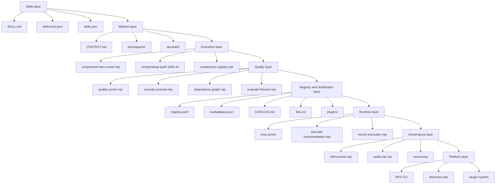
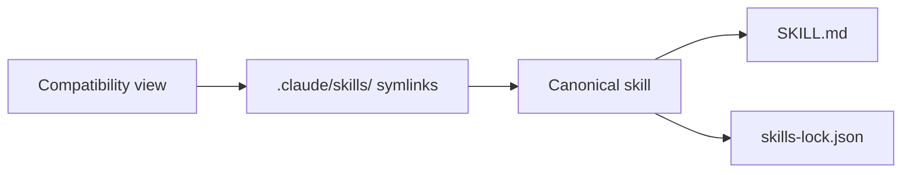

# Repository Architecture

> Reference document for the architecture of `quirk Skills`. Includes the layer diagram, layer breakdown, directory structure, key files, and the anatomy of a canonical skill.

```text
[ ARCH  ] ARCHITECTURE
```

## High-level architecture diagram



---

## 1. Skills layer

This is the domain layer. It contains the canonical skill catalog, the integrity lockfile, the portable manifest, and the compatibility view via symlinks.

| Path | Role |
|---|---|
| `.agents/skills/` | Canonical skills. Each skill is a folder with `SKILL.md` as the entrypoint. |
| `.claude/skills/` | Compatibility view. Symlinks that expose canonical skills to consumers expecting this layout. |
| `skills-lock.json` | Canonical integrity hash for each skill. |
| `skills.json` | Portable bundle manifest. Used by `npx skills` and the discovery site. |
| `registry.yaml` | Source-of-truth for the bundle. Includes JSON schema, metadata, categories, and distribution configuration. |

### Detail

- `.agents/skills/` contains 189 skills organized into categories such as `ai`, `backend`, `frontend`, `devops`, `sec`, `platform`, `routing`, etc.
- Foundation skills like `agent-canvas` provide workspace/session control for multi-agent persistence.
- `.claude/skills/` contains symlinks pointing to `.agents/skills/`, maintaining parity with tools that read skills from `.claude/skills/`.
- `skills-lock.json` is a ~41 KB JSON that records the hash of each skill to detect unauthorized modifications.
- `skills.json` is the portable manifest (~1.8 KB) with name, version, author, categories, and quality configuration.
- `registry.yaml` is the source-of-truth (~1.9 KB) with JSON schema, metadata, and lifecycle configuration.

---

## 2. Method layer

Defines the local vocabulary, conventions, ADRs, and method documentation that governs how skills behave.

| Path | Role |
|---|---|
| `CONTEXT.md` | Local vocabulary, project boundaries, and naming conventions. |
| `docs/agents/` | Method documentation, provenance, adoption guide, skill templates, stack matrix, etc. |
| `docs/adr/` | Architecture Decision Records. |
| `AUTHORSHIP.md` | Authorship and integrity of the bundle. |

### Detail

- `CONTEXT.md` is required. It must name the domain's local vocabulary, the project boundaries, and the naming conventions. Skills should reference this context and avoid vocabulary from unrelated repositories.

> **Maintenance Rule:** This file is required. It must name the domain's local vocabulary, the project boundaries, and the naming conventions. Skills should reference this context and avoid vocabulary from unrelated repositories.
- `docs/agents/` contains:
  - `quirk-method.md`: method vocabulary and quality bar.
  - `context-engine`: dynamic context retrieval via RAG from issues, docs, and traces.
  - `provenance.md`: origin and redesign status of skills.
  - `adoption-guide.md`: installation and sync guide.
  - `skill-templates.md`: artifact template map.
  - `stack-matrix.md`: skills by technology stack.
  - `skill-style-guide.md`: editing and authoring rules.
  - `skill-lab.md`: skill lab toolkit reference.
  - `release-checklist.md`: pre/post release gates.
  - `multi-agent-protocol.md`: multi-session handoff rules.
  - `skill-inventory.md`: generated status table per skill.
  - `skills-map.md`: complete skill inventory.
  - `conflict-matrix.md`: skill conflict matrix.
  - `issue-tracker.md`: issue tracker configuration.
  - `work-item-format.md`: metadata shape for specs, tickets, and PRs.
  - `triage-labels.md`: triage label vocabulary.
  - `slash-command-map.md`: flat alias map.
  - `provenance-inventory.md`: provenance records.
- `docs/adr/` contains ADRs documenting architectural decisions.

---

## 3. Execution layer

Scripts that synchronize, install, configure, and route work through the bundle.

| Path | Role |
|---|---|
| `scripts/work-item-router.mjs` | Keyword-based router that maps descriptions to skills. |
| `scripts/setup-quirk-skills.sh` | Installs the bundle in a target repository. |
| `scripts/sync-registry.mjs` | Synchronizes `registry.yaml` to `marketplace.json`, `CATALOG.md`, and other artifacts. |
| `scripts/generate-site-data.mjs` | Generates data for the discovery site. |
| `scripts/install-quirk-skills.sh` | One-line installer from upstream. |
| `scripts/skill-creator/` | Auxiliary scripts for skill creation. |

### Detail

- **Work Item Router** (`work-item-router.mjs`) is the main router. It reads `docs/agents/index.md` before routing any spec, ticket, board, or publication flow.
- `setup-quirk-skills.sh` runs the initial setup in the target repository.
- `sync-registry.mjs` regenerates distribution artifacts from `registry.yaml`.
- `generate-site-data.mjs` produces `site/src/skills.json` and other data for the discovery site.

---

## 4. Quality layer

Scripts that score, scan, graph, and evaluate skills to maintain bundle health.

| Path | Role |
|---|---|
| `.agents/skills/platform/quality-scorer.mjs` | Scoring 0-100 with grade A-F and tier BASIC/STANDARD/POWERFUL. |
| `.agents/skills/platform/security-scanner.mjs` | Detection of credential leakage, command injection, prompt injection, approval gates, and typosquatting. |
| `.agents/skills/platform/dependency-graph.mjs` | Dependency DAG, cycle detection, central skills. |
| `.agents/skills/platform/evaluate-fixtures.mjs` | Runs behavioral, regression, and security fixtures with configurable thresholds. |
| `.agents/skills/platform/evaluate-scenarios.mjs` | Structural and semantic scenarios. |
| `.agents/skills/platform/evaluate-behavioral-fixtures.mjs` | Specific behavioral fixtures. |
| `.agents/skills/platform/validate-skills.mjs` | Structural and lockfile validation. |
| `.agents/skills/platform/audit-semantics.mjs` | Semantic audit and naming conventions. |

### Detail

- `quality-scorer.mjs` evaluates 6 dimensions: frontmatter completeness, body depth, required sections, assets, behavioral spec, and safety.
- `security-scanner.mjs` returns `blocked` / `review-required` / `pass`.
- `dependency-graph.mjs` supports `mermaid` and `json` output.
- `evaluate-fixtures.mjs` combines scenario fixtures, behavioral fixtures, and security fixtures.

---

## 5. Registry and distribution layer

Manages the manifest, catalog, marketplace, plugins, and discovery entrypoints.

| Path | Role |
|---|---|
| `registry.yaml` | Source-of-truth for the bundle. Includes JSON schema, metadata, categories, and configuration. |
| `.claude-plugin/marketplace.json` | Marketplace manifest for Claude Code. Generated automatically. |
| `CATALOG.md` | Auto-generated skill catalog (~43 KB). |
| `llms.txt` | Entrypoint for agent discovery. |
| `plugins/` | Namespaced bundles by domain: `fullstack/`, `devops/`, `ai-ml/`. |
| `schema/registry.schema.json` | JSON Schema that validates `registry.yaml`. |

### Detail

- `registry.yaml` defines `bundleVersion`, `skillsDir`, `installCommand`, `pluginName`, `categories`, `supportsAgents`, `agents_compatible`, `standards`, `session_memory`, `mcp_support`, `quality`, `distribution`, and `lifecycle`.
- `plugins/` contains namespaced bundles with their own `.claude-plugin/` for domain distribution.
- `CATALOG.md` is regenerated by `sync-registry.mjs` and serves as a readable catalog.
- `llms.txt` is the entrypoint for agents to discover the bundle.
- `schema/registry.schema.json` validates the structure of `registry.yaml`.

---

## 6. Runtime layer

Instruments skill execution, exposes the registry as an MCP server, and records structured metrics.

| Path | Role |
|---|---|
| `.agents/skills/platform/mcp-server/` | MCP server that exposes skills as tools (`list_skills`, `get_skill`, `search_skills`, `resolve_skill_for_task`, `validate_skill`, `score_skill`). |
| `.agents/skills/platform/otel-skill-instrumentation.mjs` | OTEL instrumentation for skill execution traces. |
| `.agents/skills/platform/record-execution.mjs` | Records structured invocation metrics. |
| `.agents/skills/platform/traces/` | Generated traces. |
| `.agents/skills/platform/runs/` | Generated runs (~106 KB). |
| `.agents/skills/platform/audit/` | Audit trail JSONL. |

### Detail

- `mcp-server/mcp-skills-server.mjs` supports `--stdio` and HTTP. Exposes 6 main tools.
- `otel-skill-instrumentation.mjs` captures spans and metrics from skill execution.
- `record-execution.mjs` produces structured metrics per invocation.
- `runs/` stores historical executions.
- `traces/` stores execution traces.

---

## 7. Governance layer

Governs the skill lifecycle with evidence-gated updates, immutable audit trail, and channel-based versioning.

| Path | Role |
|---|---|
| `.agents/skills/platform/skill-evolver.mjs` | Evidence-gated skill evolution. Requires evidence types based on change category. |
| `.agents/skills/platform/audit-trail.mjs` | Immutable append-only JSONL of lifecycle events. |
| `VERSION` | Current bundle version. |
| `CHANGELOG.md` | Changes per version. |

### Detail

- `skill-evolver.mjs` applies evidence-gated updates. Change categories determine which evidence is required:
  - `subagent-swarm`: coordinates sub-agent roles with explicit handoff contracts.
  - `metadata` → quality-score
  - `operational-spec` → behavioral-fixture + quality-score
  - `behavioral-constraint` → behavioral-fixture + security-scan
  - `knowledge` → quality-score
  - `compatibility` → dependency-check + regression-test
- `audit-trail.mjs` records events in `.agents/skills/platform/audit/` as immutable JSONL.
- `VERSION` contains the current bundle version.
- `CHANGELOG.md` documents changes per release.

---

## 8. Platform layer

Provides the NPX CLI, the discovery site, and the plugin system for distribution and consumption.

| Path | Role |
|---|---|
| `bin/skills-quirk.js` | NPX CLI. Commands: `list`, `search`, `validate`, `audit`, `score`, `security`, `graph`, `test`, `mcp`, `evolve`, `audit-trail`, `metrics`, `sync`, `catalog`, `install`. |
| `site/` | Discovery site. Vite + React app for visual exploration of skills. |
| `.claude-plugin/plugin.json` | Plugin manifest for Claude Code. Defines `skillsDir`, owner, and metadata. |
| `package.json` | NPM metadata for the bundle. |
| `.github/workflows/` | CI: `validate.yml` and `skills-ci.yml`. |

### Detail

- `bin/skills-quirk.js` is the main CLI. It delegates to scripts in `.agents/skills/platform/` and `scripts/`.
- `site/` contains a React app with `App.jsx`, `Filters.jsx`, `SkillCard.jsx`, `main.jsx`, and `data.json`.
- `.claude-plugin/plugin.json` defines the plugin for Claude Code with `skillsDir: .agents/skills`.
- `package.json` defines the NPM package.
- `.github/workflows/validate.yml` runs the full bundle validation in CI.

---

## Directory structure

```text
skills-quirk/
├── .agents/
│   ├── adr/                          # Bundle ADRs
│   └── skills/                       # Canonical skills (189 skills)
│       ├── <category>/               # Categories: ai, backend, frontend, etc.
│       │   └── <skill-name>/
│       │       └── SKILL.md          # Skill entrypoint
│       └── platform/                 # Platform and tooling skills
│           ├── mcp-server/           # MCP server
│           ├── audit/                # Audit trail JSONL
│           ├── traces/               # OTEL traces
│           ├── runs/                 # Historical executions
│           ├── fixtures/             # Evaluation fixtures
│           ├── quality-scorer.mjs    # Quality scoring
│           ├── security-scanner.mjs  # Security scanning
│           ├── dependency-graph.mjs  # Dependency graph
│           ├── evaluate-fixtures.mjs # Fixture evaluation
│           ├── skill-evolver.mjs     # Evidence-gated evolution
│           ├── audit-trail.mjs       # Audit trail CLI
│           ├── otel-skill-instrumentation.mjs  # OTEL instrumentation
│           ├── record-execution.mjs  # Execution metrics
│           ├── check-all.mjs         # Full validation
│           ├── sync-bundle.mjs       # Sync bundle to target repo
│           ├── validate-skills.mjs   # Structural validation
│           ├── audit-semantics.mjs   # Semantic audit
│           └── skill-lab.mjs         # Skill lab toolkit
├── .claude/
│   └── skills/                       # Compatibility view (symlinks)
├── .claude-plugin/
│   └── plugin.json                   # Plugin manifest for Claude Code
├── .github/
│   └── workflows/
│       ├── validate.yml              # CI: full validation
│       └── skills-ci.yml             # CI: legacy
├── bin/
│   └── skills-quirk.js               # NPX CLI
├── docs/
│   ├── adr/                          # Project ADRs
│   ├── agents/                       # Method documentation
│   │   ├── quirk-method.md
│   │   ├── provenance.md
│   │   ├── adoption-guide.md
│   │   ├── skill-templates.md
│   │   ├── skills-map.md
│   │   ├── skill-inventory.md
│   │   ├── stack-matrix.md
│   │   ├── skill-style-guide.md
│   │   ├── release-checklist.md
│   │   ├── multi-agent-protocol.md
│   │   ├── conflict-matrix.md
│   │   ├── issue-tracker.md
│   │   ├── work-item-format.md
│   │   ├── triage-labels.md
│   │   ├── slash-command-map.md
│   │   ├── provenance-inventory.md
│   │   ├── domain.md
│   │   ├── index.md
│   │   └── examples/
│   └── proposals/                    # Proposals
├── plugins/
│   ├── fullstack/                    # fullstack plugin namespace
│   │   └── .claude-plugin/
│   ├── devops/                       # devops plugin namespace
│   │   └── .claude-plugin/
│   └── ai-ml/                        # ai-ml plugin namespace
│       └── .claude-plugin/
├── schema/
│   └── registry.schema.json          # JSON Schema for registry.yaml
├── scripts/
│   ├── work-item-router.mjs          # Work item router
│   ├── setup-quirk-skills.sh         # Setup in target repo
│   ├── sync-registry.mjs             # Sync registry to artifacts
│   ├── generate-site-data.mjs        # Data for discovery site
│   ├── install-quirk-skills.sh       # One-line installer
│   └── skill-creator/                # Auxiliary scripts
├── site/
│   ├── src/                          # React + Vite source
│   │   ├── App.jsx
│   │   ├── Filters.jsx
│   │   ├── SkillCard.jsx
│   │   ├── main.jsx
│   │   └── data.json
│   └── public/                       # Static assets
├── tooling/
│   ├── assets/                       # Assets (banners, SVGs)
│   ├── case-studies/                 # Case studies
│   ├── examples/                     # Examples
│   ├── references/                   # References
│   ├── seed/                         # Seed bundle
│   │   ├── integration-playground/
│   │   └── testing-framework/
│   ├── templates/                    # Templates
│   └── videos/                       # Video tutorials
├── CONTEXT.md                        # Local vocabulary
├── README.md                         # Main documentation
├── AUTHORSHIP.md                     # Authorship and integrity
├── CHANGELOG.md                      # Changes per version
├── VERSION                           # Current version
├── registry.yaml                     # Source-of-truth for the bundle
├── skills.json                       # Portable manifest
├── skills-lock.json                  # Canonical skill hash
├── package.json                      # NPM metadata
├── .env.template                     # Environment variable template
├── .gitignore                        # Git ignore
└── LICENSE                           # MIT License
```

---

## Key files

| File | Purpose |
|---|---|
| `CONTEXT.md` | Local vocabulary, boundaries, and naming conventions. |
| `README.md` | Main documentation, quick start, AI-agnostic prompts, architecture, method, validation, governance, and distribution. |
| `registry.yaml` | Source-of-truth for the bundle. Metadata, categories, quality configuration, distribution, and lifecycle. |
| `skills.json` | Portable manifest for consumption by agents and NPM. |
| `skills-lock.json` | Canonical hash of each skill for integrity. |
| `VERSION` | Current bundle version. |
| `CHANGELOG.md` | Changes per release. |
| `AUTHORSHIP.md` | Authorship and integrity. |
| `bin/skills-quirk.js` | NPX CLI that delegates to platform scripts. |
| `scripts/work-item-router.mjs` | Keyword-based work item router. |
| `scripts/setup-quirk-skills.sh` | Installs the bundle in a target repository. |
| `scripts/sync-registry.mjs` | Synchronizes `registry.yaml` to `marketplace.json`, `CATALOG.md`, and other artifacts. |
| `docs/agents/index.md` | Operating map of the bundle. First stop after `work-item-router`. |
| `docs/agents/quirk-method.md` | Method vocabulary and quality bar. |
| `docs/agents/provenance.md` | Origin and redesign status of skills. |
| `docs/agents/adoption-guide.md` | Installation and sync guide. |
| `.claude-plugin/plugin.json` | Plugin manifest for Claude Code. |
| `schema/registry.schema.json` | JSON Schema that validates `registry.yaml`. |
| `package.json` | NPM metadata for the bundle. |
| `.github/workflows/validate.yml` | CI: full bundle validation. |

---

## Anatomy of a canonical skill

A canonical skill is a folder under `.agents/skills/` with the following minimum structure:

```text
.agents/skills/<category>/<skill-name>/
├── SKILL.md          # Entrypoint (markdown with YAML frontmatter)
├── <skill-name>.md   # Detailed documentation (optional)
├── scripts/          # Skill auxiliary scripts
├── assets/           # Assets (images, diagrams)
├── references/       # External references
├── adrs/             # Skill-specific ADRs
├── scenarios/        # Scenario fixtures
├── behavioral-fixtures/ # Behavioral fixtures
└── skill-creator-interview.json # Design interview (optional)
```

### Entrypoint: SKILL.md

Each skill has a `SKILL.md` that serves as the entrypoint. It contains:

- **YAML frontmatter** with `name`, `description`, `version`, `author`, and optionally `inputs`, `outputs`, `sideEffects`, `trustTier`.
- **Markdown body** with step-by-step instructions, flows, contracts, and examples.
- **Required sections** according to the skill type (e.g., behavioral spec for delivery skills).

### Lockfile: skills-lock.json

`skills-lock.json` records the canonical hash of each skill. It is used to:

- Detect unauthorized modifications.
- Synchronize the bundle while maintaining integrity.
- Validate that the compatibility view matches the canonicals.

### Compatibility view: .claude/skills/

`.claude/skills/` contains symlinks pointing to `.agents/skills/`. This allows tools that expect skills in `.claude/skills/` to consume the bundle without modifying the canonical layout.



### Example: skill-creator

The `skill-creator` skill in `.agents/skills/skill-dev/skill-creator/` illustrates the complete anatomy:

- `SKILL.md`: entrypoint with frontmatter and detailed body.
- `adrs/`: skill design ADRs.
- `assets/`: visual resources.
- `behavioral-fixtures/`: behavioral fixtures.
- `references/`: external references.
- `scenarios/`: scenario fixtures.
- `scripts/`: auxiliary scripts.
- `skill-creator-interview.json`: design interview.

---

## Interaction layers

The standard workflow (`quirk Method`) crosses the layers as follows:

1. **setup-quirk-skills** (platform) installs the bundle in the target repository.
2. **Work Item Router** (execution) reads `docs/agents/index.md` (method) and routes to **ask-to** (skill).
3. **ask-to** (skill) routes to **grill-with-docs** (skill) to refine the plan.
4. **to-spec** and **to-tickets** (skills) produce specs and tickets using the format documented in `docs/agents/work-item-format.md`.
5. **implement** (skill) executes the work.
6. **publish-open-pr** (skill) opens the PR.
7. **review-pr** (skill) reviews against Standards and Spec.
8. **plan-review-fixes** (skill) produces a remediation plan if there are findings.
9. **implement-review-fixes** (skill) applies the corrections.
10. **ship-subissue** (skill) merges and closes the issue.
11. **quality-scorer**, **security-scanner**, **dependency-graph**, and **evaluate-fixtures** (quality) validate bundle health.
12. **skill-evolver** (governance) updates skills with evidence gating.
13. **audit-trail** (governance) records the lifecycle.
14. **mcp-server** (runtime) exposes the registry to external agents.
15. **bin/skills-quirk.js** (platform) provides a unified CLI.
16. **site/** (platform) provides visual discovery.
17. **plugins/** (registry and distribution) provide namespaced bundles.

---

## Design notes

- **Separation of concerns**: Each layer has a clear responsibility. The skills layer contains the domain; the method layer contains the knowledge; the execution layer contains the scripts; the quality layer contains the validations; the registry layer contains the distribution; the runtime layer contains the instrumentation; the governance layer contains the lifecycle; the platform layer contains the CLI and the site.
- **Progressive disclosure**: Skills use progressive disclosure. `SKILL.md` is the short entrypoint; the body contains details and references to external documents.
- **Integrity by default**: `skills-lock.json` and the audit trail JSONL guarantee integrity and traceability.
- **AI-agnostic**: The bundle is designed to be consumed by any agent IDE (Claude Code, Codex, Cursor, OpenAI, Gemini) without vendor lock-in dependency.
- **Evidence-gated governance**: Skill updates require explicit evidence based on the change category, documented in `skill-evolver.mjs`.
