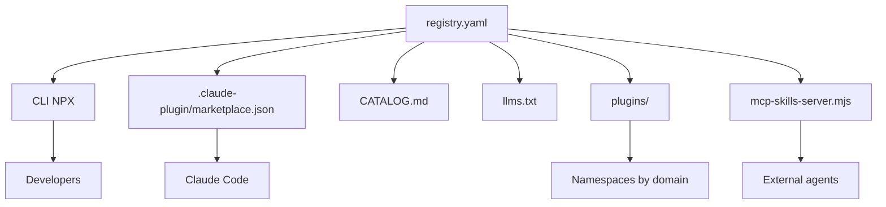
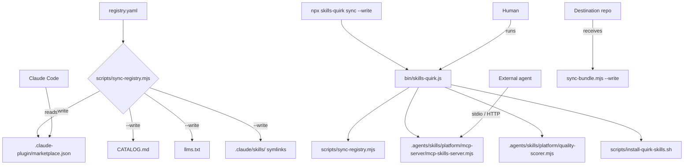

# Distribution of quirk Skills

> Reference document for the distribution mechanisms of the quirk Skills bundle. Includes the NPX CLI, the registry, the marketplace, the MCP server, the sync process, and the plugin system.

```text
[ DIST ] DISTRIBUTION
```

## 1. Overview

quirk Skills is distributed through multiple channels designed for different consumers: humans via CLI, IDEs via plugins, AI agents via MCP and discovery sites, and destination repositories via sync.



### Distribution layers

| Layer | Component | Consumer |
|---|---|---|
| **CLI** | bin/skills-quirk.js | Human developers |
| **Registry** | registry.yaml | Source-of-truth of the bundle |
| **Marketplace** | .claude-plugin/marketplace.json | Claude Code |
| **Catalog** | CATALOG.md | Human-readable |
| **Agent discovery** | llms.txt | AI agents |
| **Plugins** | plugins/*/.claude-plugin/plugin.json | IDEs by namespace |
| **MCP** | mcp-skills-server.mjs | External agents via MCP |

---

## 2. NPX CLI

The skills-quirk CLI is the main entry point for interacting with the bundle from the command line. It is distributed as an NPM package under the name @quirk/skills and is invoked via npx skills-quirk.

### Available commands

| Command | Underlying script | Description |
|---|---|---|
| list | skill-lab.mjs list | Lists all skills in the bundle |
| search <query> | skill-lab.mjs search | Searches skills by name, description, or capability |
| validate | validate-skills.mjs | Validates structure and lockfile |
| audit | audit-semantics.mjs | Audits semantics and naming conventions |
| score <skill> | quality-scorer.mjs | Calculates score 0-100 with grade A-F |
| security <skill> | security-scanner.mjs | Scans security risks |
| graph | dependency-graph.mjs | Generates dependency graph |
| test | evaluate-fixtures.mjs | Runs behavioral, regression, and security fixtures |
| mcp | mcp-skills-server.mjs | Starts the MCP server |
| evolve <skill> | skill-evolver.mjs | Evidence-gated evolution |
| audit-trail | audit-trail.mjs | Queries the audit trail |
| metrics | skill-lab.mjs metrics | Generates bundle metrics |
| sync [--write] | sync-registry.mjs | Synchronizes registry to artifacts |
| catalog [--write] | generate-site-data.mjs | Generates site/src/skills.json |
| install | install-quirk-skills.sh | Installs the bundle in a destination repo |

### CLI usage

```bash
# Show help
npx skills-quirk help

# List skills
npx skills-quirk list

# Search skills
npx skills-quirk search "react testing"

# Score a skill
npx skills-quirk score skill-creator

# Security scan
npx skills-quirk security implement

# Sync registry (dry-run)
npx skills-quirk sync

# Sync registry (apply changes)
npx skills-quirk sync --write

# Start MCP server in stdio mode
npx skills-quirk mcp --stdio

# Start MCP server in HTTP mode
npx skills-quirk mcp --port 3000
```

### Implementation

bin/skills-quirk.js is a Node.js wrapper that parses arguments, resolves the command to a script in .agents/skills/platform/ or scripts/, and executes it inheriting stdio.

```javascript
// Command resolution example
const scripts = {
  list: .agents/skills/platform/skill-lab.mjs list,
  search: .agents/skills/platform/skill-lab.mjs search,
  score: .agents/skills/platform/quality-scorer.mjs,
  security: .agents/skills/platform/security-scanner.mjs,
  sync: scripts/sync-registry.mjs,
  mcp: .agents/skills/platform/mcp-server/mcp-skills-server.mjs,
  // ...
};
```

---

## 3. Registry and marketplace

The registry is the distribution layer that generates and maintains discovery artifacts from a single source of truth.

### 3.1 registry.yaml — Source of truth

registry.yaml is the canonical file that defines the bundle metadata. It includes:

- **Identity**: name, displayName, description, version, bundleVersion, author, repository, license
- **Structure**: skillsDir, installCommand, pluginName
- **Categories**: list of skill categories
- **Compatibility**: supportsAgents, agents_compatible, standards
- **Quality configuration**: quality.scoringEnabled, minScore, tiers, securityScanEnabled
- **Distribution**: distribution.npmPackage, distribution.npxCommand, distribution.marketplaces
- **Lifecycle**: lifecycle.channels (stable, beta, canary), lifecycle.defaultChannel, lifecycle.evidenceGatedUpdates

```yaml
{
  $schema: ./schema/registry.schema.json,
  name: quirk-skills,
  displayName: Quirk Skills,
  description: A portable, validated skills bundle...,
  version: 1.0.0,
  bundleVersion: 1.0.0,
  author: quantumquirkxyz,
  repository: https://github.com/quantumquirkxyz/skills-quirk,
  license: MIT,
  skillsDir: .agents/skills,
  installCommand: bash scripts/setup-quirk-skills.sh .,
  pluginName: quirk-skills,
  categories: [accessibility, ai, backend, ...],
  supportsAgents: [claude-code, codex, cursor, openai, gemini],
  agents_compatible: [claude-code, codex, opencode, gemini, openhands, warp],
  standards: [quirk, agentskills.io],
  session_memory: .agents/skills/session/,
  mcp_support: true,
  quality: {
    scoringEnabled: true,
    minScore: 60,
    tiers: [BASIC, STANDARD, POWERFUL],
    securityScanEnabled: true,
    mutationTesting: false
  },
  distribution: {
    npmPackage: @quirk/skills,
    npxCommand: npx skills-quirk,
    marketplaces: {
      claudeCode: true,
      opencode: true,
      codex: true
    }
  },
  lifecycle: {
    channels: [stable, beta, canary],
    defaultChannel: stable,
    evidenceGatedUpdates: true
  }
}
```

The file is validated against schema/registry.schema.json before each sync.

### 3.2 .claude-plugin/marketplace.json — Claude Code marketplace manifest

marketplace.json is automatically generated by scripts/sync-registry.mjs. It is the manifest that Claude Code uses to discover and install the bundle as a plugin.

```json
{
  name: quirk-skills,
  owner: {
    name: quantumquirkxyz,
    url: https://github.com/quantumquirkxyz/skills-quirk
  },
  metadata: {
    description: A portable, validated skills bundle...,
    version: 1.0.0,
    license: MIT,
    repository: https://github.com/quantumquirkxyz/skills-quirk
  },
  plugins: [
    {
      name: quirk-ai,
      description: Quirk AI skills,
      version: 1.0.0,
      skillsDir: .agents/skills/ai,
      skills: [
        {
          name: llmops,
          description: LLMOps...,
          category: ai,
          version: 1,
          maturity: stable,
          risk: medium,
          trustTier: 3,
          capabilities: [...],
          sideEffects: [...],
          path: .agents/skills/ai/llmops
        }
      ]
    }
  ],
  skillsDir: .agents/skills
}
```

Each category is converted into a plugin namespace within the marketplace.

### 3.3 CATALOG.md — Auto-generated catalog

CATALOG.md is a Markdown document generated by scripts/sync-registry.mjs that lists all skills organized by category in table format.

```markdown
# Quirk Skills Catalog

> Generated from quirk-skills v1.0.0
> 229 skills across 31 categories

## Skills by Category

### ai

| Skill | Version | Maturity | Risk | Trust Tier | Description |
|-------|---------|----------|------|------------|-------------|
| [llmops](.agents/skills/ai/llmops) | 1 | stable | medium | 3 | LLMOps (deployment, monitoring, A/B testing...) |
| [mlops](.agents/skills/ai/mlops) | 1 | stable | medium | 3 | MLOps (feature stores, model registry...) |
```

The catalog is regenerated with npx skills-quirk sync --write or npx skills-quirk catalog --write.

### 3.4 llms.txt — Agent-discovery entrypoint

llms.txt is a plain text file generated by scripts/sync-registry.mjs designed for AI agents to discover the bundle without parsing complex Markdown.

```text
# Quirk Skills - Agent Discovery Entrypoint

> 229 skills for AI coding agents. Source: https://github.com/quantumquirkxyz/skills-quirk

## Quick Install

```bash
npx skills-quirk add quirk-skills
```

## Skills Index

- [accessibility](./agents/skills/accessibility/accessibility/SKILL.md) — Design inclusive products...
- [agent-canvas](./agents/skills/foundation/agent-canvas/SKILL.md) — Reference skill for agent workspace control...
- ...

## Categories

- accessibility: 3 skills
- ai: 5 skills
- backend: 12 skills
```

The file includes quick install, alphabetical skills index, and category counts.

### 3.5 plugins/ — Namespace plugin bundles

The plugins/ directory contains skill bundles organized by technology domain. Each plugin is a self-contained directory with its own .claude-plugin/plugin.json.

| Plugin | Path | Included skills |
|---|---|---|
| quirk-fullstack | plugins/fullstack/ | react, nextjs, typescript, testing, accessibility, frontend-design, state-management, styling |
| quirk-devops | plugins/devops/ | docker, kubernetes, terraform, ci-cd, monitoring, incident-response, chaos-engineering |
| quirk-ai-ml | plugins/ai-ml/ | ai-prompt-engineering, rag-pipeline, llm-eval, llm-fine-tuning, mlops, ai-model-evaluation |

Each plugin can be distributed independently and consumes a specific subset of the bundle.

---

## 4. MCP server

The MCP server exposes the skills registry as MCP (Model Context Protocol) tools, allowing external agents to discover, search, and validate skills in a standardized way.

### Location

```
.agents/skills/platform/mcp-server/mcp-skills-server.mjs
```

### Exposed tools

| Tool | Description | Parameters |
|---|---|---|
| list_skills | Lists all skills, optionally filtered by category or agent | category?, agent? |
| get_skill | Gets the full content of SKILL.md | name (required), version? |
| search_skills | Searches skills by query in name, description, and capabilities | query (required), limit? |
| resolve_skill_for_task | Recommends the best skill for a task description | task (required) |
| validate_skill | Validates a skill against quirk standards | name (required) |
| score_skill | Calculates score 0-100 with grade and tier | name (required) |
| get_registry_info | Gets registry metadata and statistics | (no parameters) |

### Usage in stdio mode

Stdio mode is the standard for integration with MCP clients like Claude Desktop, Cursor, or compatible IDEs.

```bash
node .agents/skills/platform/mcp-server/mcp-skills-server.mjs --stdio
```

The server reads JSON-RPC requests from stdin and writes responses to stdout.

**Example request:**

```json
{
  jsonrpc: 2.0,
  id: 1,
  method: tools/call,
  params: {
    name: search_skills,
    arguments: {
      query: react testing,
      limit: 5
    }
  }
}
```

**Example response:**

```json
{
  jsonrpc: 2.0,
  id: 1,
  result: {
    content: [
      {
        type: text,
        text: {
  query: react testing,
  results: [
    {
      name: frontend-testing,
      category: frontend,
      description: Frontend testing (Vitest, Testing Library, Playwright...),
      score: 15
    }
  ],
  total: 1
}
      }
    ]
  }
}
```

### Usage in HTTP mode

HTTP mode exposes the server on a TCP port for consumption by remote services or proxies.

```bash
node .agents/skills/platform/mcp-server/mcp-skills-server.mjs --port 3000
```

**Endpoints:**

| Method | Route | Description |
|---|---|---|
| POST | /mcp | JSON-RPC proxy for MCP tools |
| GET | /health | Health check with skill count |

**Example HTTP request:**

```bash
curl -X POST http://localhost:3000/mcp   -H "Content-Type: application/json"   -d '{
    jsonrpc: 2.0,
    id: 1,
    method: tools/call,
    params: {
      name: resolve_skill_for_task,
      arguments: {
        task: I need to design a REST API with authentication
      }
    }
  }'
```

**Example health check:**

```bash
curl http://localhost:3000/health
```

**Response:**

```json
{
  status: ok,
  skills: 229
}
```

### MCP Initialization

```json
{
  jsonrpc: 2.0,
  id: 1,
  method: initialize,
  params: {}
}
```

**Response:**

```json
{
  jsonrpc: 2.0,
  id: 1,
  result: {
    protocolVersion: 2024-11-05,
    capabilities: {
      tools: {}
    },
    serverInfo: {
      name: quirk-skills-mcp,
      version: 1.0.0
    }
  }
}
```

---

## 5. Sync Process

The sync process copies the bundle from the canonical repository to a destination repository, preserving symlinks, lockfiles, and structure.

### 5.1 sync-bundle.mjs — Full bundle sync

```
.agents/skills/platform/sync-bundle.mjs <target-repo> [--write] [--force]
```

### Dry-run mode (default)

Running without --write shows which files would be copied and detects conflicts without modifying the destination.

```bash
node .agents/skills/platform/sync-bundle.mjs /path/to/target-repo
```

**Output in case of conflicts:**

```json
{
  status: blocked,
  write: false,
  target: /path/to/target-repo,
  conflicts: [
    .agents/skills/foundation/agent-canvas/SKILL.md,
    docs/agents/adoption-guide.md
  ],
  note: Use --force with --write only after reviewing target-local changes.
}
```

**Output on success (dry-run):**

```json
{
  status: pass,
  mode: dry-run,
  target: /path/to/target-repo,
  files: 1523,
  note: No files written. Add --write to apply.
}
```

### Apply mode (--write)

Running with --write copies files to the destination and regenerates .claude/skills/ symlinks.

```bash
node .agents/skills/platform/sync-bundle.mjs /path/to/target-repo --write
```

**Output:**

```json
{
  status: pass,
  mode: write,
  target: /path/to/target-repo,
  files: 1523,
  note: Bundle synced.
}
```

### Synchronized files

| File / Directory | Description |
|---|---|
| .agents/AGENTS.md | Repository agent instructions |
| .agents/skills/ | Complete canonical skills |
| docs/agents/ | Method documentation |
| docs/adr/README.md | ADR entry point |
| tooling/case-studies/README.md | Case studies template |
| tooling/case-studies/template.md | Case studies template |
| AUTHORSHIP.md | Authorship and integrity |
| CONTEXT.md | Local vocabulary |
| README.md | Main documentation |
| LICENSE | MIT License |
| VERSION | Current bundle version |
| CHANGELOG.md | Changes by version |
| skills-lock.json | Canonical skill hash |

### Symlink behavior

The sync regenerates .claude/skills/ as relative symlinks pointing to .agents/skills/. If a symlink exists but the destination is not a symlink, the sync blocks unless --force is used.

```bash
# Example generated symlink
.claude/skills/agent-canvas -> ../../.agents/skills/foundation/agent-canvas
```

### 5.2 sync-registry.mjs — Registry to artifacts sync

scripts/sync-registry.mjs is the script that regenerates distribution artifacts from registry.yaml and the skills filesystem.

```bash
# Dry-run
node scripts/sync-registry.mjs

# Apply
node scripts/sync-registry.mjs --write
```

**Generated artifacts:**

| Artifact | Path | Description |
|---|---|---|
| Marketplace manifest | .claude-plugin/marketplace.json | Manifest for Claude Code |
| Catalog | CATALOG.md | Human-readable skills catalog |
| Agent discovery | llms.txt | Entry point for AI agents |
| Symlinks | .claude/skills/* | Compatibility view |

---

## 6. Plugin system

The plugin system allows distributing namespaced subsets of the bundle for specific domains.

### 6.1 plugin.json — Manifest structure

Each plugin is defined in .claude-plugin/plugin.json within its directory.

#### Root plugin (quirk-skills)

**Location:** .claude-plugin/plugin.json

```json
{
  name: quirk-skills,
  owner: {
    name: quantumquirkxyz,
    url: https://github.com/quantumquirkxyz/skills-quirk
  },
  metadata: {
    description: A portable, validated skills bundle...,
    version: 1.0.0,
    license: MIT,
    repository: https://github.com/quantumquirkxyz/skills-quirk
  },
  plugins: [],
  skillsDir: .agents/skills
}
```

#### Namespaced plugin example (fullstack)

**Location:** plugins/fullstack/.claude-plugin/plugin.json

```json
{
  name: quirk-fullstack,
  version: 1.0.0,
  description: Fullstack development skills for Quirk: React, Next.js, TypeScript, testing, accessibility,
  author: {
    name: quantumquirkxyz,
    url: https://github.com/quantumquirkxyz/skills-quirk
  },
  skills: [
    react, nextjs, typescript, testing, accessibility,
    frontend-design, state-management, styling
  ],
  agents: [],
  commands: [
    ship-subissue, review-pr
  ],
  hooks: [],
  mcpServers: []
}
```

### 6.2 Manifest fields

| Field | Type | Description |
|---|---|---|
| name | string | Unique plugin name |
| version | string | Plugin version |
| description | string | Human description |
| author | object | Author with name and url |
| metadata | object | Optional metadata (description, version, license, repository) |
| skills | string[] | List of skills included in the plugin |
| agents | string[] | Included agents (currently empty in all plugins) |
| commands | string[] | Exposed slash commands |
| hooks | array | Lifecycle hooks (currently empty in all plugins) |
| mcpServers | array | Included MCP servers (currently empty in all plugins) |

### 6.3 Available plugins

| Plugin | Path | Domain | Skills | Commands |
|---|---|---|---|---|
| quirk-skills | .claude-plugin/plugin.json | Full | 229 | — |
| quirk-fullstack | plugins/fullstack/.claude-plugin/plugin.json | Fullstack | 8 | ship-subissue, review-pr |
| quirk-devops | plugins/devops/.claude-plugin/plugin.json | DevOps | 7 | wayfinder, to-tickets |
| quirk-ai-ml | plugins/ai-ml/.claude-plugin/plugin.json | AI/ML | 6 | — |

---

## 7. Complete distribution flow

The full flow from registry to final consumer:



---

## 8. IDE integration

### Claude Code

Claude Code consumes the bundle through .claude-plugin/marketplace.json and .claude/skills/. The marketplace is synchronized with:

```bash
npx skills-quirk sync --write
```

### OpenCode

OpenCode consumes skills from .opencode/ or .claude/skills/. sync-registry can generate the compatible layout.

### Cursor / Codex

These IDEs consume skills from .claude/skills/ or the directory configured in their respective agent skills configuration. Symlinks guarantee parity.

---

## 9. Release channels

The bundle distributes skills through release channels defined in registry.yaml:

| Channel | Purpose | Stability |
|---|---|---|
| stable | Production. Validated skills with minimum score. | High |
| beta | Preview. Skills in advanced validation. | Medium |
| canary | Experimental. Skills in active development. | Low |

The default channel is stable. Evidence-gated updates (evidenceGatedUpdates: true) require explicit evidence according to the change category before promoting a skill between channels.

---

## 10. Cross-references

| Document | Purpose |
|---|---|
| docs/wiki/Architecture.md | Complete bundle architecture |
| docs/agents/adoption-guide.md | Installation and sync guide |
| docs/wiki/Installation.md | Step-by-step installation |
| docs/wiki/Governance.md | Lifecycle and evidence-gated updates |
| registry.yaml | Source of truth |
| bin/skills-quirk.js | NPX CLI |
| .agents/skills/platform/mcp-server/mcp-skills-server.mjs | MCP server |
| .agents/skills/platform/sync-bundle.mjs | Bundle sync to destination repo |
| scripts/sync-registry.mjs | Registry to artifacts sync |
| schema/registry.schema.json | JSON Schema for registry.yaml
