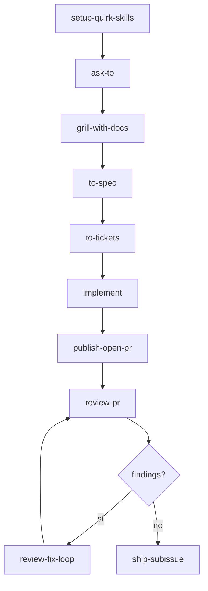
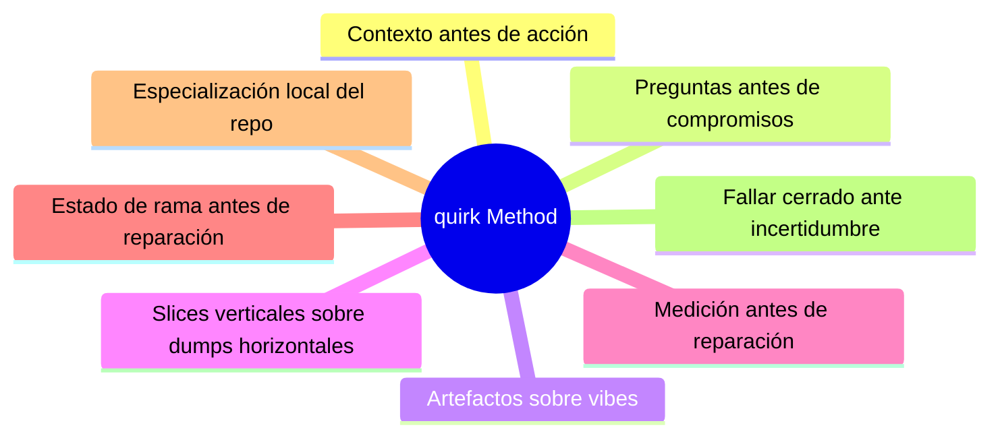
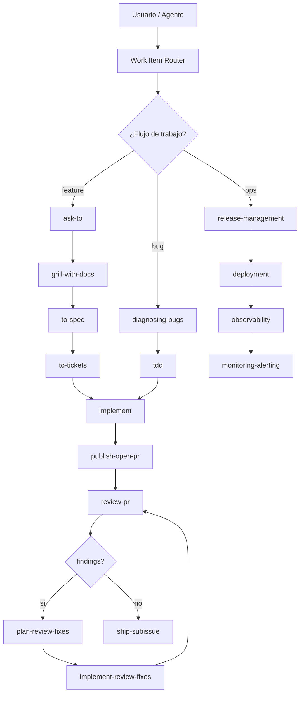
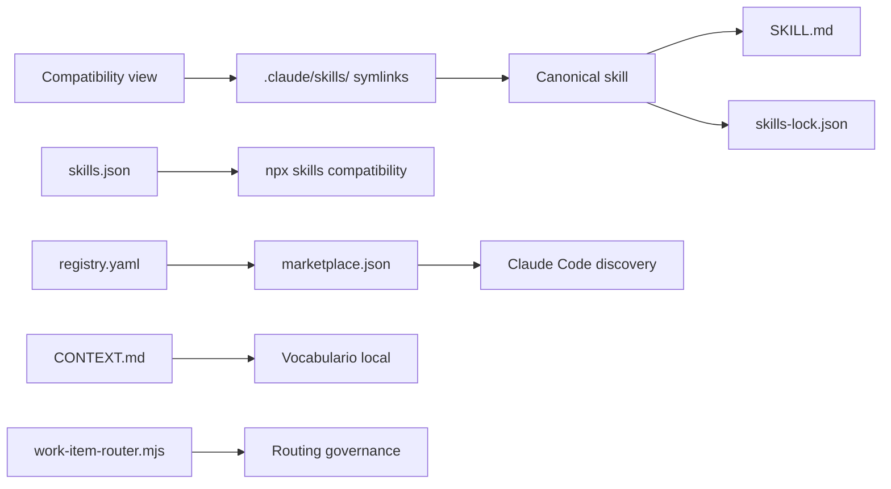
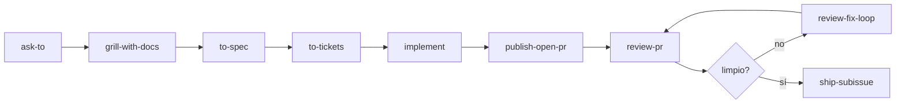
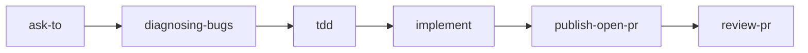
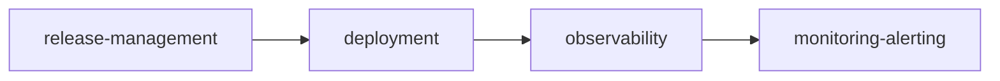

# quirk Skills — Wiki Home

> **Portable workflow system for moving software work from intent to validated delivery.**

---

## Navigation

| Page | Description |
|---|---|
| [Home](Home.md) | Main wiki page |
| [Method](Method.md) | The quirk method: principles, vocabulary and canonical flow |
| [Skills-Catalog](../../CATALOG.md) | Complete catalog of skills by category |
| [Installation](Installation.md) | Installation and synchronization guide |
| [Architecture](Architecture.md) | Overview of bundle architecture |
| [Governance](Governance.md) | Lifecycle, auditing and quality gates |
| [FAQ](FAQ.md) | Frequently asked questions |

---

## Welcome

`quirk Skills` is a portable workflow system for moving software work from intent to validated delivery. It is designed for repositories where work must move from ambiguous intent to reviewed delivery without losing context, expanding scope, or hiding risks.

The bundle contains **189 canonical skills** distributed across categories such as backend, frontend, DevOps, AI/ML, cybersecurity, physics, mathematics, finance, quantitative, Web3 and more. It follows the `quirk` method: clarify before building, preserve context, split work into claimable slices, review against Standards and Spec axes separately, repair with an explicit plan, and merge only with clean evidence.

---

## What is quirk Skills?

`quirk Skills` is a **portable workflow system** for agent-assisted software development. It installs in any repository and specializes through `CONTEXT.md`, ADRs, issue tracker configuration, and stack-specific skills.

### Definition

A **skill** is a unit of specialized instruction packaged as a `SKILL.md` file with a canonical lockfile (`skills-lock.json`). Each skill encapsulates knowledge, workflows, and artifacts for a specific task or domain.

### Purpose

- **Reduce contextual drift** between agent sessions.
- **Make workflow explicit** and reproducible.
- **Separate method specialization** from domain specialization.
- **Enable installation** in any repo with minimal friction.

### Key features

| Feature | Description |
|---|---|
| **Canonical skills** | 189 skills in `.agents/skills/` with SHA-256 hash lockfile |
| **Compatibility view** | Symlinks in `.claude/skills/` for consumers expecting that layout |
| **Local vocabulary** | `CONTEXT.md` defines repo-specific domain terms |
| **Explicit method** | Flow: clarify → preserve → split → review → repair → send |
| **Durable artifacts** | Specs, tickets, PR bodies, review plans and handoffs |
| **Automated validation** | `check-all.mjs` runs 8 scenarios and 4 behavioral fixtures |
| **Portable installation** | Sync scripts for greenfield and existing repos |

---

## The quirk Method

The `quirk` method prescribes a **6-stage** workflow:

| Stage | Skill(s) | Action |
|---|---|---|
| **1. Clarify** | `setup-quirk-skills` → `ask-to` → `grill-with-docs` | Understand the problem before building |
| **2. Preserve context** | `context-pack`, `context-engine` | Package fresh reads and provenance for the next skill |
| **3. Split into slices** | `to-spec` → `to-tickets` | Break work into narrow, complete, claimable tickets |
| **4. Review** | `review-pr` | Measure against Standards and Spec separately |
| **5. Repair** | `plan-review-fixes` → `implement-review-fixes` | Plan and execute explicit fixes |
| **6. Send** | `ship-subissue` | Merge and close only with clean evidence |

### Canonical flow



### Guiding principles



- **Context before action.** Build a fresh context pack before working on broad tasks. Prefer repo documents, ADRs, issue tracker status, and direct code evidence over memory.
- **Questions before commitments.** Use `grill` or `grill-with-docs` when work is ambiguous. Decisions are made with the user, not guessed.
- **Artifacts over vibes.** Specifications, tickets, PR bodies, review plans, implementation notes, ADRs, and handoffs must be durable enough for another agent to consume afterward.
- **Vertical slices over horizontal dumps.** Tickets should be narrow, complete paths through behavior, validation, and delivery.
- **Measurement before repair.** `review-pr` measures Standards and Spec separately. `plan-review-fixes` plans. `implement-review-fixes` executes. `ship-subissue` sends.
- **Branch state before repair.** If a PR branch is in conflict, resolve that branch state issue first with `resolving-merge-conflicts`, then return to review and repair.
- **Repo-local specialization.** Each project owns its domain language, tracker configuration, commands, and risk boundaries.
- **Fail closed under uncertainty.** Missing fixed points, stale plans, unclear issue traceability, unresolved blockers, and skipped validations must be surfaced.

### Essential vocabulary

| Term | Meaning |
|---|---|
| **Context pack** | Bounded set of fresh reads and provenance for the next skill |
| **Domain language** | Terms chosen by the project, recorded in `CONTEXT.md` and ADRs |
| **Seam** | Public boundary where design, implementation, testing, or operations become explicit |
| **Tracer bullet** | Ticket that makes a narrow end-to-end behavior work |
| **Frontier** | Tickets that are unblocked and claimable now |
| **Review axis** | Independent review dimension: Standards or Spec |
| **Repair plan** | Durable PR comment that converts findings into scoped, validated fixes |
| **Ship state** | Clean review, known validation, linked work ready for merge |
| **Agent Canvas** | Workspace/session control skill (`agent-canvas`) for multi-agent persistence and cross-device continuity |
| **Context Engine** | Dynamic context retrieval (`context-engine`) via RAG from issues, docs and traces |
| **Subagent Swarm** | Coordinated sub-agent roles (`subagent-swarm`) with explicit handoff contracts |
| **Work Item Router** | Routing script (`work-item-router.mjs`) that maps descriptions to appropriate skills |

---

## Key numbers

| Metric | Value |
|---|---|
| **Canonical skills** | 189 |
| **Main categories** | 20+ (backend, frontend, DevOps, AI/ML, cybersecurity, physics, mathematics, finance, quantitative, Web3, UX, etc.) |
| **Stable skills** | Majority of bundle (see `docs/agents/skill-inventory.md`) |
| **Experimental skills** | Sandbox of new skills under evaluation |
| **Validation scenarios** | 8 scenario fixtures |
| **Behavioral fixtures** | 4 behavioral fixtures |
| **Local gate checks** | `check-all.mjs` covers structure, semantics, scenarios, fixtures, syntax |
| **Trust tiers** | 1-4 (basic to critical) |
| **Risk levels** | low / medium / high |

### Skills by trust tier

| Tier | Trust level | Description |
|---|---|---|
| **1** | Basic | Read-only skills, low risk |
| **2** | Standard | Skills with moderate side-effects |
| **3** | High | Skills that mutate state (`implement`, `plan-review-fixes`, etc.) |
| **4** | Critical | Skills that send and close work (`ship-subissue`) |

---

## Bundle architecture

The bundle is organized in **layers**:



### System layers

| Layer | Components | Purpose |
|---|---|---|
| **Skills** | `.agents/skills/`, `.claude/skills/`, `skills-lock.json` | Canonical definitions and compatibility view |
| **Method** | `CONTEXT.md`, `docs/agents/` | Local vocabulary, ADRs, adoption guides |
| **Execution** | `check-all.mjs`, `sync-bundle.mjs`, `work-item-router.mjs` | Validation, synchronization and routing |
| **Quality** | `quality-scorer.mjs`, `security-scanner.mjs`, `dependency-graph.mjs` | Scoring, security and dependency analysis |
| **Registry** | `registry.yaml`, `.claude-plugin/marketplace.json`, `CATALOG.md` | Distribution and discovery |
| **Runtime** | `mcp-skills-server.mjs`, `otel-skill-instrumentation.mjs` | Execution as MCP tools and traces |
| **Governance** | `skill-evolver.mjs`, `audit-trail.mjs` | Evidence-gated evolution and auditing |
| **Platform** | `bin/skills-quirk.js`, `site/`, `.claude-plugin/` | NPX CLI, discovery site and plugins |

### Skills architecture diagram



---

## Quick installation

### Option 1: One-liner installer

```bash
curl -fsSL https://raw.githubusercontent.com/quantumquirkxyz/skills-quirk/main/scripts/install-quirk-skills.sh | bash
```

### Option 2: From a local checkout

```bash
git clone https://github.com/quantumquirkxyz/skills-quirk.git
cd skills-quirk
bash scripts/install-quirk-skills.sh
```

### Option 3: Manual copy

```bash
# From an existing repo with the bundle
cp -r .agents/skills /path/to/target-repo/.agents/skills
cp -r .claude/skills /path/to/target-repo/.claude/skills
cp skills-lock.json /path/to/target-repo/skills-lock.json
cp CONTEXT.md /path/to/target-repo/CONTEXT.md
cp -r docs/agents /path/to/target-repo/docs/agents
```

### Validation

```bash
node .agents/skills/platform/check-all.mjs
```

Expected result: `status: "pass"`.

### Dry-run synchronization

```bash
node .agents/skills/platform/sync-bundle.mjs /path/to/target-repo
```

### Synchronization with apply

```bash
node .agents/skills/platform/sync-bundle.mjs /path/to/target-repo --write
```

---

## First steps after installation

1. **Run `setup-quirk-skills`** in the target repo.
2. **Configure `docs/agents/issue-tracker.md`**, `docs/agents/triage-labels.md` and `docs/agents/domain.md` for the project's real tracker and domain.
3. **Update `CONTEXT.md`** with repository-specific vocabulary. Do not copy domain vocabulary from another repo.
4. **Run `work-item-router`** before any workflow skill when tracker configuration may have changed.
5. **Start the standard flow** with `ask-to` for ambiguous routing or directly with the canonical feature flow.

### Standard feature flow



### Bug fix flow



### Operations flow



---

## Supported stack

| Stack | Main skills |
|---|---|
| **React** | `react`, `frontend-design`, `testing`, `tdd` |
| **Next.js** | `nextjs`, `vercel`, `api-design`, `observability` |
| **Astro** | `astro`, `frontend-design`, `seo` |
| **Remix** | `remix`, `api-design`, `deployment` |
| **PostgreSQL** | `postgres`, `db-query-optimization`, `db-relational-design`, `db-migrations` |
| **Kubernetes** | `devops-k8s-orchestration`, `observability`, `secret-management` |
| **Terraform** | `devops-terraform-iac`, `cost-optimization` |
| **Python / ML** | `ai-ml-pipeline`, `ai-model-evaluation`, `mlops`, `rag-pipeline` |
| **Security** | `sec-threat-modeling`, `sec-security-audit`, `sec-privacy-engineering`, `zero-trust` |
| **Web3** | `web3-smart-contracts`, `web3-tokenomics`, `web3-l2-scaling`, `web3-governance` |

---

## Quality bar

A quirk artifact is acceptable when it answers:

| Question | Why it matters |
|---|---|
| What is the source of truth? | Prevents drift and duplication |
| What is in scope? | Keeps slices narrow and claimable |
| What is explicitly out of scope? | Surfaces risk early |
| Who or what consumes this artifact afterward? | Makes handoffs durable |
| What evidence proves it is done? | Enables clean review and sending |
| What risk remains? | Preserves uncertainty for the next step |

If an artifact cannot answer these questions, improve the artifact before routing it downstream.

---

## Additional resources

| Resource | Location |
|---|---|
| **Full method** | [docs/wiki/Method.md](Method.md) |
| **Skills catalog** | [docs/agents/skill-inventory.md](../agents/skill-inventory.md) |
| **Skills map** | [docs/agents/skills-map.md](../agents/skills-map.md) |
| **Adoption guide** | [docs/agents/adoption-guide.md](../agents/adoption-guide.md) |
| **Issue tracker** | [docs/agents/issue-tracker.md](../agents/issue-tracker.md) |
| **Triage labels** | [docs/agents/triage-labels.md](../agents/triage-labels.md) |
| **Domain** | [docs/agents/domain.md](../agents/domain.md) |
| **Provenance** | [docs/agents/provenance.md](../agents/provenance.md) |
| **Repo README** | [../README.md](../README.md) |

---

## Contribute

This wiki is part of the `quirk Skills` bundle. To contribute:

1. Follow the [skills style guide](../agents/skill-style-guide.md).
2. Run `node .agents/skills/platform/check-all.mjs` after each change.
3. Update `docs/wiki/Home.md` if you add a new page to the wiki.
4. Record design changes in `docs/adr/`.

---

<p align="center">
  
  
  
</p>

<p align="center">
  <a href="Method.md">Method</a> ·
  <a href="../agents/skill-inventory.md">Skills</a> ·
  <a href="../README.md">Repo</a>
</p>
