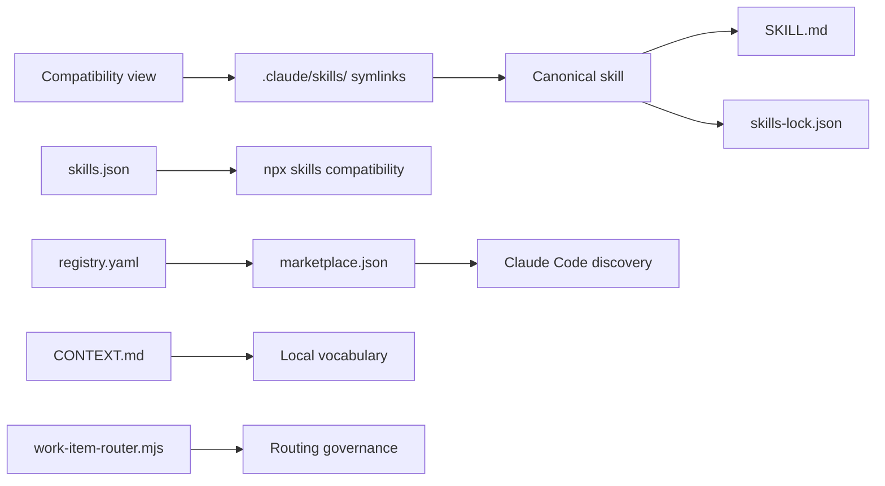
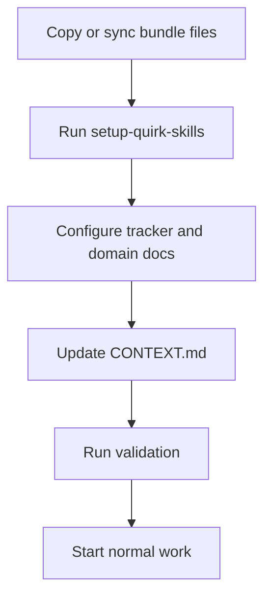
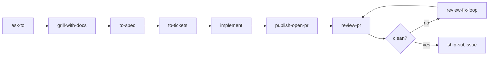
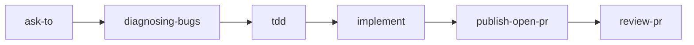
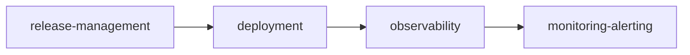

# Installation of quirk Skills

> Complete guide for installing and synchronizing the quirk Skills bundle in any repository. Includes installation methods, adoption flow, first steps, specialization rules, readiness checklist, and maintenance.

```text
[ PORT  ] INSTALLATION
```

## 1. Overview

quirk Skills is a portable workflow system designed to be installed in any repository and specialized through CONTEXT.md, ADRs, issue tracker configuration, and stack-specific skills. The bundle is delivered as a set of files that are copied or synchronized into the target repository.

Installation places three fundamental elements in the target repository:

| Element | Description |
|---|---|
| **Canonical skills** | 189 skills packaged as SKILL.md with SHA-256 lockfile hashes |
| **Compatibility view** | Symlinks in .claude/skills/ for consumers expecting that layout |
| **Method documentation** | CONTEXT.md, docs/agents/, AUTHORSHIP.md, and ADRs to specialize the bundle |

After installation, the repository is ready to run the canonical flow: ask-to -> grill-with-docs -> to-spec -> to-tickets -> implement -> publish-open-pr -> review-pr -> ship-subissue.

## 2. Prerequisites

Before installing the bundle, verify that the target repository meets the following:

- **Git** available in PATH (git --version must work).
- **Node.js** 18+ installed (required to run check-all.mjs and other platform scripts).
- **Bash** available as shell (installation scripts use bash).
- Write permissions in the target repository root directory.
- The target repository must be a valid Git repository (git rev-parse --git-dir must work).

> **Note:** gh (GitHub CLI) is not required for bundle installation, but it is required to run publishing and operations skills such as publish-open-pr and ship-subissue.

## 3. Installation methods

The bundle offers three installation methods depending on the starting point:

### 3.1 One-liner installer (curl)

Ideal for installing the bundle from the upstream repository without cloning first:

```bash
curl -fsSL https://raw.githubusercontent.com/quantumquirkxyz/skills-quirk/main/scripts/install-quirk-skills.sh | bash
```

This method downloads and runs scripts/install-quirk-skills.sh directly from GitHub, copying the bundle to the current repository.

### 3.2 From an existing local checkout

If you already have a local copy of the skills-quirk repository:

```bash
bash scripts/install-quirk-skills.sh
```

By default, the script uses the directory containing it as the source and copies files to the current repository.

### 3.3 From a fresh clone

For clean installs from scratch:

```bash
git clone https://github.com/quantumquirkxyz/skills-quirk.git
cd skills-quirk
bash scripts/install-quirk-skills.sh
```

### 3.4 Advanced installer usage

The install-quirk-skills.sh script accepts optional arguments:

```bash
bash scripts/install-quirk-skills.sh <destination-repo-path> [source-repo-path]
```

| Parameter | Description |
|---|---|
| <destination-repo-path> | Path of the repository where the bundle will be installed. |
| [source-repo-path] | Path of the source repository. If omitted, the script directory is used. |

Example:

```bash
bash scripts/install-quirk-skills.sh /home/user/my-project /home/user/skills-quirk
```

## 4. Installed files

The installer copies the following files and directories to the target repository:

| File / Directory | Purpose |
|---|---|
| .agents/skills/ | Canonical skills with SKILL.md and lockfile. Contains 189 skills organized by category. |
| .claude/skills/ | Compatibility view. Symlinks exposing canonical skills to consumers expecting that layout. |
| docs/agents/ | Method documentation, provenance, adoption guide, skill templates, stack matrix, etc. |
| docs/adr/README.md | ADR entry point (required for documenting architectural decisions). |
| CONTEXT.md | Local repository vocabulary: boundaries, naming conventions, and domain. |
| skills-lock.json | Canonical SHA-256 hash of each skill for integrity. |

### Installed bundle layers

The bundle is organized in layers that interact with each other:



| Layer | Components | Purpose |
|---|---|---|
| **Skills** | .agents/skills/, .claude/skills/, skills-lock.json | Canonical definitions and compatibility view |
| **Method** | CONTEXT.md, docs/agents/ | Local vocabulary, ADRs, adoption guides |
| **Execution** | check-all.mjs, sync-bundle.mjs, work-item-router.mjs | Validation, synchronization, and routing |
| **Quality** | quality-scorer.mjs, security-scanner.mjs, dependency-graph.mjs | Scoring, security, and dependency analysis |
| **Registry** | registry.yaml, .claude-plugin/marketplace.json, CATALOG.md | Distribution and discovery |
| **Runtime** | mcp-skills-server.mjs, otel-skill-instrumentation.mjs | Execution as MCP tools and traces |
| **Governance** | skill-evolver.mjs, audit-trail.mjs | Evidence-gated evolution and auditing |
| **Platform** | bin/skills-quirk.js, site/, .claude-plugin/ | NPX CLI, discovery site, and plugins |

## 5. Adoption flow

After copying the files, the target repository must go through the adoption flow:



Flow steps:

1. **Copy or synchronize** the bundle files (.agents/skills/, .claude/skills/, docs/agents/, .agents/adr/README.md, CONTEXT.md, skills-lock.json, skills.json, .env.template) into the target repository.
2. **Run setup-quirk-skills** once in the target repository.
3. **Configure** docs/agents/issue-tracker.md, docs/agents/triage-labels.md, and docs/agents/domain.md with the project actual tracker and domain.
4. **Update CONTEXT.md** with repository-specific vocabulary. Do not copy domain vocabulary from another repository.
5. **Run validation** to confirm the bundle is correctly installed.
6. **Start normal work** through ask-to for ambiguous routing or the canonical flow for a claimed work-item.

## 6. First execution in the project

Once adoption is complete, the repository is ready to run workflows. The flow depends on the task type:

### 6.1 Standard feature flow



This flow applies to new features. Work goes through planning, specification, division into tickets, implementation, PR opening, review, and eventual shipping.

### 6.2 Bug fix flow



For bug fixes, diagnosing-bugs is incorporated for problem isolation and tdd for test-driven development.

### 6.3 Operations flow



For release, deployment, and monitoring activities, the operations flow is used with focus on release management, deployment, and observability.

## 7. Specialization rules

Specializing the bundle for a specific repository is governed by the following rules:

- **Keep skill names stable** unless the target repository has a strong reason to fork them.
- **Specialize through CONTEXT.md**, ADRs, issue tracker documentation, validation commands, and stack-specific skills.
- **Do not embed** domain terms, branch names, issue numbers, or examples from another repository.
- **Preserve** AUTHORSHIP.md, docs/agents/quirk-method.md, and docs/agents/provenance.md unless intentionally forking the method.
- **Add new skills** only when the behavior is repeatedly useful and cannot be cleanly expressed through existing skills.
- **Prefer scenario fixtures** under evaluate-skill/scenarios/ before changing central workflow skills.
- **Treat compatibility-only skills** as transitional. Keep them only when the alias is still used externally, and add a concrete migration or retirement note in provenance before the next release touching the surrounding area.

## 8. Readiness checklist

Before considering installation complete, verify the following:

- [ ] setup-quirk-skills has run or equivalent documents exist.
- [ ] .agents/adr/ exists with at least one ADR recording a design decision.
- [ ] CONTEXT.md exists, names only this repository domain, and references .agents/adr/.
- [ ] docs/agents/issue-tracker.md reflects the project actual tracker.
- [ ] docs/agents/triage-labels.md matches the actual label strings.
- [ ] skills-lock.json matches all local SKILL.md hashes.
- [ ] .claude/skills/ has one symlink per canonical skill.
- [ ] Scenario evaluation passes.
- [ ] Semantic audit passes.
- [ ] Behavioral fixtures pass.
- [ ] Any real use of the bundle is captured under tooling/case-studies/ when the method changes.

## 9. Maintenance cadence

The bundle requires periodic validations to maintain its integrity:

| Verification | When to run |
|---|---|
| check-all.mjs | After each skill edit |
| audit-semantics.mjs | Before publishing the bundle |
| evaluate-scenarios.mjs | After changing routing, templates, or workflow skills |

### Full validation

Run from the repository root directory:

```bash
node .agents/skills/platform/check-all.mjs
```

Expected result: status: pass.

The full gate covers structure, semantic health, 8 scenario fixtures, 4 behavioral fixtures, syntax checks, shell template checks, and platform tests.

## 10. Post-installation steps

After copying the bundle files, complete the following steps to prepare the repository for normal work:

### 10.1 Run setup-quirk-skills

```bash
bash scripts/setup-quirk-skills.sh
```

This script configures the initial bundle structure in the target repository.

### 10.2 Configure the issue tracker

Edit the following files to reflect the project actual configuration:

```bash
docs/agents/issue-tracker.md
docs/agents/triage-labels.md
docs/agents/domain.md
```

- issue-tracker.md: defines the tracking tool (GitHub Issues, Jira, etc.) and navigation conventions.
- triage-labels.md: documents the triage labels used by the team.
- domain.md: describes the project domain documentation structure.

### 10.3 Update CONTEXT.md

Edit CONTEXT.md to include repository-specific vocabulary:

- Project domain terms.
- Boundaries and naming conventions.
- References to .agents/adr/.
- Any local rules that must be visible to skills.

Do not copy domain vocabulary from another repository. Each project must have its own CONTEXT.md.

### 10.4 Run validation

```bash
node .agents/skills/platform/check-all.mjs
```

Confirm the result is status: pass.

### 10.5 Verify routing flow

Run the work-item router before any workflow skill when the tracker configuration may have changed:

```bash
node scripts/work-item-router.mjs
```

This ensures routing uses the updated tracker configuration.

### 10.6 Start the standard flow

Use ask-to for ambiguous routing or the canonical flow for a claimed work-item:

1. **ask-to** — determines which skill to use.
2. **grill-with-docs** — refines the plan with questions and documentation.
3. **to-spec** — publishes the specification.
4. **to-tickets** — breaks down into traceable tickets.
5. **implement** — implements each ticket.
6. **publish-open-pr** — opens the PR.
7. **review-pr** — reviews against Standards and Spec.
8. **review-fix-loop** — applies corrections if there are findings.
9. **ship-subissue** — merges and closes the issue when the review is clean.

## 11. Additional notes

### Existing repositories with ADRs

If the target repository already has ADRs and an established CONTEXT.md, use the synchronization flow instead of a clean install:

```bash
node .agents/skills/platform/sync-bundle.mjs /path/to/target-repo
```

To apply changes:

```bash
node .agents/skills/platform/sync-bundle.mjs /path/to/target-repo --write
```

### Dry-run synchronization

Before applying changes, run a dry-run to preview the impact:

```bash
node .agents/skills/platform/sync-bundle.mjs /path/to/target-repo
```

This shows which files would change without modifying them.

## 12. Resources

| Resource | Location |
|---|---|
| **Adoption guide** | docs/agents/adoption-guide.md |
| **Bundle architecture** | docs/wiki/Architecture.md |
| **quirk method** | docs/wiki/Method.md |
| **Governance** | docs/wiki/Governance.md |
| **Skills catalog** | docs/agents/skill-inventory.md |
| **Skills map** | docs/agents/skills-map.md |
| **Provenance** | docs/agents/provenance.md |
| **Issue tracker** | docs/agents/issue-tracker.md |
| **Triage labels** | docs/agents/triage-labels.md |
| **Domain** | docs/agents/domain.md
