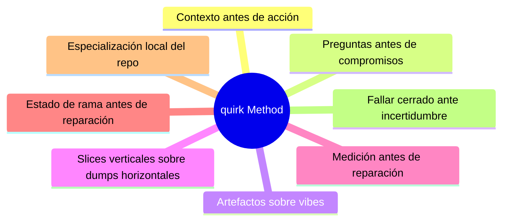
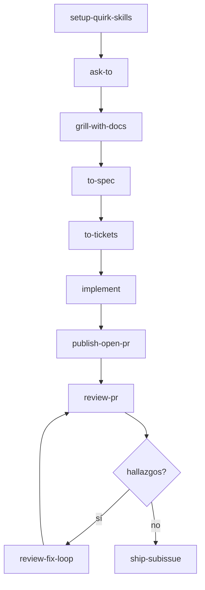

# quirk Method

The `quirk` method is a workflow for agent-assisted project development. It is designed for repositories where work must move from an ambiguous intent to a reviewed delivery without losing context, expanding scope, or hiding risks.

## Principles

- **Context before action.** Build a fresh context pack before working on broad tasks. Prefer repo documents, ADRs, issue tracker status, and direct code evidence over memory.
- **Questions before commitments.** Use `grill` or `grill-with-docs` when work is ambiguous. Decisions are made with the user, not guessed.
- **Artifacts over vibes.** Specifications, tickets, PR bodies, review plans, implementation notes, ADRs, and handoffs must be durable enough for another agent to consume afterward, and the shape of each artifact must belong to the skill that emits it.
- **Vertical slices over horizontal dumps.** Tickets must be narrow, complete paths through behavior, validation, and delivery.
- **Measurement before repair.** `review-pr` measures Standards and Spec separately. `plan-review-fixes` plans. `implement-review-fixes` executes. `ship-subissue` ships.
- **Branch state before repair.** If a PR branch is in conflict, resolve that branch-state problem first with `resolving-merge-conflicts`, then return to review and repair.
- **Repo-local specialization.** Each project owns its own domain language, tracker configuration, commands, and risk boundaries.
- **Fail closed on uncertainty.** Missing fixed points, obsolete plans, unclear issue traceability, unresolved blockers, and skipped validations must be surfaced.

## Vocabulary

| Term | Meaning |
|---|---|
| **Context pack** | A bounded set of fresh reads and provenance for the next skill |
| **Domain language** | The terms chosen by the project, recorded in `CONTEXT.md` and ADRs |
| **Seam** | The public boundary where design, implementation, testing, or operations become explicit |
| **Tracer bullet** | A ticket that makes a narrow end-to-end behavior work |
| **Frontier** | Tickets that are unlocked and claimable now |
| **Review axis** | One of two independent review dimensions: Standards or Spec |
| **Repair plan** | A durable PR comment that turns findings into bounded, validated fixes |
| **Ship state** | Review is clean, validation is known, and linked work can be merged or completed |
| **Agent Canvas** | Workspace/session control skill (`agent-canvas`) for multi-agent persistence and cross-device continuity |
| **Context Engine** | Dynamic context retrieval (`context-engine`) via RAG from issues, docs, and traces |
| **Subagent Swarm** | Coordinated sub-agent roles (`subagent-swarm`) with explicit handoff contracts |
| **Work Item Router** | Routing script (`work-item-router.mjs`) that maps descriptions to appropriate skills |

## Canonical Flow

## Alternative Entry Points

| Skill | When to use it |
|---|---|
| `project-development` | The project's shape or stack is not yet clear |
| `project-viability` | A structured assessment of project health, architecture, and scalability is needed before committing further |
| `wayfinder` | The effort is too large for a single session |
| `triage` | Unprocessed issues or external PRs need categorization |
| `diagnosing-bugs` | A failure needs a tight reproduction loop |
| `nextjs` | A Next.js app surface needs clearer constraints |
| `react` | A React component structure needs clearer constraints |
| `postgres` | A PostgreSQL schema needs clearer constraints |
| `auth` | An auth boundary needs clearer constraints |
| `deployment` | Deployment needs clearer constraints |
| `monitoring-alerting` | Monitoring needs clearer constraints |

## Quality Bar

A quirk artifact is acceptable when it answers:

| Question | Why it matters |
|---|---|
| What is the source of truth? | Prevents drift and duplication |
| What is in scope? | Keeps slices narrow and claimable |
| What is explicitly out of scope? | Surfaces risk early |
| Who or what consumes this artifact afterward? | Makes handoffs durable |
| What evidence proves it is done? | Enables clean review and shipping |
| What risk remains? | Preserves uncertainty for the next step |

If an artifact cannot answer those questions, improve the artifact before routing it downstream.

## Operational Checks

The method is maintained through executable checks:

| Check | Purpose |
|---|---|
| `validate-skills.mjs` | Bundle parity and lockfile coverage |
| `audit-semantics.mjs` | Semantic drift, retired names, weak templates, links, risk signals |
| `evaluate-scenarios.mjs` | Workflow path expectations |
| `evaluate-behavioral-fixtures.mjs` | Representative artifact shape |
| `check-all.mjs` | Full local gate |

## Provenance Classes

- **Original quirk:** authored in this repository for the quirk workflow.
- **quirk redesign:** based on an existing public or previous flow shape, then rewritten, renamed, rerouted, or re-scoped into the quirk system.
- **Retained compatibility name:** a stable command name kept because it is useful for users, while the surrounding behavior belongs to this bundle.
- **Retired legacy alias:** an old name intentionally removed from active routing.

## Maintenance Rule

When adding, renaming, or retiring a skill:

1. Update this provenance file.
2. Update `docs/agents/skills-map.md`.
3. Update or add scenario fixtures under `.agents/skills/skill-dev/evaluate-skill/scenarios/` and behavioral fixtures under `.agents/skills/skill-dev/evaluate-skill/behavioral-fixtures/` when the skill changes paths or artifact shapes.
4. Run `validate-skills.mjs`, `audit-semantics.mjs`, and `evaluate-scenarios.mjs`.
