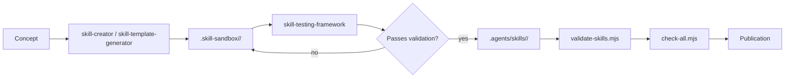
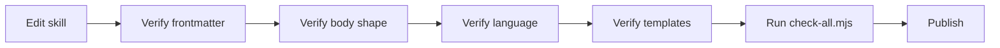
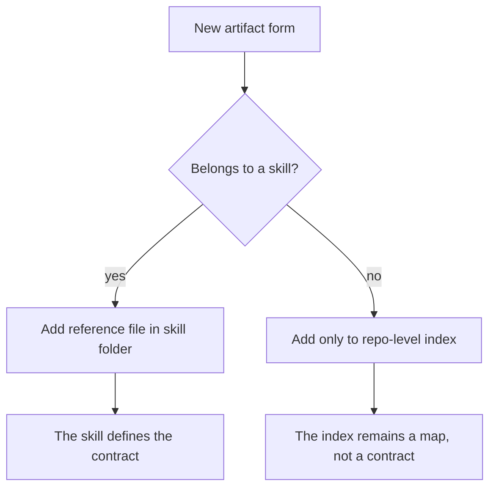

# Writing Skills

> Complete guide for authoring skills in the quirk Skills bundle.



---

## 1. Authoring Overview

A **skill** in quirk is a self-contained workflow unit that tells an agent how to execute a reproducible task. Unlike a generic document, a skill declares its contract explicitly: what it consumes, what it produces, what side effects it has, and when it finishes.

The goal of authoring is not to write a lot, but to write in a **predictable** way: the agent must follow the same process on each execution, not produce the same output.

### Guiding principles

| Principle | Explanation |
|---|---|
| **Context before action** | Build a fresh context pack before executing broad work. Prefer repo docs, ADRs, tracker status, and code evidence over memory. |
| **Artifacts over vibes** | Specs, tickets, PR bodies, review plans, implementation notes, ADRs, and handoffs must be durable. Each artifact form belongs to the skill that emits it. |
| **Vertical slices** | Tickets should be narrow, complete paths through behavior, validation, and delivery. |
| **Measurement before repair** | review-pr measures, plan-review-fixes plans, implement-review-fixes executes, ship-subissue publishes. Do not mix measurement with repair. |
| **Repo-local specialization** | Each project defines its own domain language, tracker configuration, commands, and risk boundaries. |
| **Fail closed** | Missing fixed points, obsolete plans, unclear traceability, and omitted validations must be surfaced, not ignored. |

### Essential vocabulary

| Term | Meaning |
|---|---|
| **Context pack** | Bounded set of fresh reads and provenance for the next skill. |
| **Seam** | Public boundary where design, implementation, testing, or operations are made explicit. |
| **Tracer bullet** | Ticket that makes a narrow end-to-end behavior work. |
| **Leading word** | Compact concept the model carries while executing the skill (e.g., relentless, tight, fog of war). |
| **Frontier** | Unblocked and claimable tickets now. |
| **Review axis** | One of the two review dimensions: Standards or Spec. |
| **Repair plan** | Durable comment on PR that converts findings into scoped, validated fixes. |
| **Ship state** | Clean review, known validation, and linked work ready for merge or closure. |

---

## 2. Skill Anatomy

### 2.1 Directory structure

A mature skill follows this structure:

```text
<skill-name>/
├── SKILL.md                    # Required entrypoint
├── scripts/                    # Optional: executable helpers
│   └── main.py
├── references/                 # Optional: rules, templates, definitions
│   └── domain.md
├── assets/                     # Optional: static files
│   └── README.md
├── adrs/                       # Optional: skill ADRs
│   └── 0001-initial-design.md
├── scenarios/                  # Optional: fixtures for evaluate-skill
│   └── basic-routing.json
└── behavioral-fixtures/        # Optional: representative outputs
    └── generated-skill-output.md
```

> **Rule:** A skill must be self-contained. If it produces durable artifacts, its templates belong to the skill itself, not a repo-wide template.

### 2.2 Frontmatter

The SKILL.md frontmatter uses YAML between --- delimiters. Required fields and their rules:

| Field | Type | Required | Rule |
|---|---|---|---|
| name | string | Yes | Matches the folder name. lowercase-kebab-case. |
| description | string | Yes | Declares what the skill does and when to use it. Front-load the leading word. |
| category | string | Yes | Functional category (e.g., delivery, skill-dev, routing). |
| maturity | string | Yes | stable, experimental, or deprecated. |
| version | number | Yes | Semantic version of the skill. |
| capabilities | array | Yes | List of specific capabilities the skill provides. |
| inputs | array | No | What the skill consumes. |
| outputs | array | No | What the skill produces. |
| dependencies | array | No | Skills it depends on. Must exist in the bundle. |
| sideEffects | array | No | State modifications the skill produces. |
| stopCondition | string | Yes | Verifiable completion criterion. |
| risk | enum | Yes | low, medium, or high. |
| trustTier | enum | Yes | 1, 2, 3, or 4. Must align with risk. |
| maxIterations | number | Conditional | Required if the body contains an explicit or implicit loop. |
| disable-model-invocation | boolean | No | If true, the skill cannot be invoked by the model. |

#### Risk / trustTier alignment

| risk | trustTier | Example skills |
|---|---|---|
| low | 1 or 2 | ask-to, review-pr, research |
| medium | 3 | implement, tdd, to-spec, plan-review-fixes |
| high | 4 | publish-open-pr, ship-subissue, review-fix-loop |

> **Rule:** A skill that writes code, tracker state, branches, PRs, or docs cannot be risk: low unless the writing is purely local and explicitly innocuous.

### 2.3 SKILL.md body

The body must follow this form:

```markdown
---
name: my-skill
description: Leading-word-rich description stating what it does and when to use it.
version: 1
category: skill-dev
maturity: stable
capabilities:
  - specific-capability
inputs:
  - clear-input
outputs:
  - clear-output
dependencies:
  - only-what-you-need
sideEffects:
  - honest-modifications
stopCondition: Clear, checkable completion criteria.
risk: medium
trustTier: 3
maxIterations: 6
---

## Operational Contract

- **Input:** ...
- **Output:** ...
- **Side effects:** ...
- **Dependencies:** ...
- **Stop condition:** ...
- **Risk:** ...
- **Boundary:** ...

# Skill Name

Start with purpose and boundary.

## Contract

Explicitly state:
- Input: what the skill consumes
- Output: what the skill produces
- Scope: what the skill does and does not do
- Rules: specific constraints that govern the skill behavior

[Optional sections specific to the skill purpose]

## Completion Criteria

Clear, observable criteria that tell when the skill is done.
Each criterion should be checkable by the agent.
```

#### Recommended sections

| Section | Purpose |
|---|---|
| **Purpose and boundary** | Declares what the skill does and what it does not do. |
| **Contract** | Entry, exit, scope, and explicit rules. |
| **Steps** (optional) | Only when sequence matters. Use ordered steps with per-step completion criteria. |
| **Rules** | Skill-specific rules. |
| **Completion Criteria** | Verifiable completion criteria. |
| **How This Skill Was Created** | Traceability record: interview, worksheet, or manual design. |

> **Rule:** Mode-specific details should be pushed to references/ rather than inflating SKILL.md.

---

## 3. Skill Style Guide

### 3.1 Frontmatter rules

1. name must exactly match the folder name.
2. description must declare what the skill does and when to use it. Front-load the leading word.
3. capabilities, inputs, outputs, sideEffects, stopCondition, and risk must match real behavior.
4. A skill that writes code, tracker state, branches, PRs, or docs cannot be risk: low unless the writing is purely local and explicitly innocuous.
5. trustTier must be declared and aligned with risk:
   - Tier 1 — metadata and routing only (ask-to, capability-router)
   - Tier 2 — read-only analysis or documentation (review-pr, research, domain-modeling)
   - Tier 3 — supervised local writing (implement, tdd, to-spec, plan-review-fixes)
   - Tier 4 — autonomous remote writing (publish-open-pr, ship-subissue, review-fix-loop)
6. maxIterations is required in any skill whose body contains an explicit or implicit loop. Omit it only when the skill has disable-model-invocation: true or the body contains no loop.

### 3.2 Body shape

1. Start with purpose and boundary.
2. Include a Contract section for non-trivial skills.
3. Include ordered steps only when sequence matters.
4. Include completion criteria that are verifiable.
5. Push mode-specific details to references/ rather than inflating SKILL.md.

### 3.3 Language rules

1. Use quirk vocabulary from CONTEXT.md and docs/agents/quirk-method.md.
2. Avoid custom names and repository-specific examples.
3. Prefer source of truth, scope, validation, owner, and next consumer over vague state language.
4. The skill content must be in English. Authoring documentation (such as this file) may be in Spanish.
5. Skill names and code must remain in English.

### 3.4 Validation rules

After each skill edit, run:

```bash
node .agents/skills/platform/check-all.mjs
```

This command executes:

| Check | Purpose |
|---|---|
| validate-skills.mjs | Bundle parity and lock coverage |
| audit-semantics.mjs | Semantic drift, retired names, weak templates, links, risk signals |
| evaluate-scenarios.mjs | Expected workflow path expectations |
| evaluate-behavioral-fixtures.mjs | Representative artifact form |
| sync-bundle.mjs | Bundle synchronization |



---

## 4. Template Ownership

Each skill owns its own template, examples, and supporting references for the artifact it produces. There is no universal template that must be copied into every skill.

### 4.1 How to read the ownership map

- If a skill writes a durable artifact, the template belongs to that skill side.
- If a skill has multiple artifact forms, it must maintain one reference file per form.
- Shared quality principles live in docs/agents/quirk-method.md and docs/agents/work-item-format.md.
- evaluate-skill owns scenarios/ and behavioral-fixtures/; scenarios cover route behavior and contract, while behavioral fixtures cover representative artifact form.
- skill-creator and skill-sandbox must reflect the same split when generating experimental skills.



### 4.2 Work items and review templates

| Skill | Artifact | Purpose | Next consumer |
|---|---|---|---|
| triage | AGENT-BRIEF.md, OUT-OF-SCOPE.md, needs-info template | Stable triage status and durable handoff | implement, plan-review-fixes, or wontfix closure |
| to-spec | references/spec-template.md | Publish a buildable spec issue | to-tickets |
| to-tickets | references/issue-template.md | Split spec into tracer-bullet tickets | implement |
| plan-review-fixes | references/review-fix-plan.md | Convert review findings into repair plan | implement-review-fixes |
| implement-review-fixes | references/implementation-note.md | Apply the scoped review plan and report completeness | review-pr again |
| review-fix-loop | handoff between review-pr, plan-review-fixes, implement-review-fixes | Close the review-repair loop | ship-subissue when clean |
| publish-open-pr | references/pr-body.md, references/validation.md, references/failure-modes.md | Package a finished branch into a reviewable PR | review-pr |

### 4.3 Setup and structure templates

| Skill | Artifact | Purpose | Next consumer |
|---|---|---|---|
| setup-quirk-skills | seed tracker/domain templates | Configure a repo for quirk workflows | ask-to, triage, to-spec |
| make-project | references/graphql.md | Create and configure a GitHub Projects board | project users and work-item skills |
| domain-modeling | ADR-FORMAT.md, CONTEXT-FORMAT.md | Record and maintain domain vocabulary | grill-with-docs, triage, make-project |
| grill-with-docs | context and ADR updates created during the interview | Refine the plan and write durable context | to-spec, implement |

### 4.4 Routing and learning templates

| Skill | Artifact | Purpose | Next consumer |
|---|---|---|---|
| ask-to | routing guidance in SKILL.md | Choose the next skill path | the user and downstream skill |
| evaluate-skill | scenarios/ and behavioral-fixtures/ | Test route behavior and representative artifact form | audit-semantics, check-all |
| writing-great-skills | glossary and authoring guidance files | Maintain bundle style and vocabulary | skill authors and reviewers |
| skill-creator | interview results, generated skill skeletons, scenarios, behavioral fixtures | Scaffold new skills with the correct artifact split from guided interview, script mode, or worksheets | skill-sandbox, skill-testing-framework |

### 4.5 Operating rule for new artifact forms

> **When a skill needs a new artifact form, create a new reference file for that skill rather than expanding a repo-wide template document.** Keep section names that make the artifact scannable and testable, but let the owning skill define the rest.

---

## 5. Skill Creation Workflow

### 5.1 skill-creator

skill-creator is the interactive design and generation tool for skills. It supports four modes:

| Mode | When to use it |
|---|---|
| **Interactive interview** | When the user wants guided discovery and collaborative design. |
| **Traditional worksheet flow** | When the user already has structured notes or prefers a written design process. |
| **Non-interactive script mode** | For automation, CI checks, or deterministic smoke tests. |
| **Validation-only mode** | When the skill already exists and the task is to verify structure, traceability, and quality gates. |

#### Interactive interview flow

The interview has five phases:

1. **Discovery** — Clarify the problem, user scenarios, domain, inputs, outputs, related skills, and required expertise.
2. **Collaborative design** — Propose architecture, supporting resources, and workflow. Capture user feedback before generating.
3. **Assisted research** — Collect lightweight best-practice signals and compare nearby skill patterns when useful.
4. **Naming** — Suggest 3-5 skill names from keywords and category, then validate the selected name.
5. **Generation** — Create SKILL.md, scripts/, references/, assets/, adrs/, and an interview trace.

#### Included scripts

```bash
# Guided interview (interactive or non-interactive)
python scripts/interview_skill.py
python scripts/interview_skill.py --non-interactive --output-dir ./skills
python scripts/interview_skill.py --demo --output-dir ./tmp/demo-skills

# Initialize skill from scratch or from interview results
python scripts/init_skill.py my-new-skill
python scripts/init_skill.py my-new-skill --output-dir ./skills
python scripts/init_skill.py my-new-skill --from-interview ./my-new-skill-interview.json

# Validate structure and quality checks
python scripts/package_skill.py ./skills/my-new-skill
python scripts/package_skill.py ./skills/my-new-skill --verbose
python scripts/package_skill.py ./skills/my-new-skill --no-interview-check --no-adr-check

# Research helpers
python scripts/research_helpers.py suggest-name api versioning --category integrations
python scripts/research_helpers.py analyze-skills .agents/skills
python scripts/research_helpers.py validate-name api-versioning
```

#### Generated structure

```text
<skill-name>/
├── SKILL.md
├── scripts/
│   └── main.py
├── references/
│   └── domain.md
├── assets/
│   └── README.md
├── adrs/
│   └── 0001-initial-design.md
└── <skill-name>-interview.json
```

#### Quality gate before handoff

1. Run python scripts/package_skill.py <skill-dir>.
2. Confirm the name is lowercase-kebab-case and does not duplicate an existing skill.
3. Confirm the generated files are in English and do not contain placeholder text.
4. Confirm sideEffects, risk, and trustTier match real behavior.
5. Confirm scripts/, references/, assets/, and adrs/ are present when the skill contract references them.
6. Preserve a trace from requirements to generated files through the interview JSON or the How This Skill Was Created section.

### 5.2 skill-template-generator

skill-template-generator generates an initial interactive, contract-complete template in the sandbox.

```bash
# Generate template in sandbox
node .agents/skills/platform/skill-lab.mjs template <name> --domain <domain>
```

#### Rules

1. Generate only under .skill-sandbox/.
2. Ask about problem, users, capabilities, outputs, dependencies, side effects, and risk before scaffolding.
3. Include a concrete stop condition and at least one validation path in the template.
4. Never overwrite an existing sandbox Skill without explicit user direction.

#### Completion criteria

- The sandbox path is safely created or identified.
- The generated frontmatter is complete enough for validation.
- The validation command and promotion checklist are provided.

### 5.3 skill-sandbox

skill-sandbox allows experimenting with skills in an isolated environment without affecting the canonical bundle.

#### Sandbox structure

```text
.skill-sandbox/
├── <skill-name>/
│   ├── SKILL.md
│   ├── references/          # Optional: skill artifact templates
│   └── scripts/             # Optional: skill-specific helpers
├── validations/             # Copies of validation scripts configured for sandbox
├── scenarios/               # Test scenarios to evaluate the skill
└── behavioral-fixtures/     # Expected output formats for the skill
```

#### Process

1. **Initialize sandbox** — Create .skill-sandbox/<skill-name>/ and configure the basic structure.
2. **Develop experimental skill** — Iterate using skill-creator and writing-great-skills principles.
3. **Test in isolation** — Run evaluate-skill against the experimental skill using sandboxed scenario fixtures.
4. **Validate against standards** — Compare against similar canonical skills, verify quirk vocabulary, and confirm dependencies are correctly declared.
5. **Promotion decision** — Promote only if the skill addresses useful behavior not covered, has clear boundaries, and passes all checks.

#### Guardrails

- Never modify .agents/skills/ or .claude/skills/ directly from this skill.
- Always use isolated validation scripts when testing experimental skills.
- Clean the sandbox directory after promotion or abandonment.
- Do not promote skills that duplicate existing functionality without clear improvement.

---

## 6. Skill Testing

skill-testing-framework validates structure, contracts, dependencies, anti-patterns, and isolated execution before promotion.

### Workflow

1. **Structural validation** — Run node .agents/skills/platform/skill-lab.mjs validate <path> --json.
2. **Fixture validation** — Run sandbox and behavioral fixture validators for execution evidence.
3. **Scenario evaluation** — Run node .agents/skills/platform/evaluate-scenarios.mjs.
4. **Behavioral fixture evaluation** — Run node .agents/skills/platform/evaluate-behavioral-fixtures.mjs.

### Rules

| Rule | Explanation |
|---|---|
| Structural before behavioral | Run structural validation before behavioral or sandbox validation. |
| Placeholder bodies as risk | Treat bodies with placeholders and generic outputs as quality risks even when schemas pass. |
| Preserve validator output | Preserve validator output as evidence, but add human interpretation for impact. |
| Do not promote with ambiguity | Do not promote a skill when dependencies, side effects, or stop condition are ambiguous. |

### Completion criteria

- The structural validator result is captured.
- Behavioral or sandbox evidence is captured when applicable.
- The promotion recommendation names blockers and warnings separately.

---

## 7. Skill Validation

### 7.1 check-all.mjs

check-all.mjs is the full local gate. It runs:

```bash
node .agents/skills/platform/check-all.mjs
```

Executed checks:

| # | Command | Purpose |
|---|---|---|
| 1 | validate-skills.mjs | Bundle parity and lock coverage |
| 2 | audit-semantics.mjs | Semantic drift, retired names, weak templates |
| 3 | evaluate-scenarios.mjs | Expected workflow paths |
| 4 | evaluate-behavioral-fixtures.mjs | Representative artifact form |
| 5 | audit-semantics.mjs --check | Semantic audit check mode |
| 6 | evaluate-scenarios.mjs --check | Scenario check mode |
| 7 | evaluate-behavioral-fixtures.mjs --check | Behavioral fixtures check mode |
| 8 | sync-bundle.mjs --check | Bundle sync check mode |
| 9 | bash -n on hitl-loop.template.sh | Bash syntax check |
| 10 | node --test on tests/*.test.mjs | Platform unit tests |

The output is a JSON report with status, individual checks, and summary with totalChecks, passed, failed, skillsEvaluated, totalWarnings, and totalErrors.

### 7.2 validate-skills.mjs

validate-skills.mjs validates each canonical skill against structural rules:

- SKILL.md exists.
- name in frontmatter matches the folder name.
- risk is low, medium, or high.
- trustTier is 1, 2, 3, or 4.
- risk/trustTier alignment: low -> tier 1-2, medium -> tier 3, high -> tier 4.
- maxIterations is a positive integer when there are loops in the body.
- Declared dependencies exist in the bundle.
- The flat link .claude/skills/<name> exists and is a symlink.
- The hash in skills-lock.json is not obsolete.

```bash
node .agents/skills/platform/validate-skills.mjs
```

---

## 8. Learning Path

### Level 1: quirk Method Fundamentals

Objective: internalize the principles, not memorize them.

#### quirk Method principles

1. **Context before action** — Build a fresh context pack before broad work.
2. **Questions before commitments** — Use grill or grill-with-docs when work is ambiguous.
3. **Artifacts over vibes** — Artifacts must be durable and consumable by another agent or human.
4. **Vertical slices over horizontal dumps** — Narrow, complete, independent tickets.
5. **Measurement before repair** — Measure, plan, execute, publish. Do not mix.
6. **Branch-state before repair** — Resolve branch conflicts before review and repair.
7. **Repo-local specialization** — Each project defines its own domain.
8. **Fail closed on uncertainty** — Surface uncertainty, do not make assumptions.

#### Canonical flow

```
setup-quirk-skills
-> ask-to
-> grill-with-docs
-> to-spec
-> to-tickets
-> implement
-> publish-open-pr
-> review-pr
-> review-fix-loop (when there are findings)
-> ship-subissue (after clean review)
```

#### Quality bar

A quirk artifact is acceptable when it answers:

| Question | Why it matters |
|---|---|
| What is the source of truth? | Prevents drift and duplication |
| What is in scope? | Keeps slices narrow and claimable |
| What is explicitly out of scope? | Surfaces risk early |
| Who or what consumes this artifact next? | Makes handoffs durable |
| What evidence proves it is done? | Enables clean review and ship |
| What risk remains? | Preserves uncertainty for the next step |

### Level 2: Writing Effective Skills

Objective: skills must be reliable, not verbose.

#### The Predictability Principle

Predictability means the agent follows the same process on each execution, not that it produces the same output. Every lever serves that goal.

#### Core authoring principles

1. **Front-Load the Leading Word** — The leading word is the compact concept the model carries while executing the skill. Put it early in the description. Repeat it only where behavior changes.

2. **Embrace Progressive Disclosure** — Keep SKILL.md lean by pushing details behind context pointers:
   - **In-skill step** — Primary tier: what the agent does, in order.
   - **In-skill reference** — Consulted on-demand: definitions, rules, facts.
   - **External reference** — Loaded only when the pointer fires: detailed examples, schemas.

3. **Ruthless Pruning** — Keep every meaning in a single source of truth. Eliminate sentences that do not change behavior.

4. **Master Information Hierarchy** — Use the immediacy ladder:
   1. In-skill step — ordered actions.
   2. In-skill reference — definitions, rules, facts.
   3. External reference — separate files loaded on-demand.

#### Advanced contract design

- **Inputs and Outputs Semantics** — Design inputs and outputs for meaningful composition. Design for the next consumer of the artifact.
- **Dependencies as Trust Boundaries** — Dependencies declare what other skills you trust. Keep them minimal and intentional. Circular dependencies indicate design problems.
- **Side Effects as Honesty Contracts** — Side effects declare what repo state the skill modifies. Be exhaustive and honest. Categorize with the execution-policy framework.

#### Designing for Evaluation

Think about how the skill will be evaluated from the start:

- **Scenario testing** — What expected paths are there? What static assertions validate behavior? What would constitute a regression?
- **Behavioral testing** — What artifact formats must it consistently produce? What sections are required? What placeholder text must be prohibited?

#### Common anti-patterns

| Anti-pattern | Problem | Solution |
|---|---|---|
| **Kitchen Sink Skill** | Trying to do too much in one skill. | Split by invocation or by sequence. |
| **Vague Stop Condition** | The agent cannot tell when it is done. | Make completion criteria verifiable. |
| **Hidden Dependency** | The skill relies on something undeclared. | Make all dependencies explicit in the frontmatter. |
| **Narrative Trap** | Writing prose that does not change behavior. | Apply the no-op test and remove lines that do not change behavior. |

---

## 9. Common Patterns and Anti-Patterns

### 9.1 Recommended patterns

| Pattern | When to use it | Example |
|---|---|---|
| **Leading word anchoring** | When the skill needs an anchor concept. | relentless in review-pr, tight in diagnosing-bugs. |
| **Progressive disclosure** | When the body grows beyond ~200 lines. | Move detailed rules to references/. |
| **Contract section** | In non-trivial skills. | implement, review-pr, to-spec. |
| **Completion criteria** | In any skill with steps or exit criteria. | Verifiable list at the end of the body. |
| **Template ownership** | When the skill produces a durable artifact. | triage owns AGENT-BRIEF.md. |
| **How This Skill Was Created** | For traceability and regeneration. | Interview, worksheet, or manual design record. |
| **Scenario fixtures** | For evaluate-skill. | scenarios/basic-routing.json. |
| **Behavioral fixtures** | For representative artifact forms. | behavioral-fixtures/generated-skill-output.md. |

### 9.2 Anti-patterns to avoid

| Anti-pattern | Symptom | Remedy |
|---|---|---|
| **No-op sentences** | Lines that do not change behavior versus the model default. | Apply the no-op test: if the sentence does not change behavior, remove it. |
| **Sediment** | Obsolete layers that accumulate. | Prune every line for relevance. |
| **Sprawl** | Skill too long. | Use the information ladder: disclosure behind pointers. |
| **Duplication** | Same meaning in multiple places. | Single source of truth. |
| **Negation** | Dont think of an elephant. | Promote positive behavior, not prohibition. |
| **Premature completion** | The agent finishes too early. | Refine completion criteria; if irreducibly fuzzy, split by sequence. |
| **Vague stopCondition** | Exit criterion not verifiable. | Make it observable and binary. |
| **Mismatched risk/trustTier** | risk: low with trustTier: 4. | Align with the tiers table. |
| **Missing maxIterations** | Loop without declared limit. | Add a positive maxIterations. |
| **Placeholder artifacts** | Published artifacts with TODO or FIXME. | Remove placeholders before publishing. |

### 9.3 Pre-publication checklist

```markdown
- [ ] name matches the folder (lowercase-kebab-case).
- [ ] description front-loads the leading word.
- [ ] risk and trustTier are aligned.
- [ ] maxIterations present if there are loops.
- [ ] stopCondition is verifiable.
- [ ] sideEffects lists all state modifications.
- [ ] dependencies only includes existing skills.
- [ ] Body starts with purpose and boundary.
- [ ] Contract section present for non-trivial skills.
- [ ] Completion criteria are observable.
- [ ] No placeholder text in artifacts.
- [ ] quirk vocabulary used consistently.
- [ ] node .agents/skills/platform/check-all.mjs passes.
```

### 9.4 Example of a well-structured skill

```markdown
---
name: code-review
description: Review the changes since a fixed point (commit, branch, tag, or merge-base) along two axes - Standards and Spec - and publish findings only.
category: delivery
maturity: stable
version: 1
capabilities:
  - review changes against a fixed point
  - separate Standards and Spec findings
  - publish findings only
inputs:
  - fixed point (commit, branch, tag, or merge-base)
outputs:
  - review findings structured by axis
dependencies: []
sideEffects:
  - write-comments
stopCondition: Findings are published and no further action is taken.
risk: low
trustTier: 1
---

## Operational Contract

- **Input:** fixed point and optional scope constraints.
- **Output:** structured review findings.
- **Side effects:** comments on the PR or issue.
- **Dependencies:** none.
- **Stop condition:** findings published; no fixes applied.
- **Risk:** low; read-only analysis with comment writes.
- **Boundary:** stay within the declared fixed point and axes.

# Code Review

Review changes along two axes: **Standards** (style, patterns, naming) and **Spec** (requirements, behavior, acceptance criteria).

## Contract

- Input: a fixed point (commit, branch, tag, or merge-base).
- Output: findings separated into Standards and Spec.
- Scope: review only; do not apply fixes.
- Rules: publish findings, do not modify code.

## Steps

1. Identify the fixed point and diff range.
2. Review against Standards axis.
3. Review against Spec axis.
4. Publish findings only.

## Completion Criteria

- All changed files are reviewed.
- Findings are separated by axis.
- No fixes are applied.
```

---

## References

- docs/agents/skill-style-guide.md — Skill style guide.
- docs/agents/skill-templates.md — Template ownership.
- docs/agents/quirk-method.md — quirk Method principles.
- docs/agents/work-item-format.md — Work item format.
- docs/agents/learning-path/01-fundamentals.md — quirk Method fundamentals.
- docs/agents/learning-path/02-writing-effective-skills.md — Effective skill authoring.
- .agents/skills/skill-dev/skill-creator/SKILL.md — Interactive creation skill.
- .agents/skills/skill-dev/skill-template-generator/SKILL.md — Template generator.
- .agents/skills/skill-dev/skill-sandbox/SKILL.md — Experimentation sandbox.
- .agents/skills/skill-dev/skill-testing-framework/SKILL.md — Testing framework.
- .agents/skills/platform/check-all.mjs — Full local gate.
- .agents/skills/platform/validate-skills.mjs — Structural validator.
